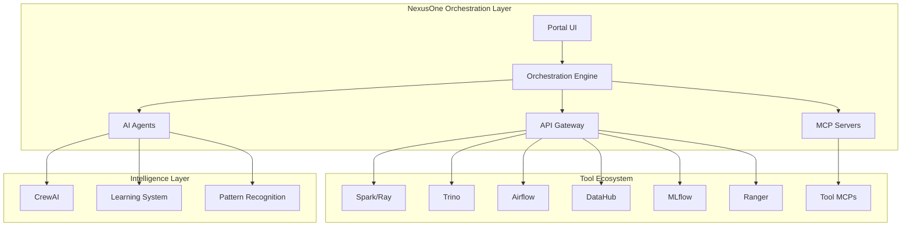

- # NexusOne Design Philosophy v2.0
## Intelligent Enterprise Data Engineering Orchestration

---

## Core Mission Statement

NexusOne provides **intelligent orchestration of enterprise data engineering tools** through traditional enterprise UX patterns enhanced with AI-powered cross-system intelligence and automated workflow coordination. We enhance and connect existing enterprise tools rather than replacing them, maintaining expert control while providing AI-powered insights throughout the complete data product lifecycle.

---

## Fundamental Design Principles

### Principle 1: Expert-First Enterprise UX

**Traditional Interface Patterns Over Innovation**
- Utilize proven enterprise UX paradigms that users already understand
- Dashboard overviews with drill-down capabilities and contextual navigation
- Tabbed interfaces for related configurations and modal workflows for complex processes
- Breadcrumb navigation with clear context hierarchy and return paths
- Random access to any functionality without artificial workflow constraints

**Deep Focus Optimization**
- Interfaces designed for sustained technical work rather than casual interaction
- Complex configuration management without cognitive overhead from spatial navigation
- Full technical control exposed immediately rather than hidden behind progressive disclosure
- Familiar patterns that reduce learning curve and increase expert efficiency

**Rationale**: Enterprise data engineers are highly skilled professionals who work most efficiently with familiar interface patterns. Innovation in UX should enhance their capabilities, not force them to learn new interaction paradigms.

### Principle 2: Intelligent Tool Orchestration

**API-First Integration Strategy**
- Deep integration with enterprise tools through comprehensive API utilization
- Cross-system state synchronization maintaining consistency across integrated platforms
- Intelligent parameter coordination preventing configuration conflicts and optimizing performance
- Context preservation when transitioning between integrated tool interfaces

**Enhancement Over Replacement**
- Leverage specialized tool capabilities rather than recreating functionality
- Embed native tool interfaces where they provide superior user experience
- Coordinate complex multi-tool workflows through intelligent automation
- Provide unified access points while preserving tool-specific expertise requirements

**MCP-Enabled Automation**
- CrewAI agents orchestrating complex workflows across multiple enterprise systems
- Bi-directional data flow maintaining real-time synchronization across tool ecosystem
- Automated configuration management with human oversight and approval workflows
- Cross-system optimization that exceeds human analytical capabilities

**Rationale**: Enterprise environments require multiple specialized tools. Rather than forcing users to abandon proven solutions, we coordinate these tools intelligently while preserving their individual strengths.

### Principle 3: Contextual AI Enhancement

**Reactive Intelligence Framework**
- AI responds to user intent and current context rather than making autonomous decisions
- Cross-system pattern recognition providing insights that manual analysis cannot discover
- Transparent reasoning with clear confidence indicators and complete override capabilities
- Learning from organizational patterns to improve recommendations over time

**Expert Empowerment Philosophy**
- AI augments human expertise rather than replacing technical judgment
- Full access to underlying configuration parameters and system controls
- Intelligent defaults with immediate manual override capability
- Proactive optimization suggestions without forcing implementation

**Cross-System Intelligence**
- Correlation analysis across DataHub, Airflow, Datadog, Ranger, and other integrated tools
- Predictive issue detection based on patterns across multiple enterprise systems
- Optimization recommendations that consider impacts across entire tool ecosystem
- Organizational knowledge capture and propagation through successful pattern recognition

**Rationale**: AI should make experts more effective, not reduce their control. The most valuable AI insights come from analyzing patterns across multiple systems that humans cannot practically monitor simultaneously.

### Principle 4: Data Product Lifecycle Focus

**ODPS v4.0 Compliance Integration**
- Open Data Product Specification adherence built into every workflow and interface
- Business context preservation throughout technical implementation complexity
- Governance automation that reduces manual compliance overhead
- Stakeholder alignment maintained across technical development phases

**Project-Centric Organization**
- All technical work organized around complete data product development lifecycles
- Business value and ROI tracking integrated with technical implementation progress
- Cross-functional collaboration supported through unified project context
- Technical debt and enhancement planning aligned with business priorities

**Governance Automation**
- Quality assurance integrated throughout development rather than added afterward
- Access control and security policies automatically applied based on data classification
- Audit trails and compliance reporting generated automatically from technical activities
- Business impact measurement and optimization recommendations based on usage analytics

**Rationale**: Data products represent the strategic evolution of data engineering from technical tasks to business value delivery. The platform should reinforce this paradigm through every interface and workflow.

---

## Interface Design Strategy

### Screen-Based Navigation Architecture

**Dashboard-Centric Information Architecture**
- Central command interface providing system overview and entry points to detailed functionality
- Contextual drill-down patterns with clear breadcrumb navigation and return paths
- Status monitoring across all integrated enterprise systems with intelligent alert prioritization
- Project-based organization with progress tracking and stakeholder communication integration

**Modal Workflow Management**
- Complex multi-step processes handled through focused modal interfaces
- Full-screen configuration management for sustained technical work
- Context preservation when switching between different configuration domains
- Progressive complexity disclosure based on user expertise and task requirements

**Tabbed Multi-Context Support**
- Related configurations accessible through tabbed interfaces within project contexts
- Cross-tab state synchronization with intelligent conflict detection and resolution
- Independent workflow progression within each tab while maintaining overall project coherence
- Collaborative editing support with real-time synchronization and change tracking

### AI Integration Patterns

**Embedded Intelligence Approach**
- AI assistance integrated within existing interface elements rather than separate spatial domains
- Contextual recommendations based on current configuration and organizational patterns
- Cross-system correlation analysis presented as enhancement to primary workflow
- Transparent reasoning with clear confidence indicators and implementation impact assessment

**Reactive Assistance Model**
- AI responds to user actions and explicit requests rather than proactive autonomous operation
- Intelligent defaults and optimization suggestions with immediate manual override capability
- Cross-system impact analysis provided when requested rather than continuously displayed
- Learning from user decisions to improve future recommendations and reduce cognitive overhead

---

## Tool Integration Philosophy

### Enterprise Tool Coordination

**Deep API Integration Strategy**
- Comprehensive utilization of enterprise tool APIs for real-time data synchronization
- Cross-system configuration coordination with intelligent conflict detection and resolution
- Performance monitoring and optimization across entire integrated tool ecosystem
- Automated workflow orchestration with human oversight and approval requirements

**Embedded Interface Strategy**
- Native tool interfaces embedded where they provide superior specialized functionality
- Context preservation when transitioning between NexusOne orchestration and embedded tools
- Intelligent handoffs with pre-populated configuration and context information
- Seamless return to orchestration interface with updated state and progress tracking

**MCP Framework Utilization**
- Model Context Protocol enabling sophisticated agent-tool interactions
- CrewAI agents orchestrating complex workflows across multiple enterprise platforms
- Bi-directional communication maintaining consistency across distributed tool ecosystem
- Automated optimization and maintenance tasks with appropriate human oversight

### 80/20 Orchestration Rule

**80% Through Intelligent Orchestration**
- Common enterprise data engineering workflows handled through coordinated API interactions
- Routine configuration and monitoring tasks automated with intelligent parameter optimization
- Cross-system optimization and issue detection through automated pattern analysis
- Template-based workflow creation with organizational best practice integration

**20% Through Embedded Tool Access**
- Specialized functionality requiring native tool interfaces embedded within orchestration context
- Complex debugging and optimization tasks utilizing best-in-class tool capabilities
- Advanced configuration scenarios handled through direct tool access with context preservation
- Expert-level customization and troubleshooting through native tool interfaces

---

## Success Metrics and Validation

### User Experience Metrics

**Expert Efficiency Enhancement**
- 60% reduction in time spent switching between enterprise tools
- 50% faster completion of common data product development workflows
- 70% reduction in configuration errors through intelligent coordination and validation
- 80% improvement in cross-system optimization discovery and implementation

**Learning and Adoption Metrics**
- Under 2 hours training time for experienced enterprise data engineers
- 90% user preference for orchestrated workflows over manual tool coordination
- 85% adoption rate of AI recommendations with measurable positive outcomes
- Continuous improvement in AI recommendation accuracy based on user feedback

### Business Value Metrics

**Data Product Development Acceleration**
- 40% faster time from project initiation to production deployment
- 95% project success rate with clear business value delivery
- 50% reduction in technical debt accumulation through governance automation
- 3x improvement in cross-functional collaboration efficiency

**Operational Excellence Achievement**
- 80% reduction in system integration maintenance overhead
- 90% of governance and compliance requirements automated
- 70% improvement in incident detection and resolution time
- Measurable ROI improvement for data engineering team productivity

---

## Implementation Principles

### Development Priorities

**Foundation First Approach**
- Establish robust API integration with core enterprise tools before building advanced features
- Implement reliable state management and context preservation across all interfaces
- Create intelligent defaults and optimization recommendations based on organizational pattern analysis
- Build comprehensive testing and validation frameworks for all integrated tool interactions

**Iterative Enhancement Strategy**
- Begin with most common enterprise workflows and expand based on user adoption patterns
- Implement AI enhancement incrementally with clear user control and override capabilities
- Add cross-system intelligence features based on demonstrated value and user acceptance
- Expand tool integration breadth based on organizational priorities and proven integration patterns

### Quality and Reliability Standards

**Enterprise-Grade Reliability**
- 99.9% uptime for critical workflow orchestration with automatic failover capabilities
- Comprehensive audit logging and compliance reporting for all automated actions
- Real-time monitoring and alerting for all integrated enterprise systems
- Disaster recovery and business continuity planning for complete tool ecosystem

**Security and Governance Integration**
- Enterprise authentication and authorization integration across all tool connections
- Data classification and access control enforcement through automated policy application
- Comprehensive security scanning and vulnerability management for all integrated systems
- Regular compliance validation and reporting for regulatory requirement adherence

---

## Conclusion

This design philosophy establishes NexusOne as an **intelligent orchestration platform** that enhances enterprise data engineering capabilities through proven UX patterns, sophisticated tool integration, and AI-powered insights. By focusing on expert empowerment rather than complexity hiding, we create sustainable competitive advantage through improved efficiency, reduced errors, and accelerated business value delivery.

The platform succeeds by making complex enterprise tool ecosystems more manageable and effective rather than attempting to replace specialized functionality. This approach ensures enterprise adoption while providing measurable improvements in productivity, quality, and business alignment.
- # NexusOne: The Intelligent Data Operations Platform
## Strategic Vision & Product Definition

---

## Executive Summary

NexusOne is an intelligent orchestration platform that transforms how enterprise data teams work by unifying their tool ecosystem through AI-powered workflows. Rather than replacing specialized tools or creating another silo, NexusOne acts as the connective intelligence layer that eliminates context switching, automates cross-tool operations, and accelerates the journey from raw data to trusted data products.

**Vision**: Empower data teams to focus on high-value work by intelligently orchestrating routine operations across their entire tool ecosystem.

**Mission**: Reduce the operational complexity of enterprise data management by 70% while maintaining full technical control and governance.

---

## Market Context & Problem Statement

### The Enterprise Data Reality

Modern enterprises have invested millions in specialized data tools, each best-in-class for its purpose. However, this has created a new problem:

```
Average Enterprise Data Stack:
- 20+ specialized tools
- 15-20 context switches per workflow  
- 60% of time spent on tool coordination
- 40% duplicate work across teams
- Knowledge scattered across systems
```

### The Core Problems We Solve

#### 1. **Tool Fragmentation Fatigue**
Data engineers spend more time navigating between tools than solving data problems. A simple pipeline failure investigation requires jumping between Airflow, Trino, DataHub, logs, Slack, and documentation.

#### 2. **Repeated Manual Workflows**
The same multi-tool workflows are executed manually hundreds of times: investigating failures, optimizing queries, creating data products, validating quality. Each repetition requires the same context switching and manual coordination.

#### 3. **Lost Organizational Knowledge**
Valuable patterns, optimizations, and solutions are discovered daily but lost in tool silos. The same problems are solved repeatedly by different team members.

#### 4. **Governance Enforcement Gaps**
With data operations spread across multiple tools, ensuring consistent governance, quality standards, and security policies becomes nearly impossible.

---

## Product Strategy

### Core Strategic Principles

1. **Orchestrate, Don't Replace**
   - Leverage existing tool investments
   - Preserve specialized capabilities
   - Respect tool-native workflows

2. **Intelligence with Control**
   - AI assists but doesn't obscure
   - Automation remains transparent
   - Manual override always available

3. **Progressive Enhancement**
   - Start with read-only aggregation
   - Add orchestration incrementally
   - Build trust through value

4. **Learn and Adapt**
   - Capture organizational patterns
   - Improve through usage
   - Propagate best practices

### Competitive Positioning

| Approach | Examples | Limitation | Our Advantage |
|----------|----------|------------|---------------|
| **All-in-One Platforms** | Databricks, Snowflake | Vendor lock-in, migration cost | Works with existing tools |
| **Workflow Orchestrators** | Airflow, Prefect | Single-purpose, technical only | Intelligent multi-tool orchestration |
| **Data Catalogs** | Collibra, Alation | Passive metadata, no automation | Active orchestration + intelligence |
| **AI Assistants** | GitHub Copilot | Single-tool focus | Cross-tool context awareness |

**Our Unique Position**: The intelligent orchestration layer that makes your existing tools work better together.

---

## Target Personas

### Primary Persona: Senior Data Engineer (40% of users)

**Profile:**
- 5+ years experience
- Manages critical data pipelines
- Deep expertise in 5-10 tools
- Frustrated by repetitive operations

**Key Needs:**
- Faster debugging and root cause analysis
- Automated cross-tool workflows
- Performance optimization insights
- Reduced operational toil

**Success Metrics:**
- 50% reduction in investigation time
- 70% fewer context switches
- 30% performance improvement

### Secondary Persona: Data Engineer (30% of users)

**Profile:**
- 1-4 years experience
- Building and maintaining data products
- Learning tool ecosystem
- Seeking best practices

**Key Needs:**
- Guided workflows with guardrails
- Query optimization assistance
- Automated quality checks
- Learning from team patterns

**Success Metrics:**
- 40% faster ramp-up time
- 60% fewer production issues
- 80% best practice compliance

### Tertiary Persona: Analytics Engineer (20% of users)

**Profile:**
- SQL/dbt focused
- Business-technical bridge
- Self-service analytics enabler
- Quality and documentation champion

**Key Needs:**
- Natural language to SQL
- Automated documentation
- Quality monitoring
- Semantic layer management

**Success Metrics:**
- 3x faster query development
- 90% documentation coverage
- 50% reduction in quality issues

### Quaternary Persona: Data Analyst (10% of users)

**Profile:**
- Business-focused
- Consumes data products
- Limited technical depth
- Needs guided access

**Key Needs:**
- Natural language queries
- Pre-built data products
- Self-service analytics
- Automated insights

**Success Metrics:**
- 80% self-service rate
- 5x faster insights
- 90% query success rate

---

## Core Capabilities

### 1. Intelligent Workflow Orchestration

**Purpose**: Automate complex multi-tool workflows while maintaining transparency and control.

**Key Features:**
- Visual workflow state across all tools
- One-click investigation and remediation
- Context preservation between tools
- Automated pattern detection and reuse

**Example Workflow:**
```
Pipeline Failure → Aggregate logs/metrics → Identify root cause → 
Generate fix → Test solution → Deploy change → Update documentation
(Previously: 2 hours, 8 tools | Now: 15 minutes, 1 interface)
```

### 2. Query Lifecycle Management

**Purpose**: Transform ad-hoc queries into optimized, governed data products.

**Evolution Path:**
```
Natural Language → SQL Generation → Optimization → 
Testing → Documentation → Productization → Monitoring
```

**Key Features:**
- NLP to SQL with business context
- Automatic optimization suggestions
- Usage tracking and pattern learning
- Progressive productization

### 3. AI-Powered Assistance

**Purpose**: Provide contextual intelligence without replacing human expertise.

**Agent Capabilities:**
- **Debug Agent**: Root cause analysis across tools
- **Optimization Agent**: Performance improvements
- **Quality Agent**: Data validation and monitoring
- **Documentation Agent**: Automatic context capture

**Integration Approach:**
- Non-intrusive suggestions
- Explainable recommendations
- Learning from team patterns
- Confidence scoring

### 4. Unified Observability

**Purpose**: Single pane of glass for system health, data quality, and pipeline performance.

**Monitoring Domains:**
- Infrastructure health (connections, resources)
- Pipeline performance (success rates, latency)
- Data quality (completeness, accuracy)
- Usage patterns (queries, access)

### 5. Governance Automation

**Purpose**: Ensure consistent security, quality, and compliance across all tools.

**Automated Policies:**
- Access control synchronization
- PII detection and masking
- Quality gate enforcement
- Audit log aggregation

---

## Key Workflows

### Workflow 1: Pipeline Failure Investigation

**Trigger**: Alert about failed data pipeline

**Current Process** (2-4 hours):
1. Check Airflow for error message
2. Search logs for details
3. Query upstream data in Trino
4. Check DataHub for schema changes
5. Investigate in multiple tools
6. Identify fix
7. Test solution
8. Deploy change
9. Update documentation

**NexusOne Process** (15-30 minutes):
1. Click on failure alert in portal
2. View aggregated context from all tools
3. Review AI-identified root cause
4. Select recommended fix
5. Test with one click
6. Deploy with automatic documentation

**Value Delivered:**
- 85% reduction in MTTR
- Complete audit trail
- Knowledge capture for future

### Workflow 2: Query Development & Optimization

**Trigger**: Need for new analytical query

**Current Process** (1-2 days):
1. Understand business requirement
2. Find relevant tables in catalog
3. Write SQL query
4. Test and debug
5. Optimize performance
6. Add security filters
7. Document query
8. Share with team

**NexusOne Process** (1-2 hours):
1. Enter business question in natural language
2. Review generated SQL with explanations
3. Apply AI optimization suggestions
4. Automatic security policy application
5. Test with sample data
6. Save with auto-documentation
7. Track usage and evolution

**Value Delivered:**
- 10x faster development
- Built-in best practices
- Automatic governance
- Reusability tracking

### Workflow 3: Data Product Creation

**Trigger**: Business need for new data product

**Current Process** (2-3 weeks):
1. Requirements gathering
2. Source data discovery
3. Pipeline development
4. Quality rule definition
5. Testing and validation
6. Documentation
7. Deployment setup
8. Monitoring configuration

**NexusOne Process** (2-3 days):
1. Define requirements in portal
2. AI suggests relevant sources
3. Generate pipeline template
4. Configure with guided workflow
5. Automated testing suite
6. One-click deployment
7. Automatic monitoring setup

**Value Delivered:**
- 80% faster delivery
- Consistent quality standards
- Complete lineage tracking
- Built-in best practices

### Workflow 4: Performance Optimization

**Trigger**: Slow query or pipeline performance

**Current Process** (4-8 hours):
1. Identify performance bottleneck
2. Analyze execution plans
3. Research optimization options
4. Test improvements
5. Measure impact
6. Deploy changes
7. Monitor results

**NexusOne Process** (30-60 minutes):
1. Click on performance alert
2. View bottleneck analysis
3. Review ranked optimization options
4. See predicted impact
5. Apply optimizations
6. A/B test results
7. Auto-deploy winning solution

**Value Delivered:**
- 70% faster optimization
- Data-driven decisions
- Automatic rollback capability
- Performance knowledge base

---

## Technical Architecture

### Integration Strategy



### Key Design Decisions

1. **API-First Integration**: All tool interactions via APIs, no database-level coupling
2. **Stateless Orchestration**: Portal doesn't store data, only orchestrates
3. **Federated Execution**: Compute happens in native tools, not portal
4. **Progressive Enhancement**: Read → Orchestrate → Automate → Learn

---

## Success Metrics

### Adoption Metrics
- **Daily Active Users**: 80% of data team
- **Workflows Automated**: 50+ in first year
- **Tool Integration Depth**: 15+ tools connected
- **Query Reuse Rate**: 40% of queries evolve

### Efficiency Metrics
- **Context Switching**: 70% reduction
- **Investigation Time**: 85% faster
- **Development Velocity**: 3x improvement
- **Operational Toil**: 60% reduction

### Quality Metrics
- **Pipeline Success Rate**: 90%+ (from 70%)
- **Data Quality Score**: 85%+ (from 60%)
- **Documentation Coverage**: 90%+ (from 30%)
- **Governance Compliance**: 100% (from 70%)

### Business Impact
- **Time to Insight**: 80% reduction
- **Data Product Delivery**: 5x faster
- **Infrastructure Costs**: 30% reduction
- **Team Productivity**: 3x improvement

---

## Implementation Strategy

### Phase 1: Foundation (Q1)
**Goal**: Establish core platform and prove value

- Deploy orchestration framework
- Integrate 5 critical tools
- Implement 3 key workflows
- Onboard early adopters
- Measure baseline metrics

### Phase 2: Intelligence (Q2)
**Goal**: Add AI-powered assistance

- Deploy specialized agents
- Implement query optimization
- Add pattern learning
- Expand to 10 tools
- Achieve 50% team adoption

### Phase 3: Scale (Q3)
**Goal**: Full platform capabilities

- Complete tool integration
- Advanced automation
- Self-learning system
- 80% team adoption
- Measurable ROI

### Phase 4: Innovation (Q4)
**Goal**: Competitive differentiation

- Predictive operations
- Autonomous optimization
- Cross-team learning
- Industry benchmarking
- Platform ecosystem

---

## Risk Mitigation

### Technical Risks

| Risk | Mitigation |
|------|------------|
| Tool API limitations | Build MCP adapters, fall back to UI automation |
| Performance bottlenecks | Federated execution, caching, async operations |
| Integration complexity | Phased rollout, tool-by-tool validation |
| AI hallucinations | Confidence scoring, human validation, audit trails |

### Organizational Risks

| Risk | Mitigation |
|------|------------|
| User resistance | Voluntary adoption, preserve tool access |
| Knowledge silos | Cross-team patterns, documentation |
| Process disruption | Gradual enhancement, training |
| Over-automation | Transparency, manual overrides |

---

## Competitive Advantages

### 1. **Tool Agnostic**
Unlike vendor platforms, we work with your existing investments, avoiding lock-in and migration costs.

### 2. **Intelligence Layer**
Not just workflow automation, but learning and improving from every interaction.

### 3. **Progressive Enhancement**
Start with simple aggregation, evolve to full automation based on proven value.

### 4. **Domain Expertise**
Deep understanding of data engineering workflows, not generic automation.

### 5. **Open Architecture**
Extensible platform that grows with your tool ecosystem.

---

## Future Vision

### Year 1: Operational Excellence
- Eliminate repetitive workflows
- Establish best practices
- Build knowledge base
- Prove ROI

### Year 2: Intelligent Automation
- Predictive operations
- Self-healing pipelines
- Autonomous optimization
- Cross-organization learning

### Year 3: Platform Ecosystem
- Marketplace for workflows
- Industry benchmarking
- Partner integrations
- Workflow as a service

---

## Conclusion

NexusOne represents a fundamental shift in how data teams work: from tool-centric to workflow-centric, from manual to intelligent, from isolated to orchestrated. By focusing on the highest-friction workflows and providing intelligent orchestration without sacrificing control, we enable data teams to deliver 3-5x more value while reducing operational burden.

The platform succeeds not by replacing tools, but by making them work together intelligently. This approach preserves investments, respects expertise, and accelerates value delivery – creating a sustainable competitive advantage for data-driven organizations.

**Core Promise**: Focus on what matters – building data products and delivering insights – while NexusOne handles the operational complexity.
- for this we should always run the front end on port 3000