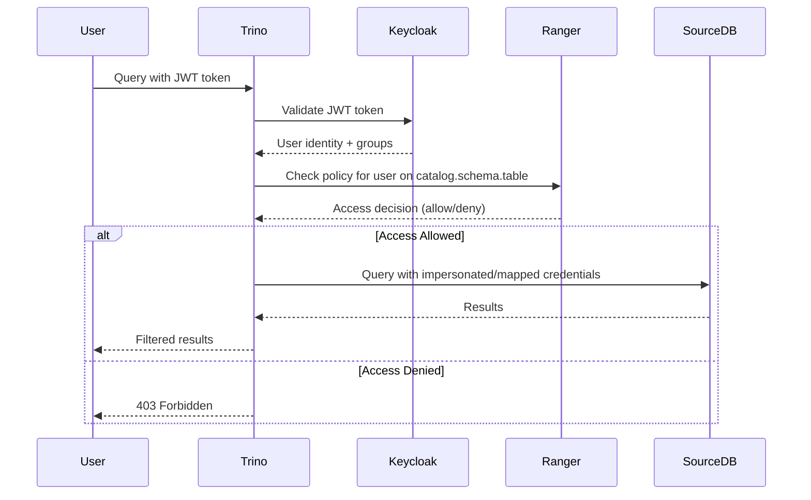

# Keycloak + Ranger Integration: Source Connection Impact Analysis

## Executive Summary

Using **Keycloak (Identity/Authentication)** and **Ranger (Authorization/Policy Management)** fundamentally changes our source connection workflow. Instead of storing database credentials directly, we leverage:

1. **Keycloak** for user authentication and service account management
2. **Ranger** for fine-grained data access policies
3. **Impersonation/Delegation** for query-time credential mapping

This is **significantly more enterprise-grade** than our current implementation and requires architectural changes.

---

## How Keycloak + Ranger Changes Things

### Current Assumption (WRONG for your setup):
```yaml
User Flow:
  1. User enters DB credentials in wizard
  2. Credentials stored (encrypted or as secret reference)
  3. Trino uses those credentials to query source

Problem: Every catalog has hardcoded credentials
```

### Actual Flow with Keycloak + Ranger:
```yaml
User Flow:
  1. User authenticates to Keycloak (SSO)
  2. Trino validates user via Keycloak
  3. Ranger policies determine what data user can access
  4. Trino impersonates user's identity to source database
  5. Source DB enforces permissions based on mapped identity

Result: No stored credentials, dynamic authorization
```

---

## Architecture Impact

### Authentication Flow



### Key Differences from Standard Setup

| Aspect | Standard Trino | Keycloak + Ranger |
|--------|----------------|-------------------|
| **User Auth** | Basic auth / LDAP | Keycloak OIDC/SAML |
| **Catalog Credentials** | Static service account | Impersonation or credential mapping |
| **Authorization** | Catalog-level only | Table/column/row level via Ranger |
| **Policy Management** | Trino config files | Ranger UI/API |
| **SSO** | Manual setup | Built-in via Keycloak |
| **Audit** | Trino logs only | Ranger audit + Trino logs |

---

## Required Configuration Changes

### 1. Trino Coordinator Configuration

**File: `/etc/trino/config.properties`**

```properties
# Keycloak Authentication
http-server.authentication.type=oauth2

http-server.authentication.oauth2.issuer=https://keycloak.company.com/realms/trino
http-server.authentication.oauth2.client-id=trino-client
http-server.authentication.oauth2.client-secret=${ENV:KEYCLOAK_CLIENT_SECRET}
http-server.authentication.oauth2.jwks-url=https://keycloak.company.com/realms/trino/protocol/openid-connect/certs

# Ranger Authorization
access-control.name=ranger
ranger.service.name=trino-prod
ranger.plugin.config.dir=/etc/trino/ranger
```

### 2. Ranger Plugin Configuration

**File: `/etc/trino/ranger/ranger-trino-security.xml`**

```xml
<configuration>
    <property>
        <name>ranger.plugin.trino.service.name</name>
        <value>trino-prod</value>
    </property>

    <property>
        <name>ranger.plugin.trino.policy.rest.url</name>
        <value>https://ranger.company.com:6080</value>
    </property>

    <property>
        <name>ranger.plugin.trino.policy.cache.dir</name>
        <value>/var/cache/ranger/trino</value>
    </property>
</configuration>
```

### 3. Catalog Configuration with Impersonation

**File: `/etc/trino/catalog/postgresql.properties`**

#### Option A: User Impersonation (PostgreSQL supports this)
```properties
connector.name=postgresql
connection-url=jdbc:postgresql://prod-db.company.com:5432/orders

# Service account for metadata operations
connection-user=trino_service
connection-password=${ENV:POSTGRES_SERVICE_PASSWORD}

# Enable user impersonation
postgresql.impersonation.enabled=true
postgresql.impersonation-user=${USER}
```

#### Option B: Credential Mapping (for DBs without impersonation)
```properties
connector.name=postgresql
connection-url=jdbc:postgresql://prod-db.company.com:5432/orders

# Use Keycloak user attributes to map to DB users
postgresql.credential-provider=keycloak-mapper
postgresql.credential-mapper.attribute=db_username
postgresql.credential-mapper.password-attribute=db_password_secret

# Fallback service account
connection-user=trino_service
connection-password=${ENV:POSTGRES_SERVICE_PASSWORD}
```

---

## Updated Wizard Flow

### Current Wizard (Inadequate):
```
Step 1: Connection Details
  - Host, port, database
  - Username, password ❌ (Not how it works with Keycloak)

Step 2: Trino Config
  - Catalog name
  - Schema mapping
```

### Required Wizard (with Keycloak + Ranger):
```
Step 1: Basic Info
  - Catalog name
  - Description
  - Team/Owner

Step 2: Connection Details
  - Host, port, database
  - SSL configuration

Step 3: Service Account (for metadata only)
  ⚠️ Note: This is NOT for query execution
  - Purpose: Schema discovery, metadata refresh
  - Options:
    ○ Keycloak service account (recommended)
    ○ Static service account (legacy)
  - Permissions needed: READ on information_schema only

Step 4: User Identity Mapping
  - How should Trino map Keycloak users to DB users?
    ○ Impersonation (user runs as themselves in DB)
    ○ Credential mapping (Keycloak attribute → DB credentials)
    ○ Single service account (all users share - not recommended)

Step 5: Ranger Policy Setup
  - Create default policies?
    □ Allow all users to query catalog
    □ Restrict to specific groups: [Data Engineers, Analysts]
    □ Row-level filters enabled
    □ Column masking enabled
  - Ranger service name: trino-prod

Step 6: Advanced
  - Connection pool settings
  - Schema whitelist/blacklist
  - Query timeout
```

---

## Credential Management: Keycloak Edition

### Service Account Creation (Automated)

**Our wizard should create Keycloak service accounts, not ask for passwords.**

```typescript
// Example: Create service account via Keycloak API
async function createTrinoServiceAccount(catalogName: string) {
  const keycloakAdmin = await getKeycloakAdminClient();

  // Create service account
  const serviceAccount = await keycloakAdmin.clients.create({
    clientId: `trino-catalog-${catalogName}`,
    serviceAccountsEnabled: true,
    standardFlowEnabled: false,
    directAccessGrantsEnabled: false,
  });

  // Generate credentials
  const credentials = await keycloakAdmin.clients.generateSecret({
    id: serviceAccount.id,
  });

  // Store in vault
  await vault.write(`trino/catalogs/${catalogName}/service-account`, {
    client_id: serviceAccount.clientId,
    client_secret: credentials.value,
  });

  return {
    clientId: serviceAccount.clientId,
    secretReference: `${ENV:VAULT_ADDR}/trino/catalogs/${catalogName}/service-account`,
  };
}
```

### User Credential Mapping

**Option 1: Keycloak User Attributes**
```yaml
Keycloak User Profile:
  username: john.doe@company.com
  attributes:
    db_username: jdoe
    db_role: analyst
    data_classification_level: confidential

Trino Catalog Config:
  postgresql.credential-mapper.username-attribute=db_username
  postgresql.credential-mapper.role-attribute=db_role
```

**Option 2: Direct Impersonation**
```yaml
Keycloak User: john.doe@company.com
PostgreSQL User: john.doe

Trino passes: SET SESSION AUTHORIZATION 'john.doe'
PostgreSQL enforces: john.doe's permissions
```

---

## Ranger Policy Examples

### Policy 1: Catalog-Level Access
```json
{
  "policyType": "access",
  "name": "Allow Data Engineers to Orders Catalog",
  "resources": {
    "catalog": { "values": ["postgresql"] },
    "schema": { "values": ["*"] },
    "table": { "values": ["*"] }
  },
  "policyItems": [
    {
      "accesses": [
        { "type": "select", "isAllowed": true },
        { "type": "insert", "isAllowed": false }
      ],
      "users": [],
      "groups": ["data-engineers"],
      "conditions": []
    }
  ]
}
```

### Policy 2: Row-Level Filtering (PII Protection)
```json
{
  "policyType": "rowFilter",
  "name": "Hide PII from Analysts",
  "resources": {
    "catalog": { "values": ["postgresql"] },
    "schema": { "values": ["public"] },
    "table": { "values": ["customers"] }
  },
  "rowFilterPolicyItems": [
    {
      "accesses": [{ "type": "select", "isAllowed": true }],
      "groups": ["analysts"],
      "rowFilterInfo": {
        "filterExpr": "data_classification != 'pii'"
      }
    }
  ]
}
```

### Policy 3: Column Masking (SSN Example)
```json
{
  "policyType": "dataMask",
  "name": "Mask SSN for Non-Admins",
  "resources": {
    "catalog": { "values": ["postgresql"] },
    "schema": { "values": ["public"] },
    "table": { "values": ["customers"] },
    "column": { "values": ["ssn"] }
  },
  "dataMaskPolicyItems": [
    {
      "accesses": [{ "type": "select", "isAllowed": true }],
      "groups": ["analysts", "data-engineers"],
      "dataMaskInfo": {
        "dataMaskType": "MASK",
        "valueExpr": "'XXX-XX-' || SUBSTR(ssn, 8, 4)"
      }
    }
  ]
}
```

---

## Updated Type System

```typescript
// New types for Keycloak + Ranger setup

export type IdentityMappingStrategy =
  | 'impersonation'      // User runs as themselves in source DB
  | 'keycloak_mapping'   // Map Keycloak attributes to DB credentials
  | 'service_account';   // All users share one account (not recommended)

export interface KeycloakServiceAccount {
  client_id: string;
  client_secret_reference: SecretReference;
  realm: string;
  roles: string[];
}

export interface IdentityMapping {
  strategy: IdentityMappingStrategy;

  // For keycloak_mapping strategy
  username_attribute?: string;     // e.g., "db_username"
  password_attribute?: string;     // e.g., "db_password_secret"
  role_attribute?: string;         // e.g., "db_role"

  // For impersonation strategy
  impersonation_query?: string;    // e.g., "SET SESSION AUTHORIZATION ${USER}"
}

export interface RangerPolicy {
  id?: string;
  name: string;
  description: string;
  resources: {
    catalog?: string[];
    schema?: string[];
    table?: string[];
    column?: string[];
  };
  users?: string[];
  groups?: string[];
  roles?: string[];
  permissions: ('select' | 'insert' | 'update' | 'delete' | 'create' | 'alter' | 'drop')[];
  row_filter?: string;           // SQL expression
  column_mask?: {
    column: string;
    mask_type: 'MASK' | 'HASH' | 'NULLIFY' | 'CUSTOM';
    mask_expression?: string;
  }[];
}

export interface FederatedSourceWithKeycloak extends FederatedSource {
  // Service account for metadata only
  service_account?: KeycloakServiceAccount;

  // How to map users
  identity_mapping: IdentityMapping;

  // Ranger integration
  ranger: {
    service_name: string;
    policies: RangerPolicy[];
    audit_enabled: boolean;
  };
}
```

---

## Implementation Impact

### What Changes in Our Wizard

#### ❌ Remove (No longer relevant):
1. ~~Password input field~~ - Use Keycloak service account
2. ~~Static credential storage~~ - Dynamic identity mapping
3. ~~Manual permission grants~~ - Ranger policies

#### ✅ Add (New requirements):
1. **Keycloak Integration Section**
   - Service account creation
   - Client ID/secret management
   - User attribute mapping

2. **Identity Mapping Configuration**
   - Strategy selection (impersonation vs mapping)
   - Attribute mapping UI
   - Test identity mapping

3. **Ranger Policy Builder**
   - Create default policies
   - Row-level filter wizard
   - Column masking wizard
   - Group/role assignment

4. **Validation Steps**
   - Test Keycloak authentication
   - Verify Ranger plugin connectivity
   - Test user impersonation
   - Validate policies

---

## Updated Wizard UX

### Step 1: Keycloak Service Account

```tsx
<div className="space-y-4">
  <h3>Service Account Configuration</h3>
  <p className="text-sm text-muted-foreground">
    This service account is used ONLY for metadata discovery (schema browsing).
    User queries will use their own Keycloak identity.
  </p>

  <RadioGroup value={serviceAccountType}>
    <RadioGroupItem value="auto">
      <Label>Automatic (Create Keycloak Client)</Label>
      <p>Recommended: We'll create a service account in Keycloak</p>
    </RadioGroupItem>

    <RadioGroupItem value="existing">
      <Label>Use Existing Keycloak Client</Label>
      <Input placeholder="trino-catalog-orders" />
    </RadioGroupItem>

    <RadioGroupItem value="legacy">
      <Label>Legacy (Static Credentials)</Label>
      <Alert variant="warning">
        Not recommended: Static credentials don't integrate with Keycloak audit
      </Alert>
    </RadioGroupItem>
  </RadioGroup>
</div>
```

### Step 2: Identity Mapping Strategy

```tsx
<div className="space-y-4">
  <h3>User Identity Mapping</h3>
  <p className="text-sm text-muted-foreground">
    How should Keycloak users map to database users?
  </p>

  <RadioGroup value={identityStrategy}>
    <RadioGroupItem value="impersonation">
      <Label>Impersonation (Recommended for PostgreSQL)</Label>
      <p>Users run queries as themselves in the database</p>
      <Alert>Requires: PostgreSQL users matching Keycloak usernames</Alert>
    </RadioGroupItem>

    <RadioGroupItem value="keycloak_mapping">
      <Label>Credential Mapping</Label>
      <p>Map Keycloak attributes to database credentials</p>

      {identityStrategy === 'keycloak_mapping' && (
        <div className="mt-4 space-y-2">
          <Label>Username Attribute</Label>
          <Input placeholder="db_username" />

          <Label>Password Secret Attribute</Label>
          <Input placeholder="db_password_secret" />

          <Alert>
            Users must have these attributes in their Keycloak profile
          </Alert>
        </div>
      )}
    </RadioGroupItem>
  </RadioGroup>
</div>
```

### Step 3: Ranger Policies

```tsx
<div className="space-y-4">
  <h3>Access Policies (Ranger)</h3>

  <div className="space-y-2">
    <Label>Default Policy</Label>
    <Select>
      <SelectItem value="allow_all">Allow All Users (Development)</SelectItem>
      <SelectItem value="group_based">Group-Based Access</SelectItem>
      <SelectItem value="deny_all">Deny All (Manual Setup)</SelectItem>
    </Select>
  </div>

  {policyType === 'group_based' && (
    <div>
      <Label>Allowed Groups</Label>
      <MultiSelect
        options={keycloakGroups}
        placeholder="Select Keycloak groups..."
      />
    </div>
  )}

  <Accordion>
    <AccordionItem value="row-filter">
      <AccordionTrigger>Row-Level Security</AccordionTrigger>
      <AccordionContent>
        <Textarea
          placeholder="user_id = ${USER}"
          label="Filter Expression"
        />
      </AccordionContent>
    </AccordionItem>

    <AccordionItem value="column-mask">
      <AccordionTrigger>Column Masking</AccordionTrigger>
      <AccordionContent>
        <div className="space-y-2">
          <Label>Column</Label>
          <Input placeholder="ssn" />

          <Label>Mask Type</Label>
          <Select>
            <SelectItem value="MASK">Partial Mask (XXX-XX-1234)</SelectItem>
            <SelectItem value="HASH">Hash (MD5/SHA256)</SelectItem>
            <SelectItem value="NULLIFY">Replace with NULL</SelectItem>
            <SelectItem value="CUSTOM">Custom Expression</SelectItem>
          </Select>
        </div>
      </AccordionContent>
    </AccordionItem>
  </Accordion>
</div>
```

---

## Deployment Differences

### Standard Deployment:
```bash
# 1. Create catalog file
cat > /etc/trino/catalog/postgresql.properties << EOF
connector.name=postgresql
connection-url=jdbc:postgresql://host:5432/db
connection-user=trino
connection-password=${ENV:POSTGRES_PASSWORD}
EOF

# 2. Restart Trino
systemctl restart trino
```

### Keycloak + Ranger Deployment:
```bash
# 1. Create Keycloak service account
curl -X POST https://keycloak.company.com/admin/realms/trino/clients \
  -H "Authorization: Bearer $ADMIN_TOKEN" \
  -d '{
    "clientId": "trino-catalog-orders",
    "serviceAccountsEnabled": true
  }'

# 2. Create catalog with impersonation
cat > /etc/trino/catalog/postgresql.properties << EOF
connector.name=postgresql
connection-url=jdbc:postgresql://host:5432/db

# Service account for metadata
connection-user=trino_service
connection-password=${ENV:POSTGRES_SERVICE_PASSWORD}

# User impersonation
postgresql.impersonation.enabled=true
postgresql.impersonation-user=${USER}
EOF

# 3. Create Ranger policies
curl -X POST https://ranger.company.com:6080/service/public/v2/api/policy \
  -H "Authorization: Bearer $RANGER_TOKEN" \
  -d '{
    "service": "trino-prod",
    "name": "Allow Data Engineers - Orders Catalog",
    "resources": {
      "catalog": ["postgresql"],
      "schema": ["*"]
    },
    "policyItems": [{
      "groups": ["data-engineers"],
      "accesses": [{"type": "select", "isAllowed": true}]
    }]
  }'

# 4. Restart Trino
systemctl restart trino
```

---

## Security Benefits

| Feature | Without Keycloak/Ranger | With Keycloak/Ranger |
|---------|------------------------|---------------------|
| **User Auth** | Basic auth (insecure) | OIDC/SAML SSO ✅ |
| **Credential Storage** | Static passwords | Dynamic identity ✅ |
| **Authorization** | Catalog-level only | Table/column/row level ✅ |
| **Audit Trail** | Trino logs only | Ranger audit DB ✅ |
| **Policy Management** | Config files | Ranger UI/API ✅ |
| **Row-Level Security** | ❌ Not possible | ✅ Via Ranger filters |
| **Column Masking** | ❌ Not possible | ✅ Via Ranger masks |
| **Centralized Identity** | ❌ Per-system users | ✅ Keycloak single source |
| **MFA** | ❌ Not available | ✅ Via Keycloak |

---

## Next Steps for Implementation

### Immediate (This Sprint):
1. ✅ Update wizard to remove static password fields
2. ✅ Add Keycloak service account creation flow
3. ✅ Add identity mapping strategy selector
4. ✅ Add Ranger policy builder

### Next Sprint:
5. Integrate Keycloak Admin API for service account automation
6. Integrate Ranger REST API for policy creation
7. Add policy validation and testing
8. Add user attribute mapper UI

### Future:
9. Row-level filter builder with SQL preview
10. Column masking wizard with data classification
11. Audit log viewer (Ranger audit integration)
12. Policy conflict detection and resolution

---

## Conclusion

**Keycloak + Ranger fundamentally changes our source connection story from "store credentials" to "map identities and enforce policies".**

This is a **major architectural shift** that makes the platform:
- ✅ More secure (no stored passwords)
- ✅ More auditable (Ranger audit trail)
- ✅ More granular (row/column level access)
- ✅ More centralized (Keycloak SSO)

**Our current wizard is 0% compatible with this architecture.** We need to rebuild it around Keycloak and Ranger primitives, not database credentials.
