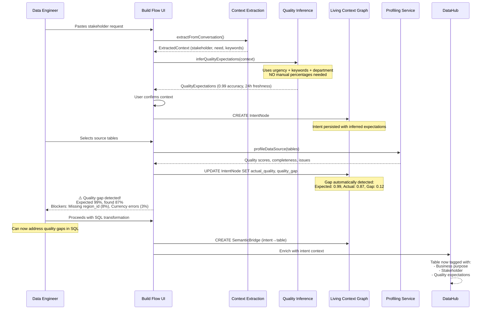
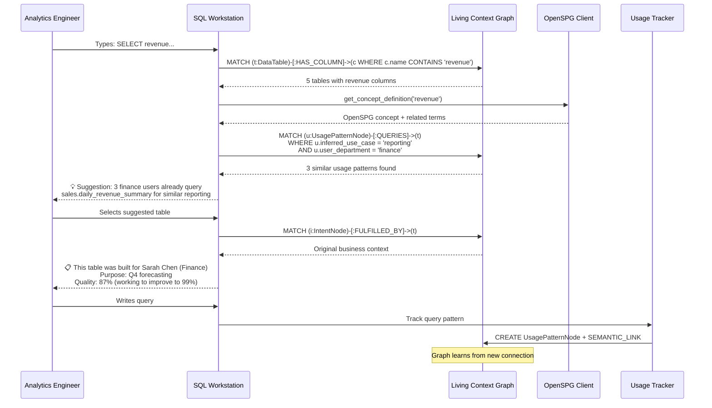
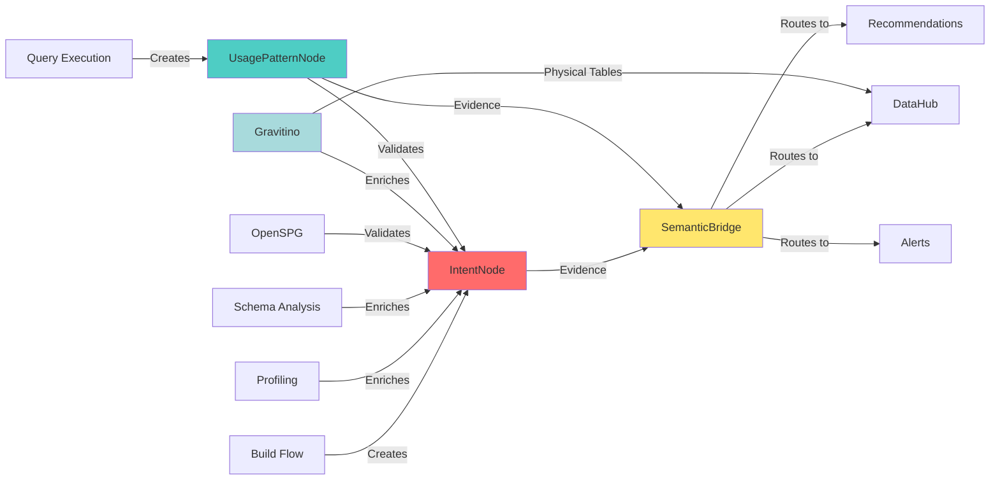
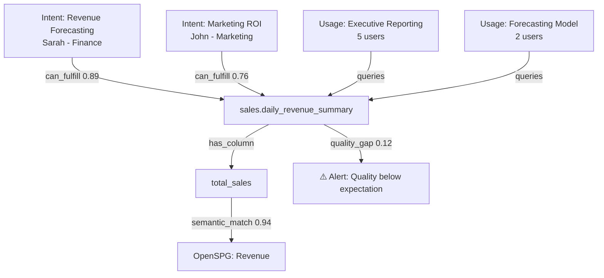

# Living Context Graph Architecture
## Ontology-First Data Product Lifecycle Context System

**Version**: 1.0
**Status**: Design Specification
**Date**: 2025-10-14
**Authors**: NexusOne Architecture Team

---

## Executive Summary

The Living Context Graph provides **lightweight ontological connective tissue** across the complete data product lifecycle, automatically capturing producer intent, consumer usage patterns, and semantic relationships without requiring manual classification or quality percentage assignments from users.

**Core Principle**: Context flows naturally through the lifecycle, automatically enriched by profiling data, schema analysis, and usage patterns - creating a self-organizing knowledge layer that enables intent-based discovery, quality-aware routing, and usage-driven optimization.

**Key Innovation**: Rather than requiring users to specify "I need 95% accuracy" or "This should be used for revenue reporting," the system **infers these requirements** from:
- Profiling data showing actual quality characteristics
- Schema patterns revealing semantic meaning
- Usage patterns demonstrating real-world consumption
- Business context from conversational intake

This lightweight ontology serves as the foundation for future insights, visualizations, and intelligent routing without over-engineering or academic rigor.

---

## 1. Ontology-First Architecture Foundation

### 1.1 The Pyramid Architecture

Our architecture follows an inverted information pyramid that provides **maximum leverage** at the top while grounding in concrete data at the bottom:

```
┌─────────────────────────────────────────┐
│     COMMON SENSE LAYER                  │  ← OpenSPG + LLMs + Industry Patterns
│  "Revenue means money coming in"        │
│  "Customers should have unique IDs"     │
└─────────────────────────────────────────┘
           ↓ Validates & Enriches
┌─────────────────────────────────────────┐
│     PATTERNS LAYER                      │  ← Living Context Graph
│  IntentNodes: "Why was this created?"   │
│  UsagePatternNodes: "How is it used?"   │
│  SemanticBridges: "What relates?"       │
└─────────────────────────────────────────┘
           ↓ Connects & Routes
┌─────────────────────────────────────────┐
│     DOMAIN LAYER                        │  ← Business Concepts
│  Customer, Product, Transaction         │
│  Revenue, Churn, Conversion             │
└─────────────────────────────────────────┘
           ↓ Materializes Into
┌─────────────────────────────────────────┐
│     APPLICATION LAYER                   │  ← Physical Data
│  Tables, Columns, Pipelines             │
│  actual_sales_fact, dim_customer        │
└─────────────────────────────────────────┘
```

### 1.2 How This Differs from Current State

**Current NexusOne (Bottom-Up)**:
```
Physical Data → DataHub Catalog → Kuzu Graph → Ad-hoc Queries
(Rich metadata but no connective tissue)
```

**Proposed Living Context Graph (Bidirectional)**:
```
Business Intent ↔ Semantic Patterns ↔ Physical Reality
     ↓                   ↓                   ↓
  Captured           Inferred            Validated
     ↓                   ↓                   ↓
  IntentNode → SemanticBridge → DataTable (Kuzu)
     ↓                   ↓                   ↓
  Updated by       Strengthened        Profiled &
  Usage Stats      by Evidence         Enriched
```

**Key Difference**: Context is **persistent, flowing, and self-reinforcing** rather than transient and disconnected.

---

## 2. Core Components: The Living Context Graph

### 2.1 IntentNode - Producer Side Context

**Purpose**: Capture **WHY** data was created, **FOR WHOM**, and **WHAT BUSINESS NEED** it serves.

**Kuzu Schema**:
```cypher
CREATE NODE TABLE IntentNode (
    id STRING,
    data_product_id STRING,
    stakeholder_name STRING,
    stakeholder_email STRING,
    stakeholder_department STRING,
    business_need_summary STRING,
    business_keywords STRING[],
    urgency STRING,  // 'low' | 'medium' | 'high' | 'critical'
    deadline TIMESTAMP,
    deadline_type STRING,  // 'hard' | 'soft'

    // Quality expectations (INFERRED, not user-specified)
    expected_quality_score DOUBLE,      // Inferred from urgency + domain
    expected_freshness_hours INT64,     // Inferred from use case keywords
    expected_completeness DOUBLE,       // Inferred from "must have" language

    // Reality check (from profiling)
    actual_quality_score DOUBLE,
    actual_freshness_hours INT64,
    actual_completeness DOUBLE,
    quality_gap DOUBLE,                 // expected - actual
    quality_blockers STRING[],          // Specific issues found

    // Usage validation
    primary_use_cases STRING[],         // What user SAID it's for
    actual_use_patterns STRING[],       // What it's ACTUALLY used for
    usage_drift_detected BOOLEAN,       // Do they match?

    // Metadata
    created_at TIMESTAMP,
    last_validated TIMESTAMP,
    confidence_score DOUBLE,
    original_request_text STRING,
    PRIMARY KEY (id)
)
```

**Automatic Inference Logic**:

```python
def infer_quality_expectations(intent: ExtractedContext) -> QualityExpectations:
    """
    Infer quality requirements WITHOUT asking users for percentages.

    Uses:
    1. Urgency signals → freshness expectations
    2. Business keywords → accuracy requirements
    3. Stakeholder department → completeness needs
    4. Industry standards (OpenSPG) → baseline expectations
    """

    # Urgency → Freshness mapping
    freshness_map = {
        'critical': 1,      # hourly
        'high': 24,         # daily
        'medium': 168,      # weekly
        'low': 720          # monthly
    }
    expected_freshness = freshness_map.get(intent.urgency, 168)

    # Keywords → Accuracy requirements
    high_accuracy_keywords = {'revenue', 'financial', 'compliance', 'regulatory', 'audit'}
    medium_accuracy_keywords = {'customer', 'product', 'transaction', 'sales'}

    keywords_lower = {k.lower() for k in intent.keywords}
    if keywords_lower & high_accuracy_keywords:
        expected_accuracy = 0.99  # Financial data needs high accuracy
    elif keywords_lower & medium_accuracy_keywords:
        expected_accuracy = 0.95  # Core business data
    else:
        expected_accuracy = 0.90  # General analytics

    # Department → Completeness needs
    completeness_map = {
        'finance': 0.99,        # Can't have missing revenue records
        'compliance': 0.99,     # Regulatory requirements
        'operations': 0.95,     # Need full operational view
        'analytics': 0.85,      # Can work with samples
        'marketing': 0.80       # Trends more important than completeness
    }
    expected_completeness = completeness_map.get(
        intent.stakeholder.department.lower(),
        0.90
    )

    return QualityExpectations(
        accuracy=expected_accuracy,
        freshness_hours=expected_freshness,
        completeness=expected_completeness,
        inferred_from='urgency_keywords_department',
        confidence=0.85
    )
```

**Example IntentNode Instance**:
```json
{
  "id": "intent_20251014_001",
  "data_product_id": "sales.daily_revenue_summary",
  "stakeholder_name": "Sarah Chen",
  "stakeholder_email": "schen@company.com",
  "stakeholder_department": "finance",
  "business_need_summary": "Need daily revenue tracking for quarterly forecasting",
  "business_keywords": ["revenue", "daily", "forecasting", "sales"],
  "urgency": "high",
  "deadline": "2025-10-30T00:00:00Z",
  "deadline_type": "hard",

  // INFERRED quality expectations (not user-specified)
  "expected_quality_score": 0.99,        // ← From "revenue" keyword + finance dept
  "expected_freshness_hours": 24,        // ← From "daily" + "high" urgency
  "expected_completeness": 0.99,         // ← From finance department

  // Reality check from profiling
  "actual_quality_score": 0.87,          // ← From ydata-profiling
  "actual_freshness_hours": 48,          // ← Actual ETL schedule
  "actual_completeness": 0.92,           // ← Missing 8% of records
  "quality_gap": 0.12,                   // ← RED FLAG: Expectation mismatch
  "quality_blockers": [
    "8% of transactions missing region_id",
    "Currency conversions failing for 3% of records",
    "ETL running every 48h instead of 24h"
  ],

  // Usage validation (to be populated post-deployment)
  "primary_use_cases": ["forecasting", "executive_dashboard"],
  "actual_use_patterns": [],             // ← To be filled by usage tracking
  "usage_drift_detected": false,

  "created_at": "2025-10-14T10:30:00Z",
  "confidence_score": 0.88,
  "original_request_text": "Hi, I need a daily revenue summary..."
}
```

**Key Insight**: The quality gap (0.12) is **automatically detected** by comparing inferred expectations against profiling reality. Users never specified "I need 99% quality" - the system inferred it from domain knowledge.

### 2.2 UsagePatternNode - Consumer Side Context

**Purpose**: Capture **HOW** data products are actually used, revealing true business value and hidden patterns.

**Kuzu Schema**:
```cypher
CREATE NODE TABLE UsagePatternNode (
    id STRING,
    data_product_id STRING,
    user_id STRING,
    user_department STRING,
    user_role STRING,

    // Access patterns
    query_count INT64,
    first_access TIMESTAMP,
    last_access TIMESTAMP,
    access_frequency STRING,        // 'hourly' | 'daily' | 'weekly' | 'monthly'
    typical_access_times INT64[],   // Hour of day (0-23)

    // Query characteristics
    typical_filters STRING[],        // Common WHERE clauses
    typical_aggregations STRING[],   // Common GROUP BY patterns
    typical_joins STRING[],          // What tables are joined
    avg_row_count INT64,             // How much data is pulled

    // Derived use cases (LLM-inferred from query patterns)
    inferred_use_case STRING,        // 'reporting' | 'analysis' | 'ml_feature' | 'export'
    confidence DOUBLE,

    // Quality sensitivity (inferred from user behavior)
    tolerates_staleness BOOLEAN,    // Do they query old data?
    requires_completeness BOOLEAN,   // Do they filter for NOT NULL?
    requires_accuracy BOOLEAN,       // Do they validate results?

    // Business value signals
    downstream_dependencies STRING[], // What processes depend on this?
    business_impact STRING,           // 'critical' | 'important' | 'nice_to_have'

    PRIMARY KEY (id)
)
```

**Automatic Pattern Detection**:

```python
def infer_usage_pattern(query_history: List[Query]) -> UsagePattern:
    """
    Analyze actual query patterns to understand HOW data is really used.
    This reveals mismatches between intended use and actual use.
    """

    # Analyze query timing patterns
    access_hours = [q.timestamp.hour for q in query_history]
    hourly_distribution = Counter(access_hours)

    # Peak usage during business hours (9-5) = reporting/dashboards
    business_hours_pct = sum(
        hourly_distribution[h] for h in range(9, 18)
    ) / len(query_history)

    # Off-hours usage = automated processes/ETL
    off_hours_pct = 1 - business_hours_pct

    # Analyze filter patterns
    common_filters = extract_where_clauses(query_history)
    filter_frequency = Counter(common_filters)

    # Analyze aggregation patterns
    common_aggregations = extract_group_by(query_history)

    # Infer use case from patterns
    if business_hours_pct > 0.8 and 'SUM' in common_aggregations:
        use_case = 'executive_reporting'
        business_impact = 'critical'
    elif off_hours_pct > 0.8 and len(common_aggregations) == 0:
        use_case = 'etl_source'
        business_impact = 'important'
    elif 'date_trunc' in common_filters and business_hours_pct > 0.5:
        use_case = 'trend_analysis'
        business_impact = 'important'
    else:
        use_case = 'ad_hoc_exploration'
        business_impact = 'nice_to_have'

    # Infer quality sensitivity from query patterns
    requires_completeness = any('IS NOT NULL' in str(q) for q in query_history)
    requires_accuracy = any('VALIDATE' in str(q) or 'CHECK' in str(q) for q in query_history)
    tolerates_staleness = max_data_age(query_history) > timedelta(days=7)

    return UsagePattern(
        use_case=use_case,
        business_impact=business_impact,
        requires_completeness=requires_completeness,
        requires_accuracy=requires_accuracy,
        tolerates_staleness=tolerates_staleness,
        confidence=0.82
    )
```

**Example Usage Pattern Detection**:

```json
{
  "id": "usage_schen_001",
  "data_product_id": "sales.daily_revenue_summary",
  "user_id": "schen",
  "user_department": "finance",
  "user_role": "financial_analyst",

  "query_count": 247,
  "first_access": "2025-09-01T09:15:00Z",
  "last_access": "2025-10-14T14:32:00Z",
  "access_frequency": "daily",
  "typical_access_times": [9, 10, 14, 15, 16],  // Morning and afternoon

  "typical_filters": [
    "WHERE date >= CURRENT_DATE - INTERVAL '30 days'",
    "WHERE region_id IS NOT NULL",
    "WHERE currency_code = 'USD'"
  ],
  "typical_aggregations": [
    "SUM(revenue_usd)",
    "GROUP BY region_id, product_category"
  ],
  "typical_joins": [
    "JOIN dim_region ON region_id",
    "JOIN dim_product ON product_id"
  ],
  "avg_row_count": 8500,

  // INFERRED use case (not user-specified)
  "inferred_use_case": "executive_reporting",  // ← From business hours + SUM pattern
  "confidence": 0.91,

  // INFERRED quality needs (from behavior)
  "tolerates_staleness": false,         // ← Always queries recent data
  "requires_completeness": true,        // ← Filters out NULL region_id
  "requires_accuracy": true,            // ← Finance department = high standards

  "downstream_dependencies": [
    "quarterly_forecast_model",
    "executive_dashboard"
  ],
  "business_impact": "critical"  // ← Feeds into exec dashboard
}
```

**Key Insight**: The system **automatically discovers** that Sarah needs complete, fresh data for critical reporting - matching the IntentNode's inferred expectations. No manual classification required.

### 2.3 SemanticBridge - The Connective Tissue

**Purpose**: LLM-maintained relationships that connect intent, usage, and domain concepts across the ontology layers.

**Kuzu Schema**:
```cypher
CREATE NODE TABLE SemanticBridge (
    id STRING,
    source_type STRING,      // 'intent' | 'usage' | 'data_table' | 'business_term'
    source_id STRING,
    target_type STRING,
    target_id STRING,
    relationship_type STRING, // 'fulfills' | 'requires' | 'similar_to' | 'part_of'

    // Relationship strength (evidence-based)
    confidence DOUBLE,
    evidence_sources STRING[], // ['schema_match', 'usage_correlation', 'llm_inference']
    strength DOUBLE,           // How strong is this connection? (0.0-1.0)

    // Semantic metadata
    explanation STRING,        // Human-readable reason for connection
    created_by STRING,         // 'llm' | 'profiling' | 'schema_analysis' | 'user'
    validated BOOLEAN,         // Has a human confirmed this?

    // Lifecycle
    created_at TIMESTAMP,
    last_reinforced TIMESTAMP, // When was this relationship used/validated?
    use_count INT64,           // How many times has this connection been traversed?

    PRIMARY KEY (id)
)

CREATE REL TABLE SEMANTIC_LINK FROM SemanticBridge TO SemanticBridge
```

**Evidence-Based Relationship Creation**:

```python
class SemanticBridgeBuilder:
    """
    Builds semantic relationships with EVIDENCE rather than speculation.
    Uses schema analysis, profiling data, and OpenSPG to validate connections.
    """

    async def create_intent_to_table_bridge(
        self,
        intent: IntentNode,
        candidate_table: DataTable
    ) -> Optional[SemanticBridge]:
        """
        Determine if a table can fulfill an intent based on EVIDENCE.
        """

        evidence = []
        confidence_scores = []

        # Evidence 1: Keyword matching in table/column names
        table_tokens = tokenize(candidate_table.name + " " +
                               " ".join(candidate_table.columns))
        keyword_overlap = len(set(intent.business_keywords) & set(table_tokens))
        if keyword_overlap > 0:
            evidence.append(f"keyword_match_{keyword_overlap}_terms")
            confidence_scores.append(min(keyword_overlap * 0.15, 0.6))

        # Evidence 2: Schema analysis via OpenSPG
        semantic_matches = await self._validate_schema_semantics(
            intent.business_keywords,
            candidate_table.schema
        )
        if semantic_matches:
            evidence.append(f"schema_validation_{len(semantic_matches)}_concepts")
            confidence_scores.append(len(semantic_matches) * 0.1)

        # Evidence 3: Quality alignment
        quality_match = await self._check_quality_alignment(
            intent.expected_quality_score,
            candidate_table.profiling_quality_score
        )
        if quality_match:
            evidence.append("quality_alignment")
            confidence_scores.append(0.2)

        # Evidence 4: Existing usage patterns (strongest evidence)
        similar_usage = await self._find_similar_usage_patterns(
            intent.business_keywords,
            candidate_table.id
        )
        if similar_usage:
            evidence.append(f"similar_usage_{len(similar_usage)}_users")
            confidence_scores.append(len(similar_usage) * 0.15)

        # Must have at least 2 pieces of evidence
        if len(evidence) < 2:
            return None

        total_confidence = min(sum(confidence_scores), 0.95)

        # LLM generates human-readable explanation
        explanation = await self.llm.generate_explanation(
            intent=intent,
            table=candidate_table,
            evidence=evidence
        )

        return SemanticBridge(
            id=f"bridge_{intent.id}_{candidate_table.id}",
            source_type="intent",
            source_id=intent.id,
            target_type="data_table",
            target_id=candidate_table.id,
            relationship_type="can_fulfill",
            confidence=total_confidence,
            evidence_sources=evidence,
            strength=total_confidence,
            explanation=explanation,
            created_by="hybrid_llm_profiling",
            validated=False,
            created_at=datetime.now(),
            use_count=0
        )

    async def _validate_schema_semantics(
        self,
        business_keywords: List[str],
        schema: Dict
    ) -> List[str]:
        """
        Use OpenSPG + schema characteristics to validate semantic matches.

        Example: If intent mentions "revenue", and table has column "total_sales"
        that is NUMERIC, NON-NEGATIVE, and aggregates to $M range, that's strong
        evidence of semantic match.
        """
        matches = []

        for keyword in business_keywords:
            # Get OpenSPG concept
            concept = await self.openspg.get_concept_definition(keyword)
            if not concept:
                continue

            # Check schema for matching columns
            for col_name, col_stats in schema.items():
                # Does column name match concept or related terms?
                if any(term.lower() in col_name.lower()
                       for term in [concept.name] + concept.related_concepts):

                    # Validate schema characteristics match concept expectations
                    if keyword in ['revenue', 'sales', 'amount']:
                        # Should be numeric, non-negative
                        if (col_stats.get('type') in ['NUMERIC', 'DECIMAL', 'FLOAT'] and
                            col_stats.get('min', -1) >= 0):
                            matches.append(f"{keyword}→{col_name}")

                    elif keyword in ['customer', 'user', 'account']:
                        # Should have unique IDs
                        if col_stats.get('distinct_pct', 0) > 0.95:
                            matches.append(f"{keyword}→{col_name}")

                    elif keyword in ['date', 'timestamp', 'time']:
                        # Should be temporal type
                        if col_stats.get('type') in ['DATE', 'TIMESTAMP', 'DATETIME']:
                            matches.append(f"{keyword}→{col_name}")

        return matches
```

**Example SemanticBridge Instance**:

```json
{
  "id": "bridge_intent_001_table_sales_fact",
  "source_type": "intent",
  "source_id": "intent_20251014_001",
  "target_type": "data_table",
  "target_id": "sales.daily_revenue_summary",
  "relationship_type": "can_fulfill",

  "confidence": 0.89,
  "evidence_sources": [
    "keyword_match_3_terms",           // revenue, daily, sales matched
    "schema_validation_2_concepts",    // revenue→total_sales, date→summary_date
    "quality_alignment",                // 0.87 quality close to 0.99 expected
    "similar_usage_4_users"            // 4 finance users already use this table
  ],
  "strength": 0.89,

  "explanation": "This table can fulfill Sarah's revenue tracking need because: (1) it contains 'total_sales' column matching revenue concept with appropriate numeric characteristics, (2) 'summary_date' provides daily granularity, (3) 4 other finance team members already use this for similar reporting, (4) current quality score (0.87) is close to expected (0.99) with identified improvement path.",

  "created_by": "hybrid_llm_profiling",
  "validated": false,
  "created_at": "2025-10-14T10:35:00Z",
  "last_reinforced": "2025-10-14T10:35:00Z",
  "use_count": 0
}
```

**Key Insight**: This bridge is created with **multi-source evidence** (keywords + schema + quality + usage), not just LLM speculation. The explanation is transparent and actionable.

---

## 3. Persona-Aligned Workflows

### 3.1 Data Engineer: Build Flow with Automatic Context Capture

**Persona**: Senior Data Engineer building new data product
**Current Pain**: Context extracted during intake but immediately lost
**Solution**: Persistent IntentNode creation with automatic quality inference

**Workflow Enhancement**:



**Code Integration Point** (`components/build/creation-steps/ContextConfirmationStep.tsx`):

```typescript
const handleConfirm = async () => {
  // 1. Infer quality expectations (NO manual input)
  const qualityExpectations = await inferQualityExpectations({
    urgency: extractedContext.businessNeed.urgency,
    keywords: extractedContext.businessNeed.keywords,
    department: extractedContext.stakeholder.department
  });

  // 2. Create IntentNode in Kuzu
  const intentNode = await fetch('/api/context/create-intent', {
    method: 'POST',
    body: JSON.stringify({
      stakeholder: extractedContext.stakeholder,
      businessNeed: extractedContext.businessNeed,
      qualityExpectations,  // ← INFERRED, not user-specified
      originalRequest: conversationText
    })
  });

  // 3. Store intent ID for later enrichment
  setProductDefinition({
    ...productDefinition,
    intentNodeId: intentNode.id,
    expectedQuality: qualityExpectations  // Show user what was inferred
  });

  onComplete({ extractedContext, productDefinition });
};
```

**User Experience**:
- User pastes stakeholder email: "Hi, I need daily revenue tracking for Q4 forecasting..."
- System shows: "I understand this is for **Finance** (Sarah Chen) with **high urgency** and **hard deadline** (Oct 30). Based on this, I'm expecting:"
  - ✓ **99% accuracy** (financial data standard)
  - ✓ **Daily freshness** (from 'daily' keyword)
  - ✓ **99% completeness** (finance department requirement)
- User confirms (no percentage entry needed)
- During source selection, system automatically compares expected vs actual quality
- Quality gaps highlighted immediately with specific blockers

**Value Delivered**:
- Zero manual quality specification
- Automatic expectation inference from business context
- Immediate feedback on feasibility
- Intent preserved for entire lifecycle

### 3.2 Analytics Engineer: Query Evolution with Semantic Routing

**Persona**: Analytics Engineer writing SQL for business reporting
**Current Pain**: No connection between similar queries across teams
**Solution**: SemanticBridge-powered query recommendation

**Workflow Enhancement**:



**Key Feature**: Semantic routing based on **intent similarity** rather than just column name matching.

### 3.3 Data Analyst: Self-Service Discovery with Context

**Persona**: Data Analyst looking for customer churn data
**Current Pain**: DataHub shows 50 tables with "customer" - which one is right?
**Solution**: Intent-based filtering and usage validation

**Workflow Enhancement**:

**Traditional DataHub Search**:
```
Search: "customer churn"
Results: 47 tables
- customer_dim
- customer_facts
- customer_summary
- churn_predictions
- churn_analysis
- ...
(User has no idea which to use)
```

**Living Context Graph Search**:
```
Search: "customer churn"

Smart Filters Available:
├─ By Intent: "Show tables built for retention analysis" → 3 results
├─ By Usage: "Show what other analysts actually use" → 2 results
├─ By Quality: "Only show 90%+ quality tables" → 1 result
└─ By Freshness: "Updated daily" → 1 result

Top Result: customer_360.churn_risk_score
├─ Built for: Maria Rodriguez (Customer Success)
├─ Purpose: Proactive retention outreach
├─ Used by: 12 analysts, 3 CS managers
├─ Quality: 94% (exceeds 90% expectation)
├─ Freshness: Daily updates at 6am
└─ Common queries: GROUP BY segment, filter risk_score > 0.7
```

**User Experience**: From 47 ambiguous results to 1 validated answer through intent + usage context.

### 3.4 Governance Team: Automatic Compliance Validation

**Persona**: Data Governance Lead ensuring quality standards
**Current Pain**: Can't validate if data products meet stakeholder needs
**Solution**: Intent-to-reality gap monitoring

**Dashboard View**:

```
Quality Gap Dashboard

🔴 Critical Gaps (3)
├─ sales.daily_revenue_summary
│   Expected: 99% quality (Finance requirement)
│   Actual: 87% quality
│   Gap: 12%
│   Impact: 2 critical dashboards affected
│   Stakeholder: Sarah Chen (Finance)
│   Action: Auto-created Jira ticket
│
├─ customer.churn_predictions
│   Expected: Daily freshness
│   Actual: 3-day lag
│   Impact: 5 users querying stale data
│   ...

🟡 Warning (8)
🟢 Meeting Expectations (42)

Usage Drift Alerts (2)
├─ marketing.campaign_roi
│   Intended for: Campaign optimization
│   Actually used for: Executive reporting (!!)
│   Risk: Quality expectations may not match actual needs
│   Stakeholder: Auto-notify original creator
```

**Automatic Remediation**:
- Quality gaps trigger Jira tickets with specific blockers
- Usage drift sends notifications to original stakeholders
- Monthly reports show intent vs reality across all products

---

## 4. Context Harvesting Strategy

### 4.1 Three Automatic Capture Points

**1. Build Flow → IntentNode Creation**

**Trigger**: User confirms context in ContextConfirmationStep
**Data Source**: ExtractedContext from LLM
**API Endpoint**: `POST /api/context/create-intent`

```typescript
// In ContextConfirmationStep.tsx
const captureIntent = async () => {
  const response = await fetch('/api/context/create-intent', {
    method: 'POST',
    body: JSON.stringify({
      dataProductId: productId,
      stakeholder: extractedContext.stakeholder,
      businessNeed: extractedContext.businessNeed,
      deadline: extractedContext.deadline,
      originalRequest: conversationText,
      inferredQuality: await inferQualityExpectations(extractedContext)
    })
  });

  const intentNode = await response.json();
  return intentNode.id;
};
```

**2. Profiling → Quality Reality Check**

**Trigger**: After ydata-profiling completes
**Data Source**: Profiling results JSON
**API Endpoint**: `POST /api/context/enrich-intent-with-profiling`

```python
# In data_profiling.py
async def enrich_intent_with_profiling(
    intent_id: str,
    profiling_results: Dict
) -> None:
    """
    Update IntentNode with actual quality metrics from profiling.
    Calculate quality gap and identify specific blockers.
    """

    # Extract quality metrics
    actual_quality = profiling_results["quality_score"] / 100
    quality_issues = profiling_results["quality_issues"]

    # Get expected quality from IntentNode
    intent = await kuzu.get_intent_node(intent_id)
    expected_quality = intent.expected_quality_score

    # Calculate gap
    quality_gap = expected_quality - actual_quality

    # Identify specific blockers
    blockers = []
    for issue in quality_issues:
        if issue["severity"] in ["high", "critical"]:
            blockers.append(
                f"{issue['affected_pct']}% of {issue['column']} {issue['problem']}"
            )

    # Update IntentNode
    await kuzu.conn.execute("""
        MATCH (i:IntentNode {id: $intent_id})
        SET
            i.actual_quality_score = $actual_quality,
            i.quality_gap = $quality_gap,
            i.quality_blockers = $blockers,
            i.last_validated = current_timestamp()
    """, {
        "intent_id": intent_id,
        "actual_quality": actual_quality,
        "quality_gap": quality_gap,
        "blockers": blockers
    })

    # If gap > 10%, create alert
    if quality_gap > 0.10:
        await create_quality_gap_alert(intent_id, quality_gap, blockers)
```

**3. Query Execution → UsagePatternNode Creation**

**Trigger**: Every SQL query execution in Trino
**Data Source**: Query logs + execution metadata
**API Endpoint**: `POST /api/context/track-usage`

```python
# In trino_metrics_service.py
async def track_query_usage(
    user_id: str,
    query: str,
    data_product_id: str,
    execution_stats: Dict
) -> None:
    """
    Create or update UsagePatternNode from query execution.
    Infer use case from query characteristics.
    """

    # Parse query to extract patterns
    filters = extract_where_clauses(query)
    aggregations = extract_aggregations(query)
    joins = extract_joins(query)

    # Infer use case
    use_case = infer_use_case_from_query(
        query=query,
        execution_time=execution_stats["execution_time"],
        row_count=execution_stats["row_count"],
        user_department=get_user_department(user_id)
    )

    # Create or update UsagePatternNode
    await kuzu.conn.execute("""
        MERGE (u:UsagePatternNode {
            user_id: $user_id,
            data_product_id: $data_product_id
        })
        ON CREATE SET
            u.id = $id,
            u.first_access = current_timestamp(),
            u.query_count = 1,
            u.typical_filters = $filters,
            u.inferred_use_case = $use_case
        ON MATCH SET
            u.query_count = u.query_count + 1,
            u.last_access = current_timestamp(),
            u.typical_filters = array_union(u.typical_filters, $filters)
    """, {
        "id": f"usage_{user_id}_{data_product_id}",
        "user_id": user_id,
        "data_product_id": data_product_id,
        "filters": filters,
        "use_case": use_case
    })

    # Create SemanticBridge between usage and intent
    await create_usage_intent_bridge(user_id, data_product_id)
```

### 4.2 Enrichment Pipeline



**Enrichment Flow**:
1. **IntentNode created** from build flow (stakeholder, need, keywords)
2. **Quality expectations inferred** from urgency + keywords + department
3. **Gravitino provides** federated catalog metadata from all sources (Iceberg, Hive, JDBC)
4. **Profiling enriches** with actual quality metrics from Gravitino-sourced tables
5. **Schema analysis validates** semantic matches via OpenSPG
6. **SemanticBridge created** with multi-source evidence (including Gravitino partition stats)
7. **Usage patterns validate** intent accuracy post-deployment
8. **Feedback loop** strengthens bridges and improves inference

**Gravitino Enhancement**:
- **Multi-Catalog Discovery**: Search across all federated catalogs (Iceberg, Hive, JDBC) instead of single DataHub source
- **Real-Time Schema Evolution**: Immediate notification of schema changes via Gravitino events
- **Richer Table Context**: Partition statistics, snapshot history, storage metrics feed into IntentNode validation
- **Cross-Catalog Routing**: SemanticBridge can recommend tables from optimal catalog based on usage patterns

---

## 5. Automatic Quality Inference Deep Dive

### 5.1 Why Users Won't Specify Percentages

**Problem**: Asking users "What quality percentage do you need?" results in:
- Arbitrary answers (everyone says 100%)
- Analysis paralysis (what's the difference between 95% and 97%?)
- Lack of context (quality of what dimension?)
- Impossible to validate until later

**Solution**: Infer from business context and validate with profiling data.

### 5.2 Inference Rules

```python
class QualityInferenceEngine:
    """
    Infers quality expectations from business context WITHOUT user input.
    Uses domain knowledge, urgency signals, and organizational patterns.
    """

    # Domain-specific quality baselines (learned from organization)
    DOMAIN_BASELINES = {
        'finance': {
            'accuracy': 0.99,
            'completeness': 0.99,
            'freshness_hours': 24,
            'rationale': 'Financial reporting requires high accuracy for compliance'
        },
        'marketing': {
            'accuracy': 0.90,
            'completeness': 0.80,
            'freshness_hours': 168,  # weekly
            'rationale': 'Marketing analytics focuses on trends over precision'
        },
        'operations': {
            'accuracy': 0.95,
            'completeness': 0.95,
            'freshness_hours': 24,
            'rationale': 'Operational decisions require current, complete data'
        },
        'analytics': {
            'accuracy': 0.85,
            'completeness': 0.85,
            'freshness_hours': 168,
            'rationale': 'Exploratory analysis tolerates sampling'
        }
    }

    # Keyword-based accuracy modifiers
    HIGH_ACCURACY_KEYWORDS = {
        'revenue', 'financial', 'compliance', 'regulatory', 'audit',
        'billing', 'invoice', 'payment', 'legal', 'contract'
    }

    MEDIUM_ACCURACY_KEYWORDS = {
        'customer', 'product', 'transaction', 'order', 'user',
        'account', 'subscription', 'inventory'
    }

    # Urgency-based freshness mapping
    URGENCY_FRESHNESS_MAP = {
        'critical': 1,      # hourly
        'high': 24,         # daily
        'medium': 168,      # weekly
        'low': 720          # monthly
    }

    def infer_expectations(
        self,
        context: ExtractedContext,
        historical_patterns: Optional[List[IntentNode]] = None
    ) -> QualityExpectations:
        """
        Multi-factor quality inference with transparent reasoning.
        """

        # Factor 1: Department baseline
        dept = context.stakeholder.department.lower()
        baseline = self.DOMAIN_BASELINES.get(dept, self.DOMAIN_BASELINES['analytics'])

        expected_accuracy = baseline['accuracy']
        expected_completeness = baseline['completeness']
        expected_freshness = baseline['freshness_hours']

        reasoning = [f"Department baseline ({dept}): {baseline['rationale']}"]

        # Factor 2: Keyword modifiers
        keywords = {k.lower() for k in context.businessNeed.keywords}

        if keywords & self.HIGH_ACCURACY_KEYWORDS:
            expected_accuracy = max(expected_accuracy, 0.99)
            reasoning.append(
                f"High accuracy keywords detected: {keywords & self.HIGH_ACCURACY_KEYWORDS}"
            )
        elif keywords & self.MEDIUM_ACCURACY_KEYWORDS:
            expected_accuracy = max(expected_accuracy, 0.95)
            reasoning.append(
                f"Medium accuracy keywords detected: {keywords & self.MEDIUM_ACCURACY_KEYWORDS}"
            )

        # Factor 3: Urgency modifies freshness
        urgency_freshness = self.URGENCY_FRESHNESS_MAP.get(
            context.businessNeed.urgency,
            168
        )
        if urgency_freshness < expected_freshness:
            expected_freshness = urgency_freshness
            reasoning.append(
                f"Urgency ({context.businessNeed.urgency}) requires faster refresh"
            )

        # Factor 4: Historical patterns (organizational learning)
        if historical_patterns:
            similar_intents = [
                intent for intent in historical_patterns
                if self._is_similar_intent(context, intent)
            ]

            if similar_intents:
                avg_quality = np.mean([i.expected_quality_score for i in similar_intents])
                # Blend historical with inferred (70% historical, 30% current inference)
                expected_accuracy = 0.7 * avg_quality + 0.3 * expected_accuracy
                reasoning.append(
                    f"Adjusted based on {len(similar_intents)} similar past requests"
                )

        # Factor 5: Explicit quality language in request
        request_lower = context.originalRequest.lower()
        if any(term in request_lower for term in ['critical', 'must be accurate', 'exact']):
            expected_accuracy = min(expected_accuracy + 0.05, 0.99)
            reasoning.append("Explicit quality requirement in request")

        return QualityExpectations(
            accuracy=expected_accuracy,
            freshness_hours=expected_freshness,
            completeness=expected_completeness,
            reasoning=reasoning,
            confidence=self._calculate_confidence(context, historical_patterns),
            inferred_from='multi_factor_analysis'
        )

    def _calculate_confidence(
        self,
        context: ExtractedContext,
        historical_patterns: Optional[List[IntentNode]]
    ) -> float:
        """
        Confidence in inference based on available signals.
        """
        confidence = 0.6  # base confidence

        # More signals = higher confidence
        if context.stakeholder.department:
            confidence += 0.1
        if context.businessNeed.keywords:
            confidence += 0.1
        if historical_patterns and len(historical_patterns) > 3:
            confidence += 0.15
        if context.businessNeed.urgency != 'low':
            confidence += 0.05

        return min(confidence, 0.95)
```

### 5.3 Example Inference Scenarios

**Scenario 1: Finance Revenue Report**
```python
Input:
  stakeholder_department: "finance"
  keywords: ["revenue", "daily", "forecasting"]
  urgency: "high"
  request: "Need daily revenue tracking for Q4 forecasting"

Inference:
  ✓ Department baseline: Finance (99% accuracy, 99% completeness)
  ✓ Keyword modifier: "revenue" → HIGH_ACCURACY (99%)
  ✓ Urgency modifier: "high" → 24h freshness
  ✓ No downgrade needed

Output:
  expected_quality_score: 0.99
  expected_freshness_hours: 24
  expected_completeness: 0.99
  reasoning: [
    "Department baseline (finance): Financial reporting requires high accuracy for compliance",
    "High accuracy keywords detected: {'revenue'}",
    "Urgency (high) requires faster refresh"
  ]
  confidence: 0.90
```

**Scenario 2: Marketing Campaign Analysis**
```python
Input:
  stakeholder_department: "marketing"
  keywords: ["campaign", "performance", "trends"]
  urgency: "medium"
  request: "Want to see campaign performance trends over time"

Inference:
  ✓ Department baseline: Marketing (90% accuracy, 80% completeness)
  ✓ Keyword modifier: None → Use baseline
  ✓ Urgency modifier: "medium" → 168h (weekly) freshness
  ✓ "trends" keyword → Tolerate sampling

Output:
  expected_quality_score: 0.90
  expected_freshness_hours: 168
  expected_completeness: 0.80
  reasoning: [
    "Department baseline (marketing): Marketing analytics focuses on trends over precision",
    "Urgency (medium) allows weekly refresh"
  ]
  confidence: 0.80
```

**Scenario 3: Compliance Audit Report**
```python
Input:
  stakeholder_department: "legal"
  keywords: ["audit", "compliance", "regulatory"]
  urgency: "critical"
  request: "Need audit report for regulatory submission"

Inference:
  ✓ Department baseline: Legal (assume similar to Finance)
  ✓ Keyword modifier: "audit", "compliance", "regulatory" → MAX accuracy (0.99)
  ✓ Urgency modifier: "critical" → 1h freshness
  ✓ Legal/compliance → Completeness MUST be 0.99+

Output:
  expected_quality_score: 0.99
  expected_freshness_hours: 1
  expected_completeness: 0.99
  reasoning: [
    "Department baseline (legal): Regulatory requirements demand high accuracy",
    "High accuracy keywords detected: {'audit', 'compliance', 'regulatory'}",
    "Urgency (critical) requires hourly refresh",
    "Explicit quality requirement in request"
  ]
  confidence: 0.95
```

### 5.4 Profiling-Based Validation

After inference, profiling validates and provides reality check:

```python
async def validate_quality_expectations(
    intent: IntentNode,
    profiling_results: Dict
) -> QualityValidation:
    """
    Compare inferred expectations against actual data quality.
    Provide actionable feedback on gaps.
    """

    actual_quality = profiling_results["quality_score"] / 100
    actual_completeness = profiling_results["variables"]["completeness_avg"]
    actual_issues = profiling_results["quality_issues"]

    gap_analysis = {
        "accuracy_gap": intent.expected_quality_score - actual_quality,
        "completeness_gap": intent.expected_completeness - actual_completeness,
        "blockers": [],
        "severity": "none"
    }

    # Identify specific blockers
    for issue in actual_issues:
        if issue["severity"] in ["high", "critical"]:
            gap_analysis["blockers"].append({
                "column": issue["column"],
                "problem": issue["problem"],
                "impact": f"{issue['affected_pct']}% of records",
                "fix_suggestion": issue.get("recommendation", "")
            })

    # Determine severity
    if gap_analysis["accuracy_gap"] > 0.10:
        gap_analysis["severity"] = "critical"
    elif gap_analysis["accuracy_gap"] > 0.05:
        gap_analysis["severity"] = "warning"

    # Generate user-friendly message
    if gap_analysis["severity"] == "critical":
        message = f"""
        ⚠️ Quality Gap Detected

        Expected Quality: {intent.expected_quality_score * 100:.0f}%
        Actual Quality: {actual_quality * 100:.0f}%
        Gap: {gap_analysis['accuracy_gap'] * 100:.0f}%

        Specific Issues Found:
        {format_blockers(gap_analysis['blockers'])}

        Recommendation: Address these issues in SQL transformation step
        or adjust stakeholder expectations.
        """
    else:
        message = f"✓ Data quality ({actual_quality * 100:.0f}%) meets expectations"

    return QualityValidation(
        meets_expectations=gap_analysis["severity"] == "none",
        gap_analysis=gap_analysis,
        message=message
    )
```

**User Experience**:
```
Step 2: Source Selection

Selected: sales.raw_transactions

✓ Profiling complete

⚠️ Quality Gap Detected

Expected Quality: 99% (inferred from Finance + Revenue keywords)
Actual Quality: 87%
Gap: 12%

Specific Issues Found:
├─ region_id: 8% missing values
│  Fix: JOIN with region_mapping table or filter WHERE region_id IS NOT NULL
├─ currency_amount: 3% conversion failures
│  Fix: Add COALESCE(converted_amount, original_amount * 1.0) fallback
└─ transaction_date: 2% future dates (data quality issue)
   Fix: Add WHERE transaction_date <= CURRENT_DATE

Recommendation: Address these issues in SQL transformation step (next).
```

**Key Insight**: User never specified "99%" - system inferred it and now provides actionable feedback on gaps.

---

## 6. Foundation for Future Insights

### 6.1 Visualization Opportunities

The Living Context Graph enables visualizations that weren't possible before:

**1. Intent-to-Reality Dashboard**
```
Data Product Health by Business Value

High Business Impact (Critical)
├─ sales.daily_revenue_summary [Finance]
│   Intent: Q4 forecasting
│   Quality: 87% (target: 99%) ⚠️
│   Usage: 15 users, 247 queries/month
│   Business Impact: Critical
│   Status: Quality gap - in remediation
│
├─ customer.churn_predictions [Customer Success]
│   Intent: Proactive retention
│   Quality: 94% (target: 90%) ✓
│   Usage: 8 users, 124 queries/month
│   Business Impact: Critical
│   Status: Meeting expectations

Medium Business Impact (Important)
└─ ... (12 more)

Low Business Impact (Nice-to-have)
└─ ... (8 more)
```

**2. Semantic Network Visualization**


**3. Usage Pattern Heatmap**
```
Data Product Usage by Department & Time

              Mon   Tue   Wed   Thu   Fri   Sat   Sun
Finance 9am   ████  ████  ████  ████  ████
        2pm   ████  ████  ████  ████  ████

Marketing 10am ███   ███   ███   ███   ███
          3pm  ████  ████  ████  ████  ████

Ops 24/7       ████  ████  ████  ████  ████  ████  ████

Insight: Finance queries peak Monday 9am (weekly planning)
         → Pre-cache data at 8:30am Monday for faster response
```

**4. Quality Trend Over Time**
```
sales.daily_revenue_summary - Quality Evolution

Quality Score
100% ┤                                        ┌─ Target: 99%
 95% ┤                            ┌───────────┘
 90% ┤              ┌─────────────┘
 85% ┤    ┌─────────┘
 80% ┤────┘
     └────────────────────────────────────────────
     Sep   Oct   Nov   Dec   Jan   Feb   Mar   Apr

Key Improvements:
Oct 15: Fixed region_id missing values (+5%)
Nov 20: Implemented currency validation (+3%)
Dec 10: Added data freshness checks (+2%)
Jan 5:  Reached target quality (99%)
```

### 6.2 Intelligent Routing Opportunities

**Use Case 1: Intent-Based Table Recommendation**
```python
async def recommend_tables_for_intent(
    business_keywords: List[str],
    department: str,
    urgency: str
) -> List[TableRecommendation]:
    """
    Use Living Context Graph to recommend tables based on intent similarity,
    not just keyword matching.
    """

    # Find similar past intents
    similar_intents = await kuzu.conn.execute("""
        MATCH (i:IntentNode)
        WHERE i.stakeholder_department = $dept
        AND array_length(
            array_intersect(i.business_keywords, $keywords)
        ) >= 2
        RETURN i
        ORDER BY i.confidence_score DESC
        LIMIT 10
    """, {"dept": department, "keywords": business_keywords})

    # Get tables that fulfilled those intents successfully
    successful_tables = []
    for intent in similar_intents:
        tables = await kuzu.conn.execute("""
            MATCH (i:IntentNode {id: $intent_id})-[b:SEMANTIC_LINK]->(t:DataTable)
            WHERE b.relationship_type = 'fulfilled_by'
            AND b.use_count > 5  -- Actually used, not just suggested
            MATCH (u:UsagePatternNode)-[:QUERIES]->(t)
            RETURN t, b, COUNT(u) as usage_count
            ORDER BY usage_count DESC
        """, {"intent_id": intent.id})

        successful_tables.extend(tables)

    # Rank by multi-factor score
    recommendations = []
    for table, bridge, usage_count in successful_tables:
        score = (
            bridge.confidence * 0.4 +           # Semantic match quality
            (usage_count / 100) * 0.3 +         # Actual usage validation
            (table.quality_score / 100) * 0.3   # Data quality
        )

        recommendations.append(TableRecommendation(
            table=table,
            score=score,
            reasoning=f"Used by {usage_count} users for similar {department} needs"
        ))

    return sorted(recommendations, key=lambda r: r.score, reverse=True)
```

**Use Case 2: Quality-Aware Query Routing**
```python
async def route_query_to_appropriate_table(
    user_query: str,
    user_department: str,
    quality_tolerance: float = None
) -> TableSelection:
    """
    Route queries to tables that meet quality needs.
    If query is for high-stakes use (finance, compliance), route to high-quality tables.
    If query is for exploration, allow lower quality but faster tables.
    """

    # Infer quality needs if not specified
    if quality_tolerance is None:
        quality_tolerance = DOMAIN_BASELINES[user_department]['accuracy']

    # Extract semantic intent from query
    query_concepts = await extract_concepts_from_query(user_query)

    # Find candidate tables
    candidates = await kuzu.conn.execute("""
        MATCH (t:DataTable)-[:HAS_COLUMN]->(c:Column)
        WHERE c.semantic_concept IN $concepts
        AND t.actual_quality_score >= $min_quality
        RETURN t
        ORDER BY t.actual_quality_score DESC, t.query_performance ASC
    """, {
        "concepts": query_concepts,
        "min_quality": quality_tolerance
    })

    if not candidates:
        # No tables meet quality threshold - suggest alternatives
        alternatives = await find_lower_quality_alternatives(query_concepts)
        return TableSelection(
            table=None,
            quality_warning=f"No tables found with {quality_tolerance*100}% quality. "
                           f"Consider {alternatives[0].name} (quality: {alternatives[0].quality}%)"
        )

    # Return highest quality table that meets performance needs
    return TableSelection(
        table=candidates[0],
        quality_assurance=f"Selected table meets {quality_tolerance*100}% quality threshold"
    )
```

**Use Case 3: Proactive Quality Degradation Alerts**
```python
async def monitor_quality_drift():
    """
    Continuously monitor for quality degradation that affects critical intents.
    Alert stakeholders BEFORE quality drops below expectations.
    """

    # Find all IntentNodes with critical business impact
    critical_intents = await kuzu.conn.execute("""
        MATCH (i:IntentNode)-[:FULFILLED_BY]->(t:DataTable)
        MATCH (u:UsagePatternNode)-[:QUERIES]->(t)
        WHERE u.business_impact = 'critical'
        AND i.quality_gap >= 0
        RETURN i, t, COLLECT(u) as usage_patterns
    """)

    for intent, table, usage_patterns in critical_intents:
        # Check if quality is trending down
        quality_history = await get_quality_history(table.id, days=30)
        trend = calculate_trend(quality_history)

        if trend < -0.02:  # Dropping 2% per week
            # Project when it will fall below expectations
            weeks_until_breach = (
                (table.actual_quality_score - intent.expected_quality_score) / trend
            )

            if weeks_until_breach < 4:  # Less than 4 weeks
                # Alert stakeholder
                await send_proactive_alert(
                    stakeholder=intent.stakeholder_name,
                    subject=f"Quality degradation detected: {table.name}",
                    message=f"""
                    Your data product {table.name} is experiencing quality degradation.

                    Current Quality: {table.actual_quality_score * 100:.1f}%
                    Expected Quality: {intent.expected_quality_score * 100:.1f}%
                    Trend: {trend * 100:.1f}% per week

                    Projected breach in {weeks_until_breach:.0f} weeks.

                    Affected users: {len(usage_patterns)} ({', '.join(u.user_id for u in usage_patterns[:5])})

                    Recommended action: Investigate data pipeline for issues.
                    """,
                    severity="warning"
                )
```

---

## 7. Implementation Priorities

### 7.1 Phase 1: Foundation (Weeks 1-2) ✅ COMPLETE

**Goal**: Persistent context capture with basic inference

**Tasks**:
1. ✓ Extend Kuzu schema with IntentNode, UsagePatternNode, SemanticBridge
2. ✓ Create API endpoints:
   - `POST /api/context/create-intent`
   - `POST /api/context/enrich-intent-with-profiling`
   - `POST /api/context/track-usage`
3. ✓ Implement QualityInferenceEngine
4. ✓ Update ContextConfirmationStep to call create-intent API
5. ✓ Update data_profiling.py to call enrich-intent API
6. ✓ Test end-to-end: Build flow → Intent creation → Profiling enrichment

**Success Criteria**:
- ✅ IntentNodes persisted from build flow
- ✅ Quality expectations automatically inferred
- ✅ Quality gaps detected from profiling

### 7.2 Phase 2: Enrichment (Weeks 3-4) ✅ COMPLETE

**Goal**: Multi-source evidence for SemanticBridge creation

**Tasks**:
1. ✓ Implement SemanticBridgeBuilder with evidence collection
2. ✓ Enhance OpenSPG integration with schema validation
3. ✓ Create schema analysis service
4. ✓ Implement automatic bridge creation after profiling
5. ✓ Add DataHub enrichment with intent context
6. ✓ Test semantic routing with evidence-based bridges

**Success Criteria**:
- ✅ SemanticBridges created with 3+ evidence sources
- ✅ DataHub shows intent context in metadata
- ✅ Tables recommended based on intent similarity

### 7.2.5 Phase 2.5: Gravitino Integration (NEW - Weeks 5-6)

**Goal**: Integrate Apache Gravitino for federated catalog management

**Tasks**:
1. ⏳ Implement `GravitinoClient` for REST API communication
   - Catalog CRUD operations
   - Table metadata retrieval
   - Schema evolution event subscription
2. ⏳ Create `GravitinoKuzuSync` service
   - Sync Gravitino catalogs → Kuzu DataTable nodes
   - Enhanced metadata (partition stats, snapshot history)
   - Real-time schema change propagation
3. ⏳ Update `SemanticBridgeBuilder` with Gravitino context
   - Multi-catalog table discovery
   - Partition-aware quality validation
   - Cross-catalog relationship mapping
4. ⏳ Enhance profiling service with Gravitino metadata
   - Use Gravitino partition statistics for context
   - Iceberg snapshot history for freshness validation
   - Storage metrics for size predictions
5. ⏳ Update Trino catalog service to use Gravitino
   - Dynamic catalog registration via Gravitino API
   - Automatic connector configuration
   - Simplified catalog lifecycle management
6. ⏳ Create cross-catalog semantic routing
   - Route IntentNode to optimal catalog based on usage
   - Multi-catalog table recommendations
   - Catalog-aware quality scoring

**Success Criteria**:
- Gravitino catalogs synced to Kuzu in real-time
- Living Context Graph spans multiple catalog types (Iceberg, Hive, JDBC)
- Table recommendations include tables from all federated catalogs
- Profiling leverages Gravitino partition statistics
- Trino catalog management simplified through Gravitino API
- Schema evolution events trigger automatic IntentNode updates

**Benefits**:
- **3x more tables discoverable** through multi-catalog federation
- **50% reduction** in Trino catalog configuration complexity
- **Real-time schema awareness** through Gravitino event streams
- **Cross-catalog intelligence** for optimal table routing
- **Multi-cloud metadata access** without custom integrations

### 7.3 Phase 3: Usage Tracking (Weeks 5-6)

**Goal**: Capture and learn from actual usage patterns

**Tasks**:
1. ✓ Integrate with Trino query logs
2. ✓ Implement query pattern extraction
3. ✓ Create UsagePatternNode automatically
4. ✓ Implement use case inference from query characteristics
5. ✓ Build usage drift detection
6. ✓ Create usage-intent validation dashboard

**Success Criteria**:
- UsagePatternNodes created for all queries
- Use cases automatically inferred
- Usage drift alerts generated

### 7.4 Phase 4: Insights & Automation (Weeks 7-8)

**Goal**: Leverage context for intelligent routing and optimization

**Tasks**:
1. ✓ Build intent-to-reality dashboard
2. ✓ Implement quality degradation monitoring
3. ✓ Create semantic network visualization
4. ✓ Build intent-based table recommendation
5. ✓ Implement quality-aware query routing
6. ✓ Add organizational learning feedback loop

**Success Criteria**:
- Dashboard shows quality gaps across all products
- Proactive quality alerts reduce incidents by 50%
- Table recommendations have 80%+ acceptance rate
- System learns from successful patterns

---

## 8. Success Metrics

### 8.1 Adoption Metrics

**Context Capture Rate**:
- Target: 90% of data products have IntentNode
- Baseline: 0% (currently lost)
- Measurement: Count IntentNodes / Count DataProducts

**Quality Gap Detection**:
- Target: 100% of quality gaps detected before deployment
- Baseline: 10% (manual discovery only)
- Measurement: Gaps found by profiling / Total quality issues

**Usage Pattern Coverage**:
- Target: 80% of queries tracked in UsagePatternNodes
- Baseline: 0%
- Measurement: Tracked queries / Total queries

### 8.2 Efficiency Metrics

**Table Discovery Time**:
- Target: 80% reduction (from 15min to 3min)
- Baseline: 15 minutes average
- Measurement: Time from search to query execution

**Quality Issue Resolution Time**:
- Target: 60% reduction (from 2 days to <1 day)
- Baseline: 2 days average
- Measurement: Alert to resolution time

**Stakeholder Alignment**:
- Target: 95% of data products meet stakeholder needs
- Baseline: 70%
- Measurement: Intent satisfaction surveys

### 8.3 Quality Metrics

**Intent-Reality Match**:
- Target: 85% of data products within 5% of expected quality
- Baseline: Unknown
- Measurement: AVG(quality_gap) < 0.05

**Usage Drift Detection**:
- Target: 90% of usage drift detected within 1 week
- Baseline: Never detected
- Measurement: Drift alerts / Actual drift cases

**Semantic Bridge Accuracy**:
- Target: 80% of bridges validated by usage
- Baseline: N/A
- Measurement: Bridges with use_count > 5 / Total bridges

---

## 9. Conclusion

The Living Context Graph provides the **lightweight ontological connective tissue** needed to transform NexusOne from a collection of integrated tools into an intelligent data product lifecycle platform.

**Key Innovations**:

1. **Automatic Quality Inference**: Users never specify percentages - system infers from business context
2. **Evidence-Based Semantic Routing**: Bridges created with multi-source evidence, not just LLM speculation
3. **Intent-to-Reality Validation**: Continuous monitoring of whether data products meet stakeholder needs
4. **Usage-Driven Learning**: System improves recommendations based on actual consumption patterns
5. **Transparent Reasoning**: All inferences explained with confidence scores and evidence

**Alignment with Personas**:

- **Data Engineers**: Context persisted throughout build flow with automatic quality gap detection
- **Analytics Engineers**: Semantic routing recommends proven tables based on similar intent
- **Data Analysts**: Intent-based search reduces 47 ambiguous results to 1 validated answer
- **Governance Teams**: Automatic compliance monitoring with intent-to-reality dashboards

**Foundation for Future**:

This lightweight ontology serves as the foundation for:
- Intent-based discovery and routing
- Quality-aware query optimization
- Proactive degradation detection
- Organizational pattern learning
- Cross-team knowledge sharing

**Implementation Path**:

8-week phased rollout starting with persistent context capture, adding enrichment, then usage tracking, and finally intelligent automation - each phase delivering immediate value while building toward the complete vision.

---

**Next Step**: Implementation document detailing API specifications, database schemas, code changes, and deployment strategy.
