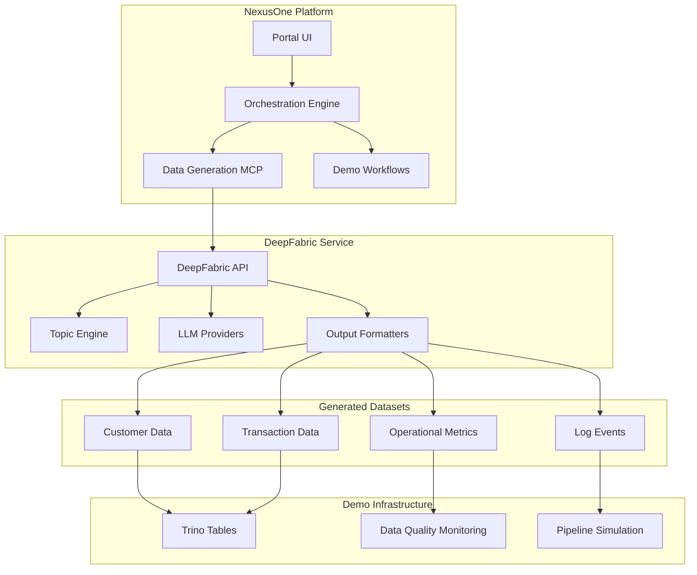

# DeepFabric Integration Plan
## Synthetic Enterprise Data Generation for NexusOne Demo Platform

---

## Executive Summary

This document outlines the integration of DeepFabric synthetic data generation into the NexusOne intelligent data orchestration platform. DeepFabric will provide realistic enterprise datasets for demonstration purposes, enabling comprehensive workflow testing without privacy concerns or data acquisition challenges.

**Integration Goals:**
- Generate realistic enterprise datasets for demo scenarios
- Support multiple data domains (financial, operational, customer)
- Enable on-demand data generation through NexusOne workflows
- Demonstrate AI-powered data product creation capabilities

---

## DeepFabric Overview

### Core Capabilities
- **AI-Powered Generation**: Uses LLMs (OpenAI, Anthropic, Ollama) for contextual data creation
- **Topic Modeling**: Hierarchical topic trees for structured domain exploration
- **Multi-Format Output**: Support for various data formats and schemas
- **Configurable Scenarios**: YAML-based configuration for different use cases

### Architecture
```
Topic Generation → Dataset Generation Engine → Format Export
     ↓                      ↓                      ↓
Topic Trees/Graphs → LLM Synthesis → Structured Data Output
```

### Key Features
- Python API and CLI interface
- Multiple AI model provider support
- Hugging Face integration
- Flexible configuration system
- Modular dataset generation

---

## Integration Architecture

### High-Level Integration Pattern



### Integration Points

1. **MCP Server**: Custom Model Context Protocol server for DeepFabric
2. **API Gateway**: RESTful interface for data generation requests
3. **Workflow Integration**: Embedded in NexusOne demo workflows
4. **Data Pipeline**: Automated ingestion into demo infrastructure

---

## Implementation Strategy

### Phase 1: Foundation Setup (Week 1)

#### 1.1 DeepFabric Installation & Configuration
```bash
# Install DeepFabric
pip install deepfabric

# Configure for enterprise scenarios
mkdir -p /mnt/blockstorage/paper-lens/data-generation
cd /mnt/blockstorage/paper-lens/data-generation
```

#### 1.2 Basic Configuration Files
Create YAML configurations for enterprise scenarios:

**Customer Data Configuration** (`customer-data.yaml`):
```yaml
name: "enterprise-customers"
description: "Realistic customer data for SaaS platform demo"
model_provider: "ollama"  # For privacy in demos
model_name: "llama3.1"
topics:
  - customer_demographics
  - subscription_tiers
  - usage_patterns
  - support_interactions
output_format: "parquet"
records_count: 10000
```

**Transaction Data Configuration** (`transaction-data.yaml`):
```yaml
name: "financial-transactions"
description: "Enterprise transaction data with realistic patterns"
model_provider: "ollama"
topics:
  - payment_processing
  - billing_cycles
  - revenue_recognition
  - refunds_chargebacks
output_format: "csv"
records_count: 50000
temporal_patterns: true
```

#### 1.3 MCP Server Development
Create DeepFabric MCP server at `/mnt/blockstorage/paper-lens/backend/mcp-servers/deepfabric/`:

```python
# server.py
from mcp.server import Server
from mcp.types import Tool, TextContent
import deepfabric
import asyncio

class DeepFabricMCP:
    def __init__(self):
        self.server = Server("deepfabric-generator")
        self.setup_tools()

    def setup_tools(self):
        @self.server.list_tools()
        async def list_tools():
            return [
                Tool(
                    name="generate_customer_data",
                    description="Generate realistic customer dataset",
                    inputSchema={
                        "type": "object",
                        "properties": {
                            "count": {"type": "integer", "default": 1000},
                            "scenario": {"type": "string", "default": "saas_customers"}
                        }
                    }
                ),
                Tool(
                    name="generate_transaction_data",
                    description="Generate financial transaction dataset",
                    inputSchema={
                        "type": "object",
                        "properties": {
                            "count": {"type": "integer", "default": 5000},
                            "time_range": {"type": "string", "default": "1_year"}
                        }
                    }
                )
            ]
```

### Phase 2: Core Integration (Week 2)

#### 2.1 Enterprise Data Scenarios

**Scenario 1: SaaS Customer Analytics**
- Customer demographics and firmographics
- Subscription history and changes
- Feature usage patterns
- Support ticket correlation

**Scenario 2: E-commerce Operations**
- Product catalog and inventory
- Order processing workflows
- Customer journey analytics
- Supply chain events

**Scenario 3: Financial Services**
- Transaction processing
- Risk assessment data
- Compliance monitoring
- Fraud detection patterns

#### 2.2 Data Pipeline Integration

```python
# data_generation_service.py
class DataGenerationService:
    def __init__(self):
        self.deepfabric = DeepFabricAPI()
        self.output_path = "/mnt/blockstorage/paper-lens/generated-data"

    async def generate_demo_dataset(self, scenario: str, count: int):
        """Generate dataset for specific demo scenario"""
        config = self.get_scenario_config(scenario)

        # Generate with DeepFabric
        dataset = await self.deepfabric.generate(
            config=config,
            count=count,
            output_format="parquet"
        )

        # Store for demo access
        output_file = f"{self.output_path}/{scenario}_{count}.parquet"
        dataset.to_parquet(output_file)

        # Register with DataHub
        await self.register_dataset_metadata(output_file, scenario)

        return {
            "status": "success",
            "file_path": output_file,
            "record_count": len(dataset),
            "schema": dataset.schema
        }
```

#### 2.3 Demo Workflow Enhancement

Update existing NexusOne workflows to use generated data:

```typescript
// components/build/DataProductCreationFlow.tsx
const DataGenerationStep = () => {
  const [generating, setGenerating] = useState(false);

  const generateDemoData = async (scenario: string) => {
    setGenerating(true);

    const result = await fetch('/api/data-generation', {
      method: 'POST',
      body: JSON.stringify({
        scenario,
        count: 10000,
        format: 'parquet'
      })
    });

    const dataset = await result.json();

    // Update workflow state with generated dataset
    updateWorkflowContext({
      sourceDataset: dataset.file_path,
      recordCount: dataset.record_count,
      generatedAt: new Date().toISOString()
    });

    setGenerating(false);
  };

  return (
    <div className="data-generation-step">
      <h3>Demo Data Generation</h3>
      <DataScenarioSelector onGenerate={generateDemoData} />
      {generating && <GenerationProgress />}
    </div>
  );
};
```

### Phase 3: Advanced Features (Week 3)

#### 3.1 Real-time Data Simulation

Implement streaming data generation for pipeline demos:

```python
# streaming_generator.py
class StreamingDataGenerator:
    def __init__(self):
        self.deepfabric = DeepFabricAPI()
        self.kafka_producer = KafkaProducer()

    async def simulate_live_data(self, scenario: str, rate_per_second: int):
        """Generate streaming data for pipeline demos"""
        while True:
            # Generate small batch
            batch = await self.deepfabric.generate_batch(
                scenario=scenario,
                size=rate_per_second
            )

            # Send to Kafka for pipeline ingestion
            for record in batch:
                await self.kafka_producer.send(
                    topic=f"demo-{scenario}",
                    value=record
                )

            await asyncio.sleep(1)
```

#### 3.2 Quality Issue Simulation

Generate datasets with intentional quality issues for monitoring demos:

```yaml
# quality-issues.yaml
name: "data-quality-demo"
description: "Dataset with realistic quality issues"
quality_issues:
  - type: "missing_values"
    columns: ["email", "phone"]
    percentage: 5
  - type: "duplicate_records"
    percentage: 2
  - type: "format_inconsistency"
    columns: ["date_format"]
    patterns: ["YYYY-MM-DD", "MM/DD/YYYY"]
  - type: "outliers"
    columns: ["transaction_amount"]
    outlier_rate: 1
```

#### 3.3 Integration with NexusOne Workflows

**Query Development Workflow**:
```typescript
// Enhanced query development with generated data
const QueryDevelopmentWorkflow = () => {
  const [queryContext, setQueryContext] = useState({
    naturalLanguageInput: "",
    generatedSQL: "",
    sampleDataset: null
  });

  const enhanceQueryWithSampleData = async (naturalLanguage: string) => {
    // Generate relevant sample dataset
    const sampleData = await generateContextualData({
      query_intent: naturalLanguage,
      size: 1000,
      realistic_patterns: true
    });

    // Use sample data to improve SQL generation
    const enhancedSQL = await generateSQL({
      natural_language: naturalLanguage,
      sample_schema: sampleData.schema,
      sample_data: sampleData.preview
    });

    setQueryContext({
      naturalLanguageInput: naturalLanguage,
      generatedSQL: enhancedSQL,
      sampleDataset: sampleData
    });
  };
};
```

### Phase 4: Production Integration (Week 4)

#### 4.1 Performance Optimization

- Implement dataset caching for common scenarios
- Add background generation for large datasets
- Optimize memory usage for streaming scenarios

#### 4.2 Configuration Management

```typescript
// config/deepfabric-scenarios.ts
export const DEMO_SCENARIOS = {
  SAAS_CUSTOMERS: {
    name: "SaaS Customer Analytics",
    config: "customer-data.yaml",
    default_size: 10000,
    generation_time: "~2 minutes"
  },
  ECOMMERCE_ORDERS: {
    name: "E-commerce Order Processing",
    config: "ecommerce-orders.yaml",
    default_size: 25000,
    generation_time: "~5 minutes"
  },
  FINANCIAL_TRANSACTIONS: {
    name: "Financial Transaction Processing",
    config: "transaction-data.yaml",
    default_size: 50000,
    generation_time: "~10 minutes"
  }
};
```

#### 4.3 API Endpoints

```typescript
// app/api/data-generation/route.ts
export async function POST(request: Request) {
  const { scenario, count, format } = await request.json();

  try {
    const result = await dataGenerationService.generate({
      scenario,
      count,
      format,
      quality_profile: "high_realism"
    });

    return NextResponse.json({
      success: true,
      dataset: result,
      metadata: {
        generated_at: new Date().toISOString(),
        record_count: result.count,
        file_size: result.size_mb
      }
    });
  } catch (error) {
    return NextResponse.json({
      success: false,
      error: error.message
    }, { status: 500 });
  }
}
```

---

## Demo Use Cases

### Use Case 1: Pipeline Failure Investigation
**Scenario**: Demonstrate root cause analysis using generated transaction data
- Generate transaction dataset with quality issues
- Simulate pipeline failure
- Show AI-powered investigation workflow
- Demonstrate automated fix suggestions

### Use Case 2: Query Optimization
**Scenario**: Show query performance improvement using customer analytics data
- Generate large customer dataset (100K+ records)
- Create intentionally slow query
- Demonstrate AI optimization suggestions
- Show performance before/after metrics

### Use Case 3: Data Product Creation
**Scenario**: Build complete data product from generated e-commerce data
- Generate multi-table e-commerce dataset
- Show natural language to SQL workflow
- Demonstrate automated testing and validation
- Show deployment to production-like environment

### Use Case 4: Real-time Monitoring
**Scenario**: Live data quality monitoring dashboard
- Stream generated data in real-time
- Show quality metrics updating live
- Demonstrate alert generation and response
- Show automated remediation workflows

---

## Technical Requirements

### Infrastructure
- **Compute**: 8GB+ RAM for large dataset generation
- **Storage**: 50GB+ for generated datasets and caching
- **Network**: Stable connection for LLM API calls (if using cloud models)

### Dependencies
```bash
# Core dependencies
pip install deepfabric>=0.1.0
pip install pandas>=2.0.0
pip install pyarrow>=10.0.0

# Integration dependencies
pip install fastapi>=0.100.0
pip install kafka-python>=2.0.0
pip install mcp-sdk>=0.1.0
```

### Configuration
```yaml
# config/deepfabric.yaml
deepfabric:
  model_provider: "ollama"  # Local for demos
  model_name: "llama3.1"
  cache_enabled: true
  cache_directory: "/tmp/deepfabric-cache"
  max_workers: 4

scenarios_directory: "./data-generation/scenarios"
output_directory: "/mnt/blockstorage/paper-lens/generated-data"
```

---

## Success Metrics

### Integration Success
- [ ] DeepFabric successfully installed and configured
- [ ] MCP server operational and responsive
- [ ] All demo scenarios generating realistic data
- [ ] Integration with existing NexusOne workflows complete

### Demo Effectiveness
- [ ] Datasets are realistic and demonstrate platform capabilities
- [ ] Generation time under 5 minutes for standard demo datasets
- [ ] Quality issues accurately simulate real-world problems
- [ ] Workflows showcase AI-powered intelligence effectively

### Technical Performance
- [ ] Memory usage under 4GB during generation
- [ ] Generated datasets validate against defined schemas
- [ ] Streaming simulation maintains consistent data rates
- [ ] No performance degradation in existing platform features

---

## Implementation Timeline

### Week 1: Foundation
- [ ] Install and configure DeepFabric
- [ ] Create basic scenario configurations
- [ ] Develop MCP server framework
- [ ] Test basic data generation

### Week 2: Integration
- [ ] Implement core enterprise scenarios
- [ ] Build data pipeline integration
- [ ] Update demo workflows
- [ ] Create API endpoints

### Week 3: Enhancement
- [ ] Add streaming data simulation
- [ ] Implement quality issue generation
- [ ] Optimize performance
- [ ] Add advanced configuration options

### Week 4: Production
- [ ] Complete testing and validation
- [ ] Deploy to demo environment
- [ ] Create documentation and guides
- [ ] Train team on new capabilities

---

## Risk Mitigation

### Technical Risks
| Risk | Probability | Impact | Mitigation |
|------|-------------|--------|------------|
| Generation performance issues | Medium | High | Pre-generate common datasets, implement caching |
| Memory consumption | Medium | Medium | Stream processing, chunk generation |
| LLM API reliability | Low | High | Local model fallback (Ollama) |
| Data quality variance | Medium | Low | Validation rules, quality scoring |

### Integration Risks
| Risk | Probability | Impact | Mitigation |
|------|-------------|--------|------------|
| Workflow disruption | Low | High | Gradual rollout, fallback to static data |
| Performance regression | Medium | Medium | Load testing, monitoring |
| Configuration complexity | Medium | Low | Simplified defaults, documentation |

---

## Future Enhancements

### Phase 2 Capabilities
- **Multi-tenant data generation**: Separate datasets per demo audience
- **Interactive scenario builder**: UI for creating custom data scenarios
- **Advanced correlation**: Cross-table relationships and referential integrity
- **Temporal patterns**: Seasonality and trend simulation

### Phase 3 Capabilities
- **ML model training data**: Labeled datasets for model demonstrations
- **Industry-specific templates**: Healthcare, finance, retail specializations
- **Compliance simulation**: GDPR, HIPAA data handling scenarios
- **Advanced analytics**: Pre-built insights and anomaly patterns

---

## Conclusion

The DeepFabric integration will significantly enhance NexusOne's demonstration capabilities by providing realistic, privacy-safe enterprise datasets. This integration supports our core mission of intelligent data orchestration while enabling comprehensive workflow demonstrations that showcase the platform's true value proposition.

The phased approach ensures minimal disruption to existing capabilities while progressively adding sophisticated data generation features that make demos more compelling and realistic.