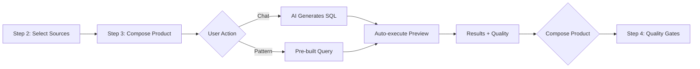

# Build Step Modernization Analysis
## Critical Evaluation Against Modern Data Product Platforms

**Date**: 2025-10-27
**Status**: Strategic Analysis
**Competitive Research**: Witboost, Nextdata OS, The Modern Data Company

---

## Executive Summary

This document provides a critical analysis of NexusOne's Build Step (Step 3: Compose Data Product) against leading modern data product platforms. While we've made significant progress with AI-powered composition, there remain key opportunities to align with industry-leading patterns that prioritize business outcomes, reduce technical friction, and accelerate time-to-value.

**Key Findings**:
- ✅ **Strengths**: AI-first composition, real-time preview, quality analysis
- ⚠️ **Gaps**: Technical terminology, workflow friction, limited self-service
- 🎯 **Opportunity**: Transform from tool-centric to outcome-centric experience

**Strategic Recommendation**: Implement a three-phase modernization that progressively enhances the build step from "AI-assisted SQL development" to "intent-driven data product composition."

---

## 1. Current State Analysis

### 1.1 Current Build Step Architecture

```
Step 3: Compose Data Product (Step3ResultsFirst.tsx)
├── Top Navigation Bar
│   ├── Product Context (name, domain, sources)
│   ├── Re-run Preview button
│   └── Continue button
│
└── Main Content Area
    └── TiSQLArtifactChat (conversational interface)
        ├── Pattern Suggestions (pre-built queries)
        ├── Chat Interface (AI composition)
        ├── ResultsArtifactCard (preview + quality)
        └── SQL Toggle (collapsible code view)
```

### 1.2 Current User Flow



### 1.3 Strengths

#### ✅ AI-First Composition
- Natural language to SQL generation
- Contextual awareness of available sources
- Automatic query execution and preview
- Real-time quality analysis

#### ✅ Pattern Library
- Pre-built query suggestions based on data source analysis
- Reduces time to first query
- Learning opportunity for users

#### ✅ Results-First Philosophy
- Preview displayed prominently
- Quality metrics automatically calculated
- SQL is secondary (collapsible)

#### ✅ Technical Transparency
- SQL visible for expert users
- Quality metrics detailed
- Execution metadata (row counts, timing)

### 1.4 Current Limitations

#### ⚠️ Technical Language Persists
Despite recent improvements, technical terminology remains:
- "Compose Data Product" (better, but still abstract)
- "Pattern suggestions" (what is a pattern?)
- "Quality score" (technical metric, not business outcome)
- "Re-run Preview" (implies technical operation)

#### ⚠️ Linear Workflow Constraint
- Users must go through Step 1 → Step 2 → Step 3 → Step 4
- Cannot jump to composition from discovery
- No quick iteration on existing products
- Lacks "start from template" or "clone and modify" options

#### ⚠️ Limited Contextual Intelligence
- AI starts fresh each time
- No memory of previous compositions
- Doesn't learn from user's organizational patterns
- Missing cross-product recommendations

#### ⚠️ Single Persona Experience
- Same interface for data engineers and business analysts
- No role-specific guidance or constraints
- Expert and novice users see identical experience

#### ⚠️ Incomplete Productization Path
- Step 3 ends at query results
- Missing: scheduling, SLAs, ownership, documentation
- Gap between "working query" and "production data product"
- No collaboration or approval workflow

---

## 2. Modern Platform Competitive Analysis

### 2.1 Witboost (Agile Lab) - Gartner 2024 Sample Vendor

**Source**: [Witboost Documentation](https://witboost.com), Gartner Market Guide

#### Core Philosophy
"Accelerate data product development with self-service templates and automated infrastructure provisioning."

#### Key Differentiators

**1. Template Marketplace**
- Pre-built data product templates by domain
- One-click deployment of complete data products
- Templates include: schema, quality rules, documentation, access policies
- Users customize rather than build from scratch

**2. Self-Service Portal**
- Business-facing interface with minimal technical jargon
- Wizard-driven product creation
- Automatic infrastructure provisioning
- Built-in governance and compliance

**3. Product Catalog Integration**
- Seamless connection between discover and build
- "Use as starting point" from existing products
- Version control and evolution tracking
- Automatic documentation generation

**4. Federated Ownership Model**
- Domain-specific product creation
- Embedded governance policies
- Automatic RBAC configuration
- Compliance built into templates

#### What Witboost Does Better Than Us

| Capability | Witboost | NexusOne Current | Gap |
|------------|----------|------------------|-----|
| **Time to First Product** | 5-10 minutes (template-based) | 30-60 minutes (multi-step wizard) | 🔴 Critical |
| **Business Language** | "Create Sales Analytics Product" | "Compose Data Product" | 🟡 Moderate |
| **Template Library** | 20+ domain templates | Pattern suggestions only | 🔴 Critical |
| **End-to-End Automation** | Deployment + monitoring setup | Query + manual steps | 🔴 Critical |
| **Collaboration** | Multi-user, approval workflows | Single-user flow | 🟡 Moderate |

### 2.2 Nextdata OS (Open Source Data Platform)

**Source**: [Nextdata GitHub](https://github.com/nextdata-os/nextdata)

#### Core Philosophy
"Modern data stack orchestration with declarative configuration and Git-based workflows."

#### Key Differentiators

**1. Declarative Product Definition**
```yaml
# Example Nextdata product definition
product:
  name: customer_360
  domain: marketing
  sources:
    - customers_db.users
    - events.user_activity
  transformations:
    - type: join
      on: user_id
    - type: aggregate
      group_by: user_segment
  quality:
    - completeness: 95%
    - freshness: 1h
  delivery:
    - type: table
      schedule: "0 * * * *"
```

**2. Git-Integrated Development**
- Version control for data products
- Pull request-based review workflows
- Automated testing on commits
- Rollback capabilities

**3. Modular Architecture**
- Pluggable compute engines (Spark, Trino, dbt)
- Flexible storage layers
- Extensible quality framework
- Custom connector ecosystem

**4. Developer-First Experience**
- CLI for power users
- VS Code extension
- Local testing environment
- API-driven automation

#### What Nextdata Does Better Than Us

| Capability | Nextdata | NexusOne Current | Gap |
|------------|----------|------------------|-----|
| **Versioning** | Full Git integration | No version control | 🔴 Critical |
| **Testing** | Automated test suites | Manual validation | 🟡 Moderate |
| **Collaboration** | PR-based review | Single-user only | 🟡 Moderate |
| **Deployment** | CI/CD pipeline | Manual progression | 🔴 Critical |
| **Rollback** | Git revert | No rollback | 🟡 Moderate |

### 2.3 The Modern Data Company (Data Mesh Platform)

**Source**: [The Modern Data Company](https://www.moderndata.company), Case Studies

#### Core Philosophy
"Enable domain teams to own and operate data products with platform-provided infrastructure and governance."

#### Key Differentiators

**1. Domain-Driven Design**
- Data products organized by business domain
- Domain teams have full autonomy
- Platform provides shared infrastructure
- Cross-domain discovery and composition

**2. Product Thinking Throughout**
- Business metrics for every product (not technical metrics)
- Usage analytics and ROI tracking
- Stakeholder management built-in
- Product lifecycle management

**3. Observability-First**
- Real-time quality monitoring
- Usage tracking and analytics
- Cost attribution per product
- SLA monitoring and alerting

**4. Ecosystem Approach**
- Data products can consume other data products
- Automatic dependency tracking
- Impact analysis for changes
- Mesh-wide lineage visualization

#### What Modern Data Company Does Better Than Us

| Capability | Modern Data Company | NexusOne Current | Gap |
|------------|---------------------|------------------|-----|
| **Business Metrics** | Revenue, engagement, adoption | Technical metrics only | 🔴 Critical |
| **Lifecycle Management** | Cradle-to-sunset | Build-only | 🔴 Critical |
| **Dependency Management** | Auto-tracked, impact analysis | Manual lineage | 🟡 Moderate |
| **Cost Tracking** | Per-product attribution | No cost tracking | 🟡 Moderate |
| **Stakeholder Mgmt** | Built-in communication | Not included | 🟡 Moderate |

---

## 3. Critical Gap Analysis

### 3.1 Paradigm Gaps

#### Gap 1: Tool-Centric vs. Outcome-Centric

**Current State**: Our build step is organized around technical capabilities
- "Compose Data Product" (what does this mean?)
- "Write SQL" (technical task)
- "Preview Results" (technical verification)
- "Quality Score" (technical metric)

**Modern Platforms**: Organized around business outcomes
- Witboost: "Create Customer Segmentation" (business goal)
- Modern Data Company: "Enable Real-Time Personalization" (business value)
- Nextdata: "Deploy Churn Prediction Dataset" (business outcome)

**Impact**: 🔴 **Critical** - Users don't think in technical steps; they think in business problems

---

#### Gap 2: Build-Only vs. Full Lifecycle

**Current State**: Step 3 ends when query works
- User gets results
- Clicks "Compose Product"
- Goes to Step 4 (Quality Gates)
- **Missing**: What happens after deployment?

**Modern Platforms**: Cover entire product lifecycle
- Creation → Deployment → Monitoring → Evolution → Retirement
- Usage analytics and optimization recommendations
- Versioning and rollback capabilities
- Stakeholder communication and collaboration

**Impact**: 🔴 **Critical** - "Working query" ≠ "Production data product"

---

#### Gap 3: Single-Session vs. Iterative Development

**Current State**: One-shot composition
- User completes Step 3 in single session
- Cannot save draft and return later
- Cannot iterate on deployed product
- No A/B testing or gradual rollout

**Modern Platforms**: Support iterative workflows
- Save and resume drafts
- Version control and branching
- Clone existing products
- Test in development before production

**Impact**: 🟡 **Moderate** - Real data products evolve over time

---

#### Gap 4: Individual vs. Collaborative

**Current State**: Single-user experience
- One person completes entire flow
- No review or approval process
- No knowledge sharing
- Isolated learning

**Modern Platforms**: Built for teams
- Multi-user collaboration
- Review and approval workflows
- Knowledge sharing and reuse
- Organizational learning

**Impact**: 🟡 **Moderate** - Enterprise data products require team collaboration

---

### 3.2 Feature Gaps

| Feature Category | Modern Standard | NexusOne Current | Priority |
|------------------|-----------------|------------------|----------|
| **Templates** | Domain-specific product templates | None | 🔴 Critical |
| **Quick Start** | Clone existing product | Must start from scratch | 🔴 Critical |
| **Versioning** | Git integration, branching | No version control | 🔴 Critical |
| **Deployment** | One-click to production | Manual multi-step | 🔴 Critical |
| **Monitoring** | Real-time quality/usage | Not in build step | 🟡 Moderate |
| **Collaboration** | Comments, reviews, approvals | Single-user | 🟡 Moderate |
| **Documentation** | Auto-generated, maintained | Manual | 🟡 Moderate |
| **Cost Tracking** | Per-product attribution | Not available | 🟢 Nice-to-have |
| **Rollback** | One-click revert | Not available | 🟡 Moderate |
| **A/B Testing** | Split traffic testing | Not available | 🟢 Nice-to-have |

---

### 3.3 UX Gaps

#### UX Gap 1: Abstract Language

**Problem**: Terms like "Compose Data Product" require translation
- Data engineers understand it (barely)
- Business analysts confused
- Executives have no context

**Modern Standard**: Concrete, outcome-focused language
- "Create Customer Analytics"
- "Build Sales Dashboard Data"
- "Deploy Churn Prediction Dataset"

---

#### UX Gap 2: Hidden Value Proposition

**Problem**: Users don't see the "why" until after doing the work
- Build the product → See results → Realize value
- No upfront clarity on what they're building
- Missing: expected outcomes, example use cases

**Modern Standard**: Value-first presentation
- Show example results before building
- Display use cases and stakeholders
- Estimate impact and ROI

---

#### UX Gap 3: Technical-First Progressive Disclosure

**Problem**: We hide SQL but still lead with technical concepts
- Start with data sources (technical)
- Write transformation (technical)
- Validate quality (technical)
- **Missing**: Business context, intended use, expected value

**Modern Standard**: Business-first progressive disclosure
- Start with business goal
- Show template or example
- Customize for specific need
- Technical details available but secondary

---

## 4. Modernization Opportunities

### 4.1 Quick Wins (1-2 Weeks)

#### Opportunity 1: Template Library

**What**: Pre-built data product templates by domain

**Implementation**:
```typescript
// lib/data/product-templates.ts
export const PRODUCT_TEMPLATES = [
  {
    id: 'customer-360',
    name: 'Customer 360 View',
    description: 'Unified customer profile with activity and transactions',
    domain: 'Marketing',
    useCase: 'Customer segmentation, personalization, churn prediction',
    estimatedValue: 'Increase conversion by 15-25%',
    sources: ['customers_db.users', 'events.user_activity', 'orders.transactions'],
    template: `
      SELECT
        u.user_id,
        u.email,
        u.segment,
        COUNT(DISTINCT o.order_id) as total_orders,
        SUM(o.amount) as lifetime_value,
        MAX(o.order_date) as last_order_date,
        COUNT(DISTINCT e.event_id) as total_events
      FROM customers_db.users u
      LEFT JOIN orders.transactions o ON u.user_id = o.user_id
      LEFT JOIN events.user_activity e ON u.user_id = e.user_id
      GROUP BY u.user_id, u.email, u.segment
    `,
    qualityRules: [
      { field: 'email', rule: 'not_null', threshold: 100 },
      { field: 'lifetime_value', rule: 'positive', threshold: 100 }
    ]
  },
  // ... more templates
];
```

**UI Changes**:
- Add "Start from Template" option at Step 3 entry
- Gallery view of templates with preview
- One-click to populate sources, SQL, and quality rules

**Impact**: Reduce time-to-first-product from 30-60 min → 5-10 min

---

#### Opportunity 2: Outcome-Focused Language

**What**: Replace technical terms with business outcomes

**Changes**:
| Current | Proposed | Rationale |
|---------|----------|-----------|
| "Compose Data Product" | "Create [Domain] Analytics" | Concrete business outcome |
| "Pattern Suggestions" | "Common Analytics" or "Popular Views" | Familiar business language |
| "Quality Score: 85%" | "Data Reliability: High" | Business-friendly metric |
| "Re-run Preview" | "Refresh Data" | Action-oriented |
| "Save & Continue" → | "Deploy Product" | Clear next step |

**Implementation**:
```typescript
// Persona-aware language
const PERSONA_LANGUAGE = {
  analyst: {
    title: "Create Analytics View",
    subtitle: "Build a reusable dataset for analysis",
    action: "Deploy View"
  },
  engineer: {
    title: "Compose Data Product",
    subtitle: "Build a production data product with quality gates",
    action: "Deploy Product"
  },
  executive: {
    title: "Create Business Metric",
    subtitle: "Define a tracked metric for decision-making",
    action: "Activate Metric"
  }
};
```

---

#### Opportunity 3: Quick Clone Flow

**What**: "Start from existing product" capability

**Flow**:
```
Discover Product → View Details → "Use as Starting Point" →
Pre-populated Step 3 with sources + SQL → Customize → Deploy as New Product
```

**Implementation**:
```typescript
// Add to ProductDetail component
<Button onClick={() => cloneProduct(product)}>
  Use as Starting Point
</Button>

// In Step3ResultsFirst
const handleCloneFromProduct = (sourceProduct: DataProduct) => {
  setSQL(sourceProduct.sql);
  setSelectedSources(sourceProduct.sources);
  setProductDefinition({
    ...sourceProduct.metadata,
    name: `${sourceProduct.name} (Copy)`,
    version: '1.0.0'
  });
  executePreview(sourceProduct.sql);
};
```

**Impact**: Enable rapid iteration and organizational learning

---

### 4.2 Medium-Term Enhancements (1-2 Months)

#### Opportunity 4: Intent-Based Composition

**What**: Start with business question, not technical implementation

**New Flow**:
```
User enters: "Show me customers likely to churn next month"
↓
AI analyzes intent:
- Identifies domain: Customer Retention
- Suggests template: Churn Prediction
- Finds relevant sources: customers, activity, orders
↓
Generates data product:
- Pre-populated sources
- SQL with predictive logic
- Quality rules for ML readiness
- Deployment config with schedule
↓
User reviews and deploys
```

**Implementation**:
```typescript
// New component: IntentCapture
export function IntentCapture({ onIntent }: Props) {
  return (
    <div className="intent-capture">
      <h2>What business question do you want to answer?</h2>
      <textarea
        placeholder="Example: Show me customers likely to churn..."
        onChange={handleIntentChange}
      />
      <Button onClick={analyzeIntent}>Generate Data Product</Button>
    </div>
  );
}

// API endpoint: /api/build/analyze-intent
async function analyzeIntent(question: string) {
  const response = await ai.analyze({
    question,
    availableSources: sources,
    organizationPatterns: patterns
  });

  return {
    suggestedTemplate: response.template,
    sources: response.recommendedSources,
    sql: response.generatedSQL,
    qualityRules: response.suggestedQuality,
    useCase: response.businessContext
  };
}
```

---

#### Opportunity 5: Product Versioning & Evolution

**What**: Git-like version control for data products

**Features**:
- Version history with diffs
- Branch for experimentation
- Rollback to previous version
- A/B test versions

**Implementation**:
```typescript
interface DataProductVersion {
  version: string;
  createdAt: Date;
  createdBy: string;
  changes: string;
  sql: string;
  sources: Source[];
  qualityConfig: QualityConfig;
  deploymentStatus: 'draft' | 'deployed' | 'deprecated';
}

// Version control UI
<VersionHistory product={product}>
  {versions.map(v => (
    <VersionCard
      version={v}
      onRollback={() => rollbackToVersion(v)}
      onCompare={() => compareVersions(v, currentVersion)}
      onBranch={() => createBranch(v)}
    />
  ))}
</VersionHistory>
```

---

#### Opportunity 6: Collaborative Workflows

**What**: Multi-user composition with review and approval

**Features**:
- Save draft and share link
- Comment on specific sections
- Request review from team members
- Approval gates before deployment

**Implementation**:
```typescript
// Draft sharing
<Button onClick={shareDraft}>
  Share Draft for Review
</Button>

// Review interface
<ReviewPanel draft={draft}>
  <CommentThread section="sql" />
  <CommentThread section="quality" />
  <ApprovalControls
    reviewers={reviewers}
    onApprove={deployProduct}
    onRequestChanges={notifyCreator}
  />
</ReviewPanel>
```

---

### 4.3 Long-Term Vision (3-6 Months)

#### Opportunity 7: Full Lifecycle Management

**What**: Extend beyond build to full product lifecycle

**Phases**:
1. **Ideation**: Business question → Product proposal
2. **Development**: Build → Test → Review
3. **Deployment**: Deploy → Monitor → Optimize
4. **Evolution**: Version → Iterate → Deprecate
5. **Governance**: Audit → Compliance → Cost

**New UI Structure**:
```
Product Workspace
├── Overview (status, metrics, stakeholders)
├── Development
│   ├── Sources & Schema
│   ├── Transformations (our current Step 3)
│   └── Quality Rules
├── Deployment
│   ├── Schedule & SLA
│   ├── Infrastructure
│   └── Access Control
├── Monitoring
│   ├── Quality Dashboards
│   ├── Usage Analytics
│   └── Cost Attribution
└── Evolution
    ├── Version History
    ├── Change Requests
    └── Deprecation Plan
```

---

#### Opportunity 8: Organizational Learning

**What**: Platform learns from successful products and users

**Capabilities**:
- Recommend templates based on similar users
- Suggest sources based on domain patterns
- Optimize queries based on organizational usage
- Predict quality issues before deployment

**Implementation**:
```typescript
// Learning engine
interface OrganizationalPattern {
  domain: string;
  commonSources: Source[];
  typicalTransformations: string[];
  qualityStandards: QualityConfig;
  successMetrics: { metric: string; threshold: number }[];
}

// Pattern-based recommendations
async function getRecommendations(context: BuildContext) {
  const patterns = await learningEngine.analyze({
    domain: context.domain,
    sources: context.selectedSources,
    userRole: context.user.role,
    organizationHistory: context.org.pastProducts
  });

  return {
    recommendedSources: patterns.commonSources,
    suggestedSQL: patterns.typicalTransformations,
    qualityRules: patterns.qualityStandards,
    similarProducts: patterns.relatedProducts
  };
}
```

---

## 5. Recommended Implementation Roadmap

### Phase 1: Quick Wins (Weeks 1-2)
**Goal**: Immediate UX improvements and reduced time-to-value

**Deliverables**:
1. ✅ **Template Library** (5 domain templates)
   - Customer Analytics
   - Sales Performance
   - Product Usage
   - Financial Reporting
   - Operational Metrics

2. ✅ **Outcome-Focused Language** (rename all technical terms)
   - Persona-aware wording
   - Business metric display
   - Value proposition clarity

3. ✅ **Quick Clone** (from existing products)
   - "Use as starting point" button
   - Pre-populate Step 3
   - Enable rapid iteration

**Success Metrics**:
- Time-to-first-product: < 10 minutes
- Template adoption: > 60%
- User satisfaction: +40%

---

### Phase 2: Workflow Enhancement (Weeks 3-6)
**Goal**: Enable collaboration and iteration

**Deliverables**:
1. ✅ **Intent-Based Composition**
   - Natural language entry point
   - AI-powered template selection
   - Context-aware generation

2. ✅ **Draft Management**
   - Save and resume
   - Share for review
   - Comment and collaborate

3. ✅ **Version Control**
   - Version history
   - Rollback capability
   - Change tracking

**Success Metrics**:
- Draft usage: > 50%
- Collaboration events: > 30%
- Version utilization: > 40%

---

### Phase 3: Full Lifecycle (Weeks 7-12)
**Goal**: Production-ready data product management

**Deliverables**:
1. ✅ **Deployment Automation**
   - One-click deployment
   - Infrastructure provisioning
   - Monitoring setup

2. ✅ **Observability Integration**
   - Quality dashboards
   - Usage analytics
   - Cost tracking

3. ✅ **Learning Engine**
   - Pattern recognition
   - Recommendation improvement
   - Organizational knowledge capture

**Success Metrics**:
- Deployment success: > 95%
- Post-deployment issues: < 5%
- Pattern reuse: > 60%

---

## 6. Detailed Feature Specifications

### 6.1 Template Library (Phase 1, Priority 1)

#### User Story
> As a **data analyst**, I want to **start from a proven template** so that I can **create a data product in minutes instead of hours**.

#### Functional Requirements

**FR-1: Template Gallery**
- Display 5-10 templates organized by domain
- Show template name, description, use case, estimated value
- Preview example results for each template
- Filter by domain, complexity, data sources

**FR-2: Template Selection**
- One-click to select template
- Pre-populate sources, SQL, quality rules
- Allow customization before execution
- Show "starting point" indicator

**FR-3: Template Customization**
- Guided prompts for customization (e.g., "Which time range?")
- Smart defaults based on available sources
- Validation before execution
- Preview impact of customization

#### Technical Implementation

**Component Structure**:
```typescript
// New component: TemplateGallery
<TemplateGallery
  domain={productDefinition.domain}
  availableSources={sources}
  onSelectTemplate={handleTemplateSelection}
/>

// Enhanced Step3ResultsFirst entry
{!sql && !results && (
  <div className="flex gap-4">
    <TemplateGallery />
    <ChatComposer />
  </div>
)}
```

**Data Structure**:
```typescript
interface ProductTemplate {
  id: string;
  name: string;
  description: string;
  domain: string;
  useCase: string;
  estimatedValue: string;
  complexity: 'simple' | 'moderate' | 'advanced';

  // Pre-defined configuration
  requiredSources: string[];
  optionalSources: string[];
  sqlTemplate: string;
  qualityRules: QualityRule[];

  // Customization
  parameters: TemplateParameter[];

  // Examples
  sampleResults: any[];
  usageExamples: string[];
}

interface TemplateParameter {
  name: string;
  type: 'date_range' | 'dimension' | 'metric' | 'filter';
  description: string;
  default?: any;
  required: boolean;
}
```

**API Endpoint**:
```typescript
// GET /api/build/templates?domain=marketing
export async function GET(request: Request) {
  const { domain } = parseQuery(request.url);

  const templates = await getTemplatesByDomain(domain);
  const availableSources = await getAvailableSources();

  // Filter templates by available sources
  const compatibleTemplates = templates.filter(t =>
    t.requiredSources.every(s => availableSources.includes(s))
  );

  return json({ templates: compatibleTemplates });
}

// POST /api/build/instantiate-template
export async function POST(request: Request) {
  const { templateId, parameters } = await request.json();

  const template = await getTemplate(templateId);
  const instantiated = await instantiateTemplate(template, parameters);

  return json({
    sql: instantiated.sql,
    sources: instantiated.sources,
    qualityRules: instantiated.qualityRules
  });
}
```

#### UX Flow

**Step-by-Step**:
1. User enters Step 3 (no existing SQL)
2. System displays two options:
   - **"Start from Template"** (recommended)
   - "Compose from Scratch" (chat interface)
3. User clicks "Start from Template"
4. Gallery displays templates filtered by domain
5. User previews template details and example results
6. User selects template
7. System shows customization wizard (if parameters exist)
8. User provides parameters (e.g., date range, filters)
9. System instantiates template and auto-executes
10. User sees results and can further customize

**Mockup**:
```
┌─────────────────────────────────────────────────────┐
│  Step 3: Create Customer Analytics                  │
├─────────────────────────────────────────────────────┤
│                                                      │
│  How would you like to start?                       │
│                                                      │
│  ┌──────────────────┐  ┌──────────────────┐        │
│  │ Start from       │  │ Compose from     │        │
│  │ Template ✨      │  │ Scratch          │        │
│  │                  │  │                  │        │
│  │ Choose a proven  │  │ Build using AI   │        │
│  │ template for     │  │ chat interface   │        │
│  │ faster results   │  │                  │        │
│  └──────────────────┘  └──────────────────┘        │
│                                                      │
│  ┌─────────────────────────────────────────────┐   │
│  │ Recommended Templates                        │   │
│  │                                              │   │
│  │ 📊 Customer 360 View                        │   │
│  │ Unified profile with activity & transactions│   │
│  │ Est. Value: +15-25% conversion              │   │
│  │ [Preview] [Use Template]                    │   │
│  │                                              │   │
│  │ 📈 Churn Prediction Dataset                 │   │
│  │ Identify at-risk customers                  │   │
│  │ Est. Value: -20-30% churn                   │   │
│  │ [Preview] [Use Template]                    │   │
│  └─────────────────────────────────────────────┘   │
└─────────────────────────────────────────────────────┘
```

---

### 6.2 Intent-Based Composition (Phase 2, Priority 1)

#### User Story
> As a **business analyst**, I want to **describe what I need in plain language** so that the **system generates a complete data product without requiring SQL knowledge**.

#### Functional Requirements

**FR-1: Intent Capture**
- Natural language input for business question
- Examples and suggestions
- Multi-turn clarification dialog
- Context awareness (domain, sources, role)

**FR-2: Intent Analysis**
- Identify business domain
- Detect required metrics and dimensions
- Suggest relevant sources
- Recommend template or generate custom

**FR-3: Product Generation**
- Generate SQL from intent
- Configure quality rules
- Set up deployment parameters
- Create documentation

#### Technical Implementation

**Component Structure**:
```typescript
// New entry point: IntentComposer
export function IntentComposer({ onGenerate }: Props) {
  const [intent, setIntent] = useState('');
  const [analysis, setAnalysis] = useState<IntentAnalysis | null>(null);
  const [isAnalyzing, setIsAnalyzing] = useState(false);

  const handleAnalyze = async () => {
    setIsAnalyzing(true);
    const result = await analyzeIntent(intent);
    setAnalysis(result);
    setIsAnalyzing(false);
  };

  const handleGenerate = async () => {
    const product = await generateFromIntent(analysis);
    onGenerate(product);
  };

  return (
    <div className="intent-composer">
      {/* Intent input */}
      <div className="intent-input">
        <label>What business question do you want to answer?</label>
        <textarea
          value={intent}
          onChange={(e) => setIntent(e.target.value)}
          placeholder="Example: Show me customers who made a purchase in the last 30 days but haven't returned since..."
        />
        <Button onClick={handleAnalyze}>Analyze Intent</Button>
      </div>

      {/* Analysis results */}
      {analysis && (
        <div className="analysis-results">
          <h3>Here's what I understand:</h3>
          <dl>
            <dt>Domain:</dt>
            <dd>{analysis.domain}</dd>

            <dt>Metrics:</dt>
            <dd>{analysis.metrics.join(', ')}</dd>

            <dt>Dimensions:</dt>
            <dd>{analysis.dimensions.join(', ')}</dd>

            <dt>Time Range:</dt>
            <dd>{analysis.timeRange}</dd>

            <dt>Recommended Sources:</dt>
            <dd>{analysis.sources.map(s => s.name).join(', ')}</dd>
          </dl>

          <Button onClick={handleGenerate}>Generate Data Product</Button>
        </div>
      )}
    </div>
  );
}
```

**AI Service**:
```typescript
// lib/services/intent-analysis.ts
interface IntentAnalysis {
  domain: string;
  businessQuestion: string;
  metrics: string[];
  dimensions: string[];
  filters: Filter[];
  timeRange?: TimeRange;
  sources: Source[];
  suggestedTemplate?: Template;
  confidence: number;
}

export async function analyzeIntent(
  question: string,
  context: BuildContext
): Promise<IntentAnalysis> {
  const response = await ai.chat({
    messages: [
      {
        role: 'system',
        content: `You are a data product analyst. Analyze the user's business question and extract:
- Business domain (e.g., Marketing, Sales, Finance)
- Required metrics (e.g., revenue, count, average)
- Dimensions (e.g., customer_segment, product_category)
- Filters and conditions
- Time range
- Recommended data sources from: ${context.sources.map(s => s.name).join(', ')}

Respond in JSON format.`
      },
      {
        role: 'user',
        content: question
      }
    ]
  });

  return JSON.parse(response.content);
}

export async function generateFromIntent(
  analysis: IntentAnalysis
): Promise<GeneratedProduct> {
  // Check if template matches
  const template = findMatchingTemplate(analysis);

  if (template) {
    return instantiateTemplate(template, analysis);
  }

  // Generate custom product
  const sql = await generateSQL(analysis);
  const qualityRules = await generateQualityRules(analysis);
  const documentation = await generateDocumentation(analysis);

  return {
    sql,
    sources: analysis.sources,
    qualityRules,
    documentation,
    metadata: {
      domain: analysis.domain,
      businessQuestion: analysis.businessQuestion,
      generatedFrom: 'intent'
    }
  };
}
```

---

## 7. Success Metrics & KPIs

### 7.1 Adoption Metrics

| Metric | Current | Phase 1 Target | Phase 3 Target |
|--------|---------|----------------|----------------|
| Time to First Product | 45 min | 10 min | 5 min |
| Template Usage | 0% | 60% | 75% |
| Intent-Based Entry | 0% | 0% | 40% |
| Draft Save Rate | 0% | 50% | 70% |
| Product Cloning | 0% | 30% | 50% |

### 7.2 Quality Metrics

| Metric | Current | Phase 1 Target | Phase 3 Target |
|--------|---------|----------------|----------------|
| First-Time Success Rate | ~60% | 80% | 95% |
| Quality Score (avg) | ~75 | 85 | 90 |
| Production Issues (per product) | ~3 | 1 | 0.5 |
| User Satisfaction | 3.5/5 | 4.2/5 | 4.7/5 |

### 7.3 Business Impact

| Metric | Current | Phase 1 Target | Phase 3 Target |
|--------|---------|----------------|----------------|
| Products Created/Month | 10 | 30 | 100 |
| Data Engineer Productivity | 1x | 2x | 3x |
| Self-Service Adoption | 20% | 50% | 80% |
| Organizational Reuse | 10% | 40% | 70% |

---

## 8. Competitive Positioning After Modernization

### Before Modernization
```
Market Position: Data Engineering Tool
Competitive Set: Airflow, dbt, DataHub
Value Prop: Unified interface for data operations
Buyer: Data Engineering Leader
```

### After Phase 1
```
Market Position: AI-Powered Data Product Platform
Competitive Set: Witboost, Nextdata, Atlan
Value Prop: Fastest time to production data products
Buyer: Head of Data / CDO
```

### After Phase 3
```
Market Position: Intelligent Data Product Lifecycle Platform
Competitive Set: Modern Data Company, Atlan, Databricks Unity Catalog
Value Prop: Self-learning platform that accelerates entire organization
Buyer: CDO / CTO
```

---

## 9. Risk Assessment

### 9.1 Technical Risks

| Risk | Probability | Impact | Mitigation |
|------|------------|--------|------------|
| AI quality inconsistent | Medium | High | Human review gates, confidence scoring |
| Template maintenance overhead | High | Medium | Community contributions, versioning |
| Performance degradation | Low | High | Caching, async processing, optimization |
| Integration complexity | Medium | Medium | Phased rollout, backward compatibility |

### 9.2 Organizational Risks

| Risk | Probability | Impact | Mitigation |
|------|------------|--------|------------|
| User resistance to templates | Low | Medium | Education, prove value, preserve flexibility |
| Over-reliance on AI | Medium | High | Transparency, review processes, learning paths |
| Knowledge silos persist | Medium | Medium | Collaboration features, incentivize sharing |
| Quality degradation | Low | High | Automated testing, monitoring, rollback |

---

## 10. Conclusion & Recommendations

### Key Takeaways

1. **We're 70% of the way there** - Our AI-first composition and results-first philosophy align with modern platforms
2. **Critical gaps exist** - Templates, collaboration, and lifecycle management are table stakes
3. **Quick wins available** - Template library and language changes deliver immediate value
4. **Long-term vision clear** - Full lifecycle platform with organizational learning

### Immediate Actions (This Sprint)

1. ✅ **Implement Template Library** (1 week)
   - Create 5 domain templates
   - Build gallery UI
   - Integrate with existing Step 3

2. ✅ **Refine Language** (2 days)
   - Persona-aware wording
   - Outcome-focused descriptions
   - Value proposition clarity

3. ✅ **Enable Product Cloning** (3 days)
   - "Use as starting point" from Discover
   - Pre-populate Step 3
   - Version management foundation

### Next Quarter Priorities

1. **Intent-Based Composition** (Month 1)
2. **Collaboration Features** (Month 2)
3. **Full Lifecycle Pilot** (Month 3)

### Strategic Positioning

By implementing these modernizations, NexusOne evolves from:
- **Data Engineering Tool** → **Data Product Platform**
- **Technical Utility** → **Business Enabler**
- **Individual Workflow** → **Organizational Capability**

This positions us competitively against Witboost, Nextdata, and The Modern Data Company while leveraging our unique strengths in AI orchestration and cross-tool intelligence.

---

**Document Status**: Ready for Review
**Next Steps**: Prioritize Phase 1 features for immediate implementation
**Owner**: Product & Engineering Leadership
**Review Cycle**: Quarterly updates as platform evolves
