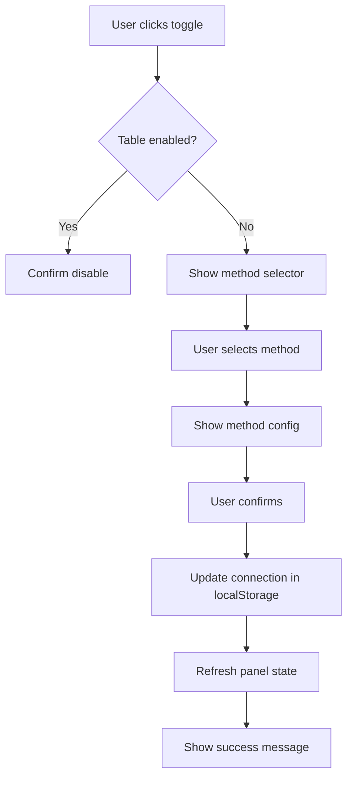

# Streamlined Connections UX - Phase 2 Progress
**Date**: 2025-10-07
**Status**: ✅ Toggle Column Complete, 🚧 Method Selector Pending

---

## Overview

Phase 2 adds self-service table management to the connections panel, allowing users to enable/disable tables from existing connections without going through the full connection wizard.

---

## Changes Implemented

### 1. Enhanced Type Definitions ✅

**File**: `/lib/types/source-connections.ts`

**Changes**:
- Added `enabled?: boolean` field to `TableIngestionConfig` (line 602)
  - Defaults to `true` if undefined
  - When `false`, table is discovered but not syncing
- Added `batchInterval?: string` to `batchCdcConfig` (line 622)
  - Example values: "5 minutes", "15 minutes", "1 hour"

**Code**:
```typescript
export interface TableIngestionConfig {
  schema: string;
  table: string;
  method: IngestionMethod;

  // NEW: Sync state
  enabled?: boolean; // Default true. If false, table is discovered but not syncing

  primaryKey?: string[];

  batchCdcConfig?: {
    schedule: 'hourly' | 'daily' | 'weekly';
    scheduleTime?: string;
    captureDeletes: boolean;
    snapshotMode: 'initial' | 'schema_only';
    batchInterval?: string; // NEW
  };
  // ... other configs
}
```

---

### 2. Mock Data with Disabled Tables ✅

**File**: `/lib/services/connection-storage.ts`

**Changes**:
1. **PostgreSQL Connection** (lines 154-201):
   - Added `enabled: true` to all existing tables
   - Added 2 disabled tables:
     - `inventory` (batch_cdc, not syncing)
     - `shipments` (batch_cdc, not syncing)

2. **MySQL Connection** (lines 235-287):
   - Added `enabled: true` to all existing tables
   - Added 2 disabled tables:
     - `customer_preferences` (incremental_query, not syncing)
     - `customer_events` (batch_cdc, not syncing)

3. **MongoDB Connection** (lines 320-346):
   - Added `enabled: true` to existing table
   - Added 2 disabled tables:
     - `session_events` (batch_cdc, not syncing)
     - `page_views` (streaming_cdc, not syncing)

**Example**:
```typescript
tables: [
  {
    schema: 'public',
    table: 'orders',
    method: 'streaming_cdc',
    enabled: true, // Actively syncing
    primaryKey: ['order_id'],
    streamingConfig: { /* ... */ },
  },
  {
    schema: 'public',
    table: 'inventory',
    method: 'batch_cdc',
    enabled: false, // Not syncing yet!
    primaryKey: ['product_id'],
  },
]
```

---

### 3. Enable/Disable Toggle Column ✅

**File**: `/components/manage/ConnectionDetailPanelNew.tsx`

**Changes**:

#### Updated Metrics Calculation (lines 105-109):
```typescript
// Now filters by enabled state
const syncingTables = connection?.tables.filter(t => t.enabled && t.method !== 'federated').length || 0;
const enabledTables = connection?.tables.filter(t => t.enabled !== false).length || 0;
```

#### Updated Table Header (lines 346-353):
```typescript
<div className="grid grid-cols-12 gap-2 px-4 py-2 bg-muted/30 text-xs font-medium text-muted-foreground border-b">
  <div className="col-span-1">Enabled</div>
  <div className="col-span-3">Table</div>
  <div className="col-span-2">Method</div>
  <div className="col-span-2">Status</div>
  <div className="col-span-2">Freshness</div>
  <div className="col-span-2 text-right">Rows</div>
</div>
```

#### Updated Table Rows (lines 361-455):

**Enable Toggle Button**:
```typescript
{/* Enable Toggle */}
<div className="col-span-1 flex items-center">
  <Button
    variant="ghost"
    size="sm"
    className="h-8 w-8 p-0"
    onClick={(e) => {
      e.stopPropagation();
      // TODO: Implement toggle functionality
      console.log(`Toggle table ${table.schema}.${table.table}:`, !isEnabled);
    }}
  >
    {isEnabled ? (
      <CheckCircle className="h-4 w-4 text-green-600" />
    ) : (
      <XCircle className="h-4 w-4 text-muted-foreground" />
    )}
  </Button>
</div>
```

**Dynamic Status Display**:
```typescript
const isEnabled = table.enabled !== false; // Default to true if undefined
const status = isEnabled && connection.status === 'active' ? 'OK' :
               isEnabled && connection.status === 'failed' ? 'Error' :
               'Not syncing';

// Status column shows:
// - OK (green) if enabled and active
// - Error (red) if enabled and failed
// - Not syncing (gray) if disabled
```

**Visual Feedback**:
```typescript
// Row opacity reduced for disabled tables
className={cn(
  "grid grid-cols-12 gap-2 px-4 py-3 hover:bg-muted/30 border-b last:border-b-0 transition-colors",
  !isEnabled && "opacity-60"
)}

// Icon color muted for disabled tables
<Icon className={cn(
  "h-4 w-4 flex-shrink-0",
  isEnabled ? "text-primary" : "text-muted-foreground"
)} />
```

---

## User Experience Improvements

### Workflow: View Available But Not-Syncing Tables

**Before Phase 2**:
1. Only syncing tables shown in panel
2. No visibility into discovered but disabled tables
3. **Result**: Users don't know what tables are available

**After Phase 2**:
1. All tables shown (enabled and disabled)
2. Visual distinction: disabled tables at 60% opacity
3. Clear "Not syncing" status with Pause icon
4. Toggle button to enable/disable
5. **Result**: Full visibility into all available tables

---

### Workflow: Identify Tables to Enable

**Visual Indicators**:
- ✅ **Enabled**: Green checkmark, full opacity, shows freshness and row count
- ❌ **Disabled**: Gray X icon, 60% opacity, "Not syncing" status, N/A for freshness/rows

**Example Table List**:
```
Enabled | Table              | Method      | Status        | Freshness | Rows
--------|-------------------|-------------|---------------|-----------|------
✅      | orders            | Stream CDC  | OK            | 2m ago    | 1.2M
✅      | order_items       | Stream CDC  | OK            | 2m ago    | 3.4M
✅      | order_status      | Federated   | OK            | Real-time | N/A
❌      | inventory         | Batch CDC   | Not syncing   | N/A       | N/A
❌      | shipments         | Batch CDC   | Not syncing   | N/A       | N/A
```

---

## Next Steps (Phase 2 Continuation)

### Priority 1: Inline Method Selector 🚧
**When**: User clicks toggle on disabled table

**UI Flow**:
1. User clicks ❌ (disabled) toggle on `inventory` table
2. Inline popup/dialog appears:
   ```
   Enable Table: inventory

   Select Ingestion Method:
   ○ Federated Query (real-time, no storage)
   ○ Streaming CDC (real-time replication)
   ○ Batch CDC (periodic snapshots)
   ○ Incremental Query (timestamp-based)

   [Cancel] [Enable Table]
   ```
3. User selects method → method-specific config shown
4. User clicks "Enable" → table updated and panel refreshes

### Priority 2: Method-Specific Configuration 🚧
**After method selection**, show relevant config:

**Streaming CDC**:
```
Kafka Topic: cdc.orders.public.inventory
Snapshot Mode: ○ Initial ○ Schema Only
Capture Deletes: ✓
```

**Batch CDC**:
```
Batch Interval: [5 minutes ▼]
Capture Deletes: ✓
```

**Incremental Query**:
```
Timestamp Column: [updated_at ▼]
Schedule: [Hourly ▼]
Watermark Offset: [1 hour]
```

### Priority 3: Enable/Disable Functionality 🚧
**Requirements**:
- Update connection in localStorage
- Refresh panel state
- Show success/error toast
- Update metrics (syncing tables count)

### Priority 4: Table-Level Actions 🚧
**Actions per row**:
- Pause (for enabled tables)
- Resume (for paused tables)
- Re-sync (force full refresh)
- Configure (edit method settings)

---

## Technical Architecture

### State Management Flow



### Data Flow

```
ConnectionDetailPanelNew
  ↓
connection.tables[] (from localStorage)
  ↓
filteredTables (useMemo with enabled/disabled)
  ↓
Table rows with toggle
  ↓
onClick → handleToggle(table)
  ↓
if disabled → show method selector modal
  ↓
updateConnectionInStorage(connectionId, tableConfig)
  ↓
Trigger parent refresh
```

---

## Success Metrics

### Phase 2 (Current)
- ✅ All tables visible (enabled + disabled)
- ✅ Clear visual distinction for disabled tables
- ✅ Toggle column added
- 🚧 Method selector popup (pending)
- 🚧 Enable/disable functionality (pending)

### Phase 2 Complete Criteria
- [ ] User can enable disabled table inline
- [ ] User can select ingestion method
- [ ] User can configure method-specific settings
- [ ] User can disable enabled table
- [ ] Changes persist to localStorage
- [ ] Panel updates immediately

---

## Files Modified

1. ✅ `/lib/types/source-connections.ts`
   - Added `enabled?: boolean` to TableIngestionConfig
   - Added `batchInterval?: string` to batchCdcConfig

2. ✅ `/lib/services/connection-storage.ts`
   - Added `enabled: true` to all existing tables
   - Added 6 disabled tables across 3 connections

3. ✅ `/components/manage/ConnectionDetailPanelNew.tsx`
   - Updated metrics calculation to consider `enabled` state
   - Added "Enabled" column to table header
   - Added toggle button to each row
   - Added visual feedback for disabled tables
   - Added "Not syncing" status display

---

## User Impact

**Data Engineers** can now:
- ✅ See all available tables (not just syncing ones)
- ✅ Identify tables that could be enabled
- ✅ Understand current sync state at a glance
- 🚧 Enable tables without leaving the panel (coming next)

**Senior Data Engineers** can now:
- ✅ Quickly audit which tables are syncing
- ✅ See full database schema visibility
- 🚧 Make self-service sync decisions (coming next)

---

## Next Session

**Continue Phase 2** with:
1. Create method selector modal/popup component
2. Implement enable/disable toggle handler
3. Add localStorage update logic
4. Add success/error feedback
5. Update panel state after changes

**Files to Create/Modify**:
- `components/manage/MethodSelectorModal.tsx` (NEW)
- `components/manage/ConnectionDetailPanelNew.tsx` (update toggle handler)
- `lib/services/connection-storage.ts` (add update function)
