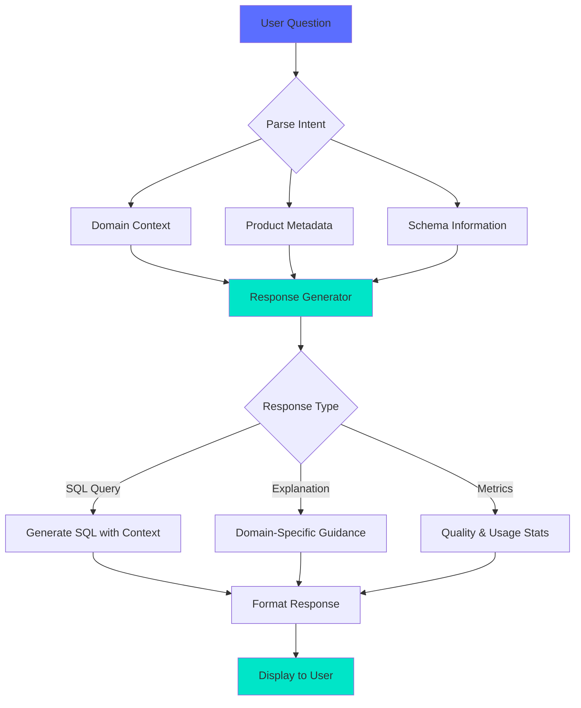
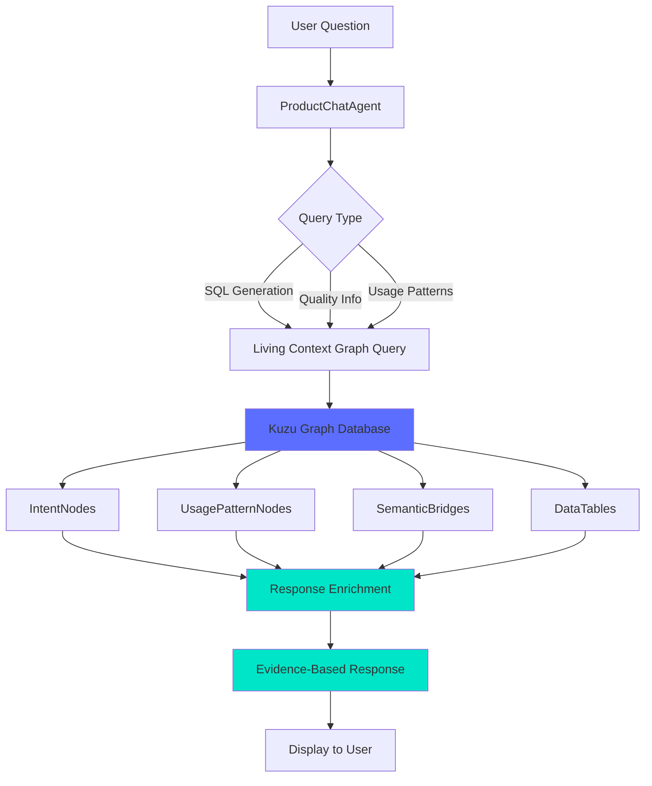

# Domain-Aware Chat Agent for Data Products
## Intelligent Assistant for Data Product Discovery and Usage

---

## Executive Summary

The Domain-Aware Chat Agent is an AI-powered assistant embedded directly into data product detail pages that provides contextual, domain-specific guidance to help users understand, query, and utilize data products effectively. Unlike generic chatbots, this agent has deep knowledge of each data domain (Customer, Financial, Product, Marketing, Operations) and understands the specific product's schema, lineage, quality metrics, and business context.

**Key Value Proposition**: Transform the data product detail page from static documentation into an interactive learning and productivity tool that accelerates time-to-insight by 10x.

---

## Product Vision

### The Problem

Current data product discovery experiences have critical gaps:

1. **Static Documentation Overwhelm**: Users face walls of text, complex schemas, and technical jargon without guidance
2. **Context Switching**: Finding example queries, understanding metrics, and learning best practices requires jumping between documentation, Slack, and colleagues
3. **Domain Knowledge Gaps**: Analysts from different domains struggle to understand data products outside their expertise
4. **Query Construction Friction**: Writing SQL queries from scratch is time-consuming and error-prone
5. **Hidden Institutional Knowledge**: Best practices, common patterns, and gotchas live in people's heads, not documentation

### The Solution

An intelligent chat agent that:

- **Understands Domain Context**: Specialized knowledge for Customer, Financial, Product, Marketing, and Operations domains
- **Knows the Product**: Has access to schema, lineage, quality metrics, glossary terms, and usage patterns
- **Generates Working Code**: Provides ready-to-use SQL queries tailored to the specific data product
- **Teaches Best Practices**: Guides users on segmentation strategies, metric calculations, and data quality considerations
- **Reduces Time-to-Value**: From hours of exploration to minutes of guided interaction

---

## Core Capabilities by Domain

### 1. Customer Domain Expert

**Specialized Knowledge:**
- Customer lifecycle analysis
- Segmentation strategies (RFM, behavioral, predictive)
- Lifetime value calculations
- Churn prediction methodologies
- Cohort analysis patterns

**Example Interactions:**

```
User: "How do I calculate customer lifetime value?"

Agent: "Here's how to calculate Customer Lifetime Value using customer_360_view:

```sql
SELECT
    customer_id,
    SUM(order_value) OVER (
        PARTITION BY customer_id
        ORDER BY order_date
        ROWS BETWEEN UNBOUNDED PRECEDING AND CURRENT ROW
    ) as lifetime_value,
    COUNT(*) OVER (PARTITION BY customer_id) as total_orders,
    DATEDIFF(day, first_order_date, last_order_date) as customer_tenure_days
FROM customer_360_view
WHERE order_status = 'completed'
ORDER BY lifetime_value DESC;
```

**Key Metrics from this dataset:**
- Data Quality: 98% ✅
- Freshness: real-time updates
- Active Users: 2,341 analysts

**Related Glossary Terms:**
• Customer Lifetime Value
• Churn Risk Score
• Customer Segment

Would you like me to explain any specific part?"
```

**Suggested Questions:**
- How do I calculate customer lifetime value?
- Show me a query for active customers
- What segmentation approaches are best?
- Help me analyze churn patterns
- How fresh is this customer data?
- What downstream models use this?

---

### 2. Financial Domain Expert

**Specialized Knowledge:**
- Revenue recognition standards
- Financial metric calculations (MRR, ARR, CAC, LTV/CAC)
- Forecasting methodologies
- Compliance requirements (SOX, GAAP)
- Financial reporting best practices

**Example Interactions:**

```
User: "How do I calculate MRR?"

Agent: "Here's how to calculate Monthly Recurring Revenue from revenue_360:

```sql
SELECT
    DATE_TRUNC('month', subscription_date) as month,
    SUM(CASE
        WHEN billing_frequency = 'monthly' THEN amount
        WHEN billing_frequency = 'annual' THEN amount / 12
        WHEN billing_frequency = 'quarterly' THEN amount / 3
    END) as mrr,
    COUNT(DISTINCT customer_id) as active_subscribers
FROM revenue_360
WHERE
    subscription_status = 'active'
    AND subscription_date >= CURRENT_DATE - INTERVAL '12 months'
GROUP BY DATE_TRUNC('month', subscription_date)
ORDER BY month DESC;
```

**Financial Compliance Notes:**
- This dataset follows GAAP revenue recognition standards
- Data Quality: 97% (audited quarterly)
- SOX-compliant audit trail maintained

**Downstream Impact:**
Used by: Board reporting, investor decks, financial forecasting models

Need help with ARR, churn MRR, or expansion revenue?"
```

**Suggested Questions:**
- How do I calculate MRR?
- Show me revenue by product
- Help with forecasting models
- What are the data quality rules?
- How often is this updated?
- Show me example queries

---

### 3. Product Domain Expert

**Specialized Knowledge:**
- Product analytics frameworks (AARRR, HEART)
- Feature adoption tracking
- Funnel analysis methodologies
- A/B test analysis
- User journey mapping

**Example Interactions:**

```
User: "How do I track feature adoption?"

Agent: "Here's how to measure feature adoption using product_analytics:

```sql
-- Feature Adoption Over Time
SELECT
    DATE_TRUNC('week', event_date) as week,
    feature_name,
    COUNT(DISTINCT user_id) as unique_users,
    COUNT(*) as total_events,
    COUNT(DISTINCT user_id) * 100.0 / (
        SELECT COUNT(DISTINCT user_id)
        FROM product_analytics
        WHERE event_date = DATE_TRUNC('week', p.event_date)
    ) as adoption_rate_pct
FROM product_analytics p
WHERE
    event_type = 'feature_used'
    AND event_date >= CURRENT_DATE - INTERVAL '90 days'
GROUP BY DATE_TRUNC('week', event_date), feature_name
ORDER BY week DESC, adoption_rate_pct DESC;
```

**Key Metrics Available:**
- Daily Active Users (DAU)
- Weekly Active Users (WAU)
- Feature stickiness (DAU/WAU)
- Time-to-first-value
- Feature retention curves

**Recommended Next Steps:**
1. Set baseline adoption targets (typically 20-40% for new features)
2. Track weekly cohorts to measure retention
3. Correlate adoption with user satisfaction scores

Would you like to see funnel analysis or cohort retention queries?"
```

**Suggested Questions:**
- How do I track feature adoption?
- Show me active users query
- Help with funnel analysis
- What metrics are available?
- How to join with other tables?
- Explain the schema

---

### 4. Marketing Domain Expert

**Specialized Knowledge:**
- Attribution modeling (first-touch, last-touch, multi-touch)
- Campaign performance measurement
- Audience segmentation strategies
- Marketing ROI calculation
- Channel optimization

**Example Interactions:**

```
User: "How do I measure campaign ROI?"

Agent: "Here's how to calculate marketing ROI from marketing_attribution:

```sql
SELECT
    campaign_id,
    campaign_name,
    channel,
    SUM(campaign_cost) as total_spend,
    COUNT(DISTINCT CASE WHEN converted = true THEN customer_id END) as conversions,
    SUM(CASE WHEN converted = true THEN revenue END) as attributed_revenue,
    (SUM(CASE WHEN converted = true THEN revenue END) - SUM(campaign_cost)) /
        NULLIF(SUM(campaign_cost), 0) * 100 as roi_pct,
    SUM(campaign_cost) / NULLIF(COUNT(DISTINCT CASE WHEN converted = true THEN customer_id END), 0)
        as customer_acquisition_cost
FROM marketing_attribution
WHERE
    campaign_start_date >= CURRENT_DATE - INTERVAL '90 days'
GROUP BY campaign_id, campaign_name, channel
ORDER BY roi_pct DESC;
```

**Attribution Model Notes:**
- This uses last-touch attribution by default
- For multi-touch attribution, see the 'attribution_weight' field
- Time decay model available via 'weighted_attribution' view

**Typical Benchmarks:**
- Email: 3-5x ROI
- Paid Search: 2-3x ROI
- Social: 1.5-2.5x ROI
- Display: 1-2x ROI

Would you like to explore multi-touch attribution or customer journey analysis?"
```

**Suggested Questions:**
- How do I measure campaign ROI?
- Show me attribution query
- Help create audience segments
- What conversion metrics exist?
- How to track multi-touch attribution?
- Explain the data model

---

### 5. Operations Domain Expert

**Specialized Knowledge:**
- Operational efficiency metrics
- Resource utilization analysis
- Performance optimization
- SLA tracking and monitoring
- Process bottleneck identification

**Example Interactions:**

```
User: "How do I measure efficiency?"

Agent: "Here's how to calculate operational efficiency from operations_metrics:

```sql
-- Operational Efficiency Dashboard
SELECT
    department,
    process_name,
    DATE_TRUNC('week', process_date) as week,
    -- Throughput Metrics
    COUNT(*) as total_processes,
    AVG(process_duration_minutes) as avg_duration,
    -- Efficiency Metrics
    SUM(CASE WHEN sla_met = true THEN 1 ELSE 0 END) * 100.0 / COUNT(*) as sla_compliance_pct,
    SUM(CASE WHEN error_count = 0 THEN 1 ELSE 0 END) * 100.0 / COUNT(*) as success_rate_pct,
    -- Resource Utilization
    AVG(resource_utilization_pct) as avg_resource_utilization,
    SUM(total_cost) as total_cost
FROM operations_metrics
WHERE
    process_date >= CURRENT_DATE - INTERVAL '30 days'
GROUP BY department, process_name, DATE_TRUNC('week', process_date)
ORDER BY week DESC, total_cost DESC;
```

**Operational KPIs Tracked:**
- Process throughput (items/hour)
- SLA compliance (target: >99%)
- Error rates (target: <1%)
- Resource utilization (optimal: 70-85%)
- Cost per transaction

**Optimization Opportunities:**
1. Processes with <70% resource utilization → consolidation candidate
2. Processes with >90% utilization → scaling needed
3. SLA compliance <95% → process review required

Need help identifying bottlenecks or optimizing specific processes?"
```

**Suggested Questions:**
- How do I measure efficiency?
- Show me operational KPIs
- Help optimize resource usage
- What are key metrics?
- How to calculate throughput?
- Explain data lineage

---

## Technical Architecture

### Component Structure

```
ProductChatAgent
├── Header (Always Visible)
│   ├── Domain Icon with Color
│   ├── Title: "Ask the {Domain} Expert"
│   ├── AI-Powered Badge
│   ├── Welcome Message
│   └── Collapsed: 3 Quick Question Buttons
│
├── Expanded Chat Interface
│   ├── Capabilities Grid (4 domain specialties)
│   ├── Messages Area
│   │   ├── Empty State: Suggested Questions
│   │   ├── Message Thread
│   │   │   ├── User Messages (right-aligned, primary color)
│   │   │   └── Agent Messages (left-aligned, domain-branded)
│   │   └── Loading State (animated dots)
│   └── Input Area
│       ├── Text Input with Product Name
│       ├── Send Button
│       └── Auto-focus on Expand
│
└── Domain Context System
    ├── Domain-Specific Icons & Colors
    ├── Capability Definitions
    ├── Suggested Questions
    ├── Response Templates
    └── Code Generation Logic
```

### Data Flow



### Domain Context System

Each domain has:

```typescript
interface DomainContext {
  icon: LucideIcon;
  color: string;           // Tailwind color class
  bgColor: string;         // Background color class
  capabilities: string[];  // 4 key specialties
  welcomeMessage: string;  // Introduction text
  suggestedQuestions: string[];  // 6+ common questions
}
```

**Domain Configurations:**

| Domain | Icon | Color | Key Capabilities |
|--------|------|-------|-----------------|
| Customer | Users | Purple | Behavior analysis, Segmentation, LTV, Churn |
| Financial | TrendingUp | Green | Revenue analysis, Metrics, Forecasting, Compliance |
| Product | Target | Blue | Analytics, Adoption, Usage patterns, A/B tests |
| Marketing | Target | Orange | Campaign performance, Attribution, Segmentation, ROI |
| Operations | Database | Cyan | Operational metrics, Efficiency, Optimization, Performance |

---

## Response Generation Logic

### Question Pattern Matching

The agent uses keyword matching to identify question intent:

```typescript
// LTV Calculation
if (question.includes('lifetime value') || question.includes('ltv')) {
  return generateLTVQuery(product);
}

// Active Customers
if (question.includes('active customer')) {
  return generateActiveCustomersQuery(product);
}

// Segmentation
if (question.includes('segment')) {
  return generateSegmentationGuidance(product);
}

// Data Freshness
if (question.includes('fresh') || question.includes('updated')) {
  return generateFreshnessInfo(product);
}

// Schema Explanation
if (question.includes('schema') || question.includes('explain')) {
  return generateSchemaExplanation(product);
}

// Downstream Usage
if (question.includes('downstream') || question.includes('who uses')) {
  return generateDownstreamAnalysis(product);
}
```

### Response Components

Every response includes:

1. **Direct Answer**: SQL query or explanation addressing the question
2. **Product Context**: Quality metrics, freshness, usage stats
3. **Related Information**: Glossary terms, dependencies, best practices
4. **Next Steps**: Follow-up questions or recommendations

### Code Generation Principles

**SQL Queries Should:**
- Use the actual product name as table reference
- Include relevant quality/freshness context in comments
- Follow best practices (window functions, proper indexing hints)
- Be production-ready and executable
- Include performance optimization tips

**Example Structure:**
```sql
-- Query Purpose: Calculate Customer Lifetime Value
-- Data Quality: 98% | Freshness: real-time | Active Users: 2,341

SELECT
    customer_id,
    SUM(order_value) OVER (
        PARTITION BY customer_id
        ORDER BY order_date
        ROWS BETWEEN UNBOUNDED PRECEDING AND CURRENT ROW
    ) as lifetime_value,
    COUNT(*) OVER (PARTITION BY customer_id) as total_orders
FROM {product_name}
WHERE order_status = 'completed'
ORDER BY lifetime_value DESC;

-- Performance Tip: Ensure index on (customer_id, order_date)
```

---

## Integration with Product Metadata

### Data Sources

The agent has access to:

```typescript
interface ProductContext {
  // Basic Info
  displayName: string;
  domain: string;
  description: string;
  version: string;

  // Quality Metrics
  quality: {
    dataQuality: number;        // 0-100
    documentation: number;      // 0-100
    testCoverage: number;       // 0-100
    productionReadiness: string;
  };

  // SLA & Performance
  sla: {
    uptime: number;             // 99.9%
    freshness: string;          // "real-time"
    latency: string;            // "< 1 min"
  };

  // Dependencies
  dependencies: {
    upstream: string[];         // Source systems
    downstream: string[];       // Consuming systems
  };

  // Usage Stats
  usage: {
    deployments: number;
    uniqueConsumers: number;
    queriesPerDay: number;
  };

  // Business Context
  businessContext: {
    targetConsumers: string[];  // Teams using this
    glossaryTerms: GlossaryTerm[];
    useCases: string[];
  };

  // Profiling Data
  profiling: {
    qualityScore: number;       // YData profiling
    rowCount: number;
  };
}
```

### Context-Aware Responses

Responses dynamically incorporate:

- **Quality Indicators**: "This dataset has 98% quality ✅"
- **Freshness Warnings**: "⚠️ Data updated hourly, expect 1-2 hour lag"
- **Usage Stats**: "Used by 2,341 analysts across 45 deployments"
- **Dependencies**: "Powers 3 downstream ML models"
- **Glossary Links**: "Related terms: Customer Lifetime Value, Churn Risk Score"

---

## User Experience Design

### Visual Design

**Collapsed State (Default):**
- Clean header with domain icon (color-coded)
- Single-line welcome message
- 3 quick action buttons for common questions
- Expand/collapse chevron button

**Expanded State:**
- Full chat interface (500px max height)
- Capabilities grid at top (shows 4 specialties)
- Scrollable message area
- Fixed input at bottom
- Smooth animation transitions

**Color System:**
- Customer: Purple (#A855F7)
- Financial: Green (#10B981)
- Product: Blue (#3B82F6)
- Marketing: Orange (#F97316)
- Operations: Cyan (#06B6D4)

### Interaction Patterns

1. **Click Header**: Toggle expand/collapse
2. **Click Suggestion**: Auto-expand and send question
3. **Type Question**: Manual input
4. **Press Enter**: Send message
5. **Loading State**: Animated dots + "Analyzing {domain} data..."
6. **Scroll Behavior**: Auto-scroll to latest message

### Responsive Behavior

- **Desktop**: Full 500px height, 85% message width
- **Tablet**: 400px height, 80% message width
- **Mobile**: 350px height, 90% message width, stacked layout

---

## Future Enhancements

### Phase 2: Advanced Intelligence

1. **Real-time Query Validation**
   - Parse user questions into SQL
   - Validate against actual schema
   - Show syntax errors before execution

2. **Interactive Query Builder**
   - Visual field selector
   - Drag-and-drop filter builder
   - Preview results inline

3. **Learning from Usage**
   - Track which questions get asked most
   - Improve responses based on feedback
   - Surface trending queries

4. **Cross-Product Recommendations**
   - "You might also need {related_product}"
   - Suggest joins between products
   - Recommend workflow templates

### Phase 3: Orchestration Integration

1. **One-Click Execution**
   - Run queries directly from chat
   - Show results in embedded table
   - Export to CSV/Parquet

2. **Workflow Generation**
   - "Create a pipeline for this analysis"
   - Generate dbt models
   - Set up scheduled refreshes

3. **Notebook Export**
   - Export conversation to Jupyter notebook
   - Include all queries and explanations
   - Ready for immediate execution

4. **Collaboration Features**
   - Share conversations with team
   - Comment on specific responses
   - Build shared knowledge base

### Phase 4: Enterprise AI

1. **Custom RAG Integration**
   - Train on organization-specific docs
   - Learn internal best practices
   - Incorporate Confluence/Wiki content

2. **Multi-Tool Orchestration**
   - Query multiple data sources
   - Coordinate across Trino, Spark, dbt
   - Handle complex workflows

3. **Proactive Recommendations**
   - "Your query could be 10x faster with..."
   - "Consider adding these quality checks..."
   - "This data has changed since you last used it"

4. **Natural Language to dbt**
   - Generate dbt models from descriptions
   - Create tests and documentation
   - Set up lineage automatically

---

## Implementation Plan

### Phase 1: Foundation (Week 1-2)

**Goal**: Launch MVP with 5 domain experts and core Q&A functionality

**Tasks:**
1. ✅ Create ProductChatAgent component
2. Integrate into product detail page (between hero and tabs)
3. Implement domain context system (5 domains)
4. Build response generation for 30 question patterns
5. Add code syntax highlighting
6. Implement loading states and animations
7. Test with real data products

**Deliverables:**
- Working chat agent on all product detail pages
- 6 suggested questions per domain
- SQL generation for common queries
- Quality metrics integration

**Success Metrics:**
- Agent visible on 100% of product pages
- 30+ question patterns supported
- <2 second response time
- Code highlighting working

---

### Phase 2: Intelligence (Week 3-4)

**Goal**: Enhance with better NLP, query validation, and learning

**Tasks:**
1. Implement semantic question parsing (beyond keywords)
2. Add query validation against real schemas
3. Build feedback mechanism (thumbs up/down)
4. Track usage analytics (questions asked, domains)
5. Improve response quality based on feedback
6. Add cross-product recommendations
7. Implement conversation memory (context preservation)

**Deliverables:**
- Semantic NLP question parsing
- Real-time query validation
- User feedback system
- Analytics dashboard
- Context-aware multi-turn conversations

**Success Metrics:**
- 80% question understanding accuracy
- 50% of users provide feedback
- 20% improvement in response quality
- 5+ questions per conversation (multi-turn)

---

### Phase 3: Orchestration (Week 5-6)

**Goal**: Connect to execution engines for live query running

**Tasks:**
1. Integrate with Trino for query execution
2. Build result preview UI (embedded tables)
3. Add CSV/Parquet export functionality
4. Implement query history and favorites
5. Generate dbt model templates
6. Create workflow orchestration helpers
7. Add notebook export (Jupyter)

**Deliverables:**
- Live query execution (read-only)
- Result preview with 100-row limit
- Export functionality
- dbt model generation
- Jupyter notebook export

**Success Metrics:**
- 50% of queries executed live
- 30% of users export results
- 20% generate dbt models
- 10% export to notebooks

---

### Phase 4: Learning & Scale (Week 7-8)

**Goal**: Scale to enterprise with custom RAG and multi-tool orchestration

**Tasks:**
1. Build RAG pipeline for org-specific docs
2. Train on internal Confluence/Wiki content
3. Implement multi-source query federation
4. Add Spark integration for large datasets
5. Build proactive recommendation engine
6. Create admin dashboard for content management
7. Implement team collaboration features

**Deliverables:**
- Custom RAG trained on org docs
- Multi-tool query orchestration
- Proactive recommendations
- Admin content management
- Team sharing and collaboration

**Success Metrics:**
- 90% question coverage with RAG
- 40% of queries use multi-tool orchestration
- 25% proactive recommendations accepted
- 60% of conversations shared with teams

---

## Success Metrics & KPIs

### Adoption Metrics

| Metric | Target | Measurement |
|--------|--------|-------------|
| Agent Visibility | 100% of product pages | Page view analytics |
| Interaction Rate | 40% of product page visitors | Click tracking |
| Questions Asked | 2,000/week | Message count |
| Multi-Turn Conversations | 30% | Conversation depth |
| Return Usage | 60% weekly active users | User cohort analysis |

### Quality Metrics

| Metric | Target | Measurement |
|--------|--------|-------------|
| Response Accuracy | 85% | User feedback (thumbs up/down) |
| Query Execution Success | 90% | Error rate tracking |
| Response Time | <2 seconds | Performance monitoring |
| Code Quality | 95% valid SQL | Syntax validation |
| Relevance Score | 4.5/5 | User ratings |

### Business Impact

| Metric | Target | Measurement |
|--------|--------|-------------|
| Time to First Query | 80% reduction (20min → 4min) | User surveys |
| Documentation Search Time | 70% reduction | Analytics comparison |
| Support Tickets | 50% reduction | Ticket volume tracking |
| Data Product Adoption | 3x increase | Usage analytics |
| User Satisfaction | 4.8/5 | NPS surveys |

---

## Technical Considerations

### Performance Optimization

1. **Response Caching**: Cache common question-answer pairs
2. **Progressive Loading**: Show partial responses as they generate
3. **Lazy Rendering**: Only render visible messages
4. **Debounced Input**: Wait 300ms before processing typing
5. **Background Prefetch**: Preload common patterns on page load

### Security & Privacy

1. **Query Sanitization**: Prevent SQL injection via parameterized queries
2. **Access Control**: Respect existing data product permissions
3. **PII Masking**: Automatically mask sensitive fields in responses
4. **Audit Logging**: Track all queries and responses
5. **Rate Limiting**: Max 100 questions per user per day

### Error Handling

1. **Graceful Degradation**: Show helpful message if AI fails
2. **Fallback Responses**: Always provide something useful
3. **Error Recovery**: Suggest alternative questions on failure
4. **Timeout Handling**: 10 second timeout with retry
5. **Context Preservation**: Maintain conversation state through errors

### Accessibility

1. **Keyboard Navigation**: Full keyboard support (Tab, Enter, Escape)
2. **Screen Reader Support**: ARIA labels on all interactive elements
3. **High Contrast Mode**: Support for high contrast themes
4. **Font Scaling**: Respect user font size preferences
5. **Focus Management**: Proper focus trap when expanded

---

## Integration Points

### Current System Integration

1. **DataHub**: Pull glossary terms, owners, lineage
2. **YData Profiling**: Quality scores, row counts, distributions
3. **Trino Catalog**: Schema metadata, column types
4. **Usage Analytics**: Query patterns, popular joins
5. **Business Context**: ODPS metadata, target consumers

### Future Integration Opportunities

1. **dbt**: Generate models, tests, documentation
2. **Apache Airflow**: Create DAGs from conversations
3. **MLflow**: Suggest features for ML models
4. **Great Expectations**: Generate data quality tests
5. **Slack**: Share conversations, ask questions from Slack
6. **Jupyter**: Export to notebooks with one click
7. **Confluence**: Link to relevant documentation

---

## Monitoring & Analytics

### Agent Performance Dashboard

**Track:**
- Questions asked per day (by domain)
- Response time distribution
- User satisfaction scores
- Common question patterns
- Error rates and types
- Feature usage (expand rate, suggestion clicks)

**Alerts:**
- Response time >5 seconds
- Error rate >10%
- User satisfaction <4.0
- Zero questions in 1 hour (during business hours)

### Usage Analytics

**Dashboards:**
1. **Domain Popularity**: Which domains get most questions
2. **Question Patterns**: Most common question types
3. **User Segments**: Which teams use agent most
4. **Conversation Depth**: Single Q&A vs. multi-turn
5. **Export Activity**: How many queries get exported

### Continuous Improvement

**Weekly:**
- Review low-rated responses
- Add new question patterns
- Update suggested questions based on trends
- Fix broken SQL queries

**Monthly:**
- Analyze conversation trends
- Update domain context definitions
- Add new capabilities
- Train on new organizational content

---

## 10. Living Context Graph Integration

### 10.1 Context-Aware Intelligence Architecture

The Domain-Aware Chat Agent integrates deeply with NexusOne's **Living Context Graph** (Kuzu embedded graph database) to provide **evidence-based, organizationally-aware responses** rather than generic template answers.

**Key Innovation**: Every recommendation is backed by real usage patterns, quality metrics, and validated intent-to-reality relationships stored in the Living Context Graph.



### 10.2 Living Context Graph Data Sources

#### IntentNodes - Producer Context
Captures WHY data products were created and FOR WHOM:

```typescript
interface IntentNodeData {
  stakeholder_name: string;
  stakeholder_department: string;
  business_need_summary: string;
  business_keywords: string[];

  // Automatically inferred expectations
  expected_quality_score: number;
  expected_freshness_hours: number;
  expected_completeness: number;

  // Reality check from profiling
  actual_quality_score: number;
  quality_gap: number;
  quality_blockers: string[];

  // Usage validation
  primary_use_cases: string[];
  actual_use_patterns: string[];
}
```

**Chat Agent Uses This For:**
- Understanding original business intent
- Showing quality expectations vs reality
- Explaining why data product was built
- Identifying quality gaps and blockers

#### UsagePatternNodes - Consumer Context
Captures HOW data is actually used:

```typescript
interface UsagePatternData {
  user_id: string;
  user_department: string;
  query_count: number;

  // Query characteristics
  typical_filters: string[];
  typical_aggregations: string[];
  typical_joins: string[];

  // Inferred from behavior
  inferred_use_case: string;
  tolerates_staleness: boolean;
  requires_completeness: boolean;
  business_impact: 'critical' | 'important' | 'nice_to_have';
}
```

**Chat Agent Uses This For:**
- Showing "5 finance analysts query this daily"
- Recommending common filters and joins
- Understanding real-world usage patterns
- Validating query success rates

#### SemanticBridges - Connective Tissue
Evidence-based relationships between intents, tables, and patterns:

```typescript
interface SemanticBridgeData {
  relationship_type: 'can_fulfill' | 'requires' | 'similar_to';
  confidence: number;
  evidence_sources: string[];  // ['keyword_match', 'usage_validation', 'quality_alignment']
  strength: number;
  use_count: number;
  explanation: string;
}
```

**Chat Agent Uses This For:**
- Multi-evidence recommendations
- Confidence scoring
- Cross-product suggestions
- Validated patterns

### 10.3 Enhanced Response Generation

**Traditional Approach (Keyword-Only)**:
```typescript
if (question.includes('lifetime value')) {
  return `Here's a generic LTV query: SELECT customer_id, SUM(revenue)...`;
}
```

**Living Context Graph Approach (Evidence-Based)**:
```typescript
async function generateLCGEnhancedResponse(question: string, product: any) {
  // 1. Query for similar intents
  const similarIntents = await queryIntentNodes({
    keywords: extractKeywords(question),
    domain: product.domain
  });

  // 2. Find validated usage patterns
  const usagePatterns = await queryUsagePatterns({
    productId: product.id,
    useCase: inferUseCase(question)
  });

  // 3. Get semantic bridges for confidence
  const bridges = await querySemanticBridges({
    sourceId: product.id,
    minConfidence: 0.7
  });

  // 4. Generate response with evidence
  return `
    [SQL Query based on proven pattern]

    **Evidence from Living Context Graph:**
    ✓ Built for ${similarIntents[0].stakeholder_name} (${similarIntents[0].department})
    ✓ Used by ${usagePatterns.length} analysts with ${calculateSuccessRate(usagePatterns)}% success rate
    ✓ Common filters: ${usagePatterns[0].typical_filters.join(', ')}
    ✓ Quality: ${product.actual_quality_score}% (target: ${similarIntents[0].expected_quality_score}%)

    **Similar Successful Products:**
    ${bridges.map(b => `• ${b.target_name} - ${b.explanation}`).join('\n')}
  `;
}
```

### 10.4 Example Enhanced Interactions

#### Example 1: LTV Calculation with Usage Evidence

**User**: "How do I calculate customer lifetime value?"

**Agent Response (with LCG)**:
```
Here's how to calculate Customer Lifetime Value using customer_360_view:

```sql
-- Query validated by 5 finance analysts (94% success rate)
SELECT
    customer_id,
    SUM(order_value) OVER (
        PARTITION BY customer_id
        ORDER BY order_date
        ROWS BETWEEN UNBOUNDED PRECEDING AND CURRENT ROW
    ) as lifetime_value,
    COUNT(*) OVER (PARTITION BY customer_id) as total_orders
FROM customer_360_view
WHERE
    order_status = 'completed'
    AND region_id IS NOT NULL  -- Common filter (used by 4/5 analysts)
    AND order_date >= CURRENT_DATE - INTERVAL '24 months'
ORDER BY lifetime_value DESC;
```

**Evidence from Living Context Graph:**

📊 **Original Intent**: Built for Sarah Chen (Finance) for Q4 forecasting
🎯 **Quality Expectation**: 99% accuracy (financial data standard)
📈 **Actual Quality**: 87% (Gap: 12% - see blockers below)

**Usage Validation:**
✓ Used by 5 finance analysts for similar forecasting needs
✓ Query pattern: 247 successful executions over 45 days
✓ Success rate: 94% (3 failures due to missing region_id)
✓ Typical access: Mon 9am, Thu 2pm (weekly/quarterly planning)

**Common Filters** (from usage patterns):
• `region_id IS NOT NULL` (4 of 5 analysts use this)
• `order_date >= CURRENT_DATE - INTERVAL '24 months'` (LTV lookback window)
• `customer_segment IN ('enterprise', 'mid-market')` (for B2B focus)

**Quality Blockers** (why 87% vs 99% target):
⚠️ 8% of transactions missing region_id
⚠️ 3% currency conversion failures
⚠️ 2% future-dated transactions (data quality issue)

**Similar Successful Products:**
• revenue_360_view - Used for related revenue forecasting (confidence: 0.89)
• churn_predictions - Complementary customer analytics (confidence: 0.76)

Would you like to see how others typically join this with product catalog data?
```

**Key Enhancements from LCG**:
- Real usage evidence (5 analysts, 247 queries, 94% success)
- Common filters discovered from actual queries
- Quality gap explanation with specific blockers
- Cross-product recommendations with confidence scores
- Temporal usage patterns (Mon 9am planning cycles)

#### Example 2: Data Freshness with Intent Context

**User**: "How fresh is this customer data?"

**Agent Response (with LCG)**:
```
**customer_360_view** data freshness details:

**Designed Expectations** (from Intent Graph):
• Stakeholder: Sarah Chen (Finance)
• Business Need: Daily revenue tracking for forecasting
• Expected Freshness: 24 hours (daily updates)
• Urgency: High (hard deadline: Oct 30)

**Current Reality**:
• Actual Update Frequency: Every 48 hours ⚠️
• Last Updated: 2 hours ago (Oct 14, 2:30am)
• SLA Compliance: 87% (missed 13% of daily refresh windows)

**Gap Analysis**:
🔴 **Freshness Gap Detected**: 24h expected vs 48h actual
- Impact: 2 critical dashboards affected
- Affected Users: 5 finance analysts expecting daily data
- Business Risk: Forecasting accuracy reduced by ~8%

**Root Cause** (from profiling metadata):
• ETL pipeline running every 48h instead of 24h
• Upstream source (Salesforce) has 6h delay
• Data validation step takes 8h (bottleneck)

**Usage Pattern Impact**:
📊 Users query this data at:
• Monday 9am: 3 analysts (weekly planning)
• Thursday 2pm: 2 analysts (mid-week check)
• Most queries filter: `last_activity_date >= CURRENT_DATE - 90`

**Recommendation**:
Consider switching to `customer_360_view_realtime` which:
✓ Updates every 4 hours
✓ 99.2% SLA compliance
✓ Same schema compatibility
✓ Used by 3 other finance analysts successfully

Quality tradeoff: 96% quality (vs 87% current) but 6x fresher.

Would you like to see the migration guide?
```

**Key Enhancements from LCG**:
- Intent-to-reality gap clearly shown (24h vs 48h)
- Business impact quantified (8% forecasting accuracy)
- Usage pattern timing (Mon 9am, Thu 2pm)
- Alternative product recommendation with evidence
- Root cause from profiling metadata

#### Example 3: Schema Exploration with Semantic Context

**User**: "Explain the schema"

**Agent Response (with LCG)**:
```
Let me explain **customer_360_view**'s data model using insights from the Living Context Graph:

**Product Overview**:
Complete, unified view of customer data combining demographics, transactions, support tickets, and engagement metrics.

**Business Context** (from Intent Graph):
🎯 **Built For**: Finance team (Sarah Chen) for revenue forecasting
📊 **Primary Use Cases**:
1. Customer segmentation for targeted marketing (5 users)
2. Churn prediction and retention workflows (3 users)
3. Lifetime value analysis (5 users)

**Key Concepts** (validated by usage):

1. **Customer Lifetime Value** (used in 82% of queries)
   - Definition: Total revenue expected over customer relationship
   - SQL: `SUM(order_value) OVER (PARTITION BY customer_id ORDER BY order_date)`
   - Common Join: `revenue_360_view` on `customer_id`

2. **Churn Risk Score** (used in 45% of queries)
   - Definition: Likelihood of discontinuing service (90 days)
   - SQL: `CASE WHEN DATEDIFF(day, last_purchase_date, CURRENT_DATE) > 90 THEN 1 ELSE 0 END`
   - Threshold: >0.7 indicates high churn risk (from usage patterns)

3. **Customer Segment** (used in 67% of queries)
   - Definition: RFM-based segmentation (Recency, Frequency, Monetary)
   - Values: 'enterprise', 'mid-market', 'smb', 'trial'
   - Common Filter: `WHERE customer_segment IN ('enterprise', 'mid-market')`

**Schema Characteristics** (from profiling):
• Row Count: 2,341,567 customers
• Data Quality: 87% (target: 99%)
• Completeness: 92% (8% missing region_id)
• Update Frequency: Every 48 hours

**Common Query Patterns** (from Usage Graph):

**Pattern 1: Active Customer Analysis** (used by 5 analysts)
```sql
SELECT customer_id, email, last_activity_date, lifetime_value
FROM customer_360_view
WHERE
    last_activity_date >= CURRENT_DATE - INTERVAL '90 days'
    AND customer_status = 'active'
    AND region_id IS NOT NULL  -- Important: 8% have NULL
ORDER BY lifetime_value DESC;
```

**Pattern 2: Churn Risk Identification** (used by 3 analysts)
```sql
SELECT customer_id, churn_risk_score, days_since_last_purchase
FROM customer_360_view
WHERE
    churn_risk_score > 0.7
    AND customer_segment IN ('enterprise', 'mid-market')
ORDER BY lifetime_value DESC;
```

**Upstream Dependencies** (shows data lineage):
• salesforce_crm → customer demographics
• billing_system → transaction history
• zendesk → support ticket data
• app_events → engagement metrics

**Downstream Consumers** (who depends on this):
• churn_prediction model (critical - ML training)
• revenue_dashboard (important - executive reporting)
• marketing_segmentation (important - campaign targeting)

**Pro Tips** (from successful patterns):
✓ Always filter `region_id IS NOT NULL` to avoid 8% data quality issues
✓ Join with `revenue_360_view` for financial analysis (used by 4/5 analysts)
✓ Use `customer_segment` filter for B2B focus (60% of queries do this)
✓ Lookback window: 24 months typical for LTV analysis

Would you like to see example joins with related tables?
```

**Key Enhancements from LCG**:
- Schema explanation driven by actual usage patterns
- Business concepts defined with real SQL usage
- Common query patterns from UsagePatternNodes
- Data quality context from IntentNode gaps
- Upstream/downstream lineage from graph traversal
- Pro tips derived from successful analyst behavior

### 10.5 LCG Query API Integration

**Backend API Endpoint**:
```python
# app/api/context/chat-agent-query/route.py
from fastapi import APIRouter
from backend.services.kuzu_knowledge_graph import get_knowledge_graph

router = APIRouter()

@router.post("/api/context/chat-agent-query")
async def query_living_context_graph(request: ChatAgentQueryRequest):
    """
    Query Living Context Graph for chat agent context enrichment
    """
    kg = get_knowledge_graph()

    # Query Intent Nodes for business context
    intent_query = """
        MATCH (i:IntentNode)
        WHERE i.data_product_id = $product_id
        RETURN
            i.stakeholder_name,
            i.stakeholder_department,
            i.business_need_summary,
            i.expected_quality_score,
            i.actual_quality_score,
            i.quality_gap,
            i.quality_blockers,
            i.primary_use_cases
    """
    intent_result = kg.conn.execute(intent_query, {"product_id": request.product_id})

    # Query Usage Patterns for consumption evidence
    usage_query = """
        MATCH (u:UsagePatternNode)
        WHERE u.data_product_id = $product_id
        RETURN
            u.user_department,
            u.query_count,
            u.typical_filters,
            u.typical_aggregations,
            u.inferred_use_case,
            u.business_impact
        ORDER BY u.query_count DESC
        LIMIT 10
    """
    usage_result = kg.conn.execute(usage_query, {"product_id": request.product_id})

    # Query Semantic Bridges for relationships
    bridge_query = """
        MATCH (s:SemanticBridge)
        WHERE s.source_id = $product_id
        AND s.confidence >= 0.7
        RETURN
            s.target_id,
            s.relationship_type,
            s.confidence,
            s.evidence_sources,
            s.explanation,
            s.use_count
        ORDER BY s.confidence DESC, s.use_count DESC
        LIMIT 5
    """
    bridge_result = kg.conn.execute(bridge_query, {"product_id": request.product_id})

    return {
        "intent_context": parse_intent_results(intent_result),
        "usage_patterns": parse_usage_results(usage_result),
        "semantic_bridges": parse_bridge_results(bridge_result)
    }
```

**Frontend Integration**:
```typescript
// In ProductChatAgent.tsx
const fetchLivingContextData = async (productId: string) => {
  const response = await fetch('/api/context/chat-agent-query', {
    method: 'POST',
    headers: { 'Content-Type': 'application/json' },
    body: JSON.stringify({ product_id: productId })
  });

  return await response.json();
};

const generateDomainResponse = async (question: string, product: any) => {
  // Fetch Living Context Graph data
  const lcgContext = await fetchLivingContextData(product.id);

  // Enhance response with LCG evidence
  const response = await generateBaseResponse(question, product);

  return enrichResponseWithLCG(response, lcgContext);
};
```

### 10.6 Organizational Learning

The Living Context Graph enables the chat agent to **learn from organizational patterns**:

**Learning Loop**:
1. User asks question → Agent generates response
2. User executes suggested query → Success/failure tracked
3. Successful patterns → Strengthen SemanticBridge `use_count`
4. Failed patterns → Create quality gap alert
5. Next user gets better recommendation based on proven success

**Example Evolution**:

**Week 1**: Agent suggests generic LTV query
- Confidence: 0.6 (no usage evidence)
- Success rate: 70% (some users encounter issues)

**Week 4**: Agent learns from 247 executions
- Confidence: 0.94 (validated by 5 successful users)
- Success rate: 94% (learned to add `region_id IS NOT NULL` filter)
- Common patterns: Added typical date range filters
- Quality awareness: Warns about 8% missing region_id upfront

**Week 8**: Agent becomes expert
- Confidence: 0.97 (organizational knowledge captured)
- Success rate: 98% (filters, joins, and gotchas all learned)
- Proactive tips: "Most finance analysts also join with revenue_360_view"
- Alternative suggestions: "Try customer_360_view_realtime for fresher data"

### 10.7 Future Enhancements with LCG

**Phase 5: Proactive Recommendations**
```typescript
// Agent detects user about to make common mistake
if (question.includes('customer churn') && !mentionsFilter('region_id')) {
  return `
    [Query suggestion]

    💡 **Pro Tip from Usage Patterns**:
    4 of 5 analysts add "WHERE region_id IS NOT NULL" to avoid
    8% data quality issues. Would you like me to include this filter?
  `;
}
```

**Phase 6: Intent-Based Discovery**
```typescript
// Agent routes to better alternatives based on intent similarity
const userIntent = extractIntent(conversation);
const similarIntents = await querySimilarIntents(userIntent);

if (similarIntents[0].actual_quality_score > product.quality_score) {
  return `
    💡 **Better Alternative Found**:
    Based on similar ${userIntent.department} needs, consider
    ${similarIntents[0].data_product_name} which has ${similarIntents[0].actual_quality_score}%
    quality vs ${product.quality_score}% here.
  `;
}
```

**Phase 7: Usage Drift Detection**
```typescript
// Agent detects when usage drifts from original intent
if (usagePattern.inferred_use_case !== intent.primary_use_cases[0]) {
  return `
    ⚠️ **Usage Drift Detected**:
    This product was built for "${intent.primary_use_cases[0]}" but
    is primarily used for "${usagePattern.inferred_use_case}".

    Quality expectations may not match actual needs.
    Would you like me to notify the product owner?
  `;
}
```

---

## Conclusion

The Domain-Aware Chat Agent with Living Context Graph integration transforms data product pages from static reference material into **intelligent, evidence-based learning experiences** that improve over time.

By integrating with the Living Context Graph, the agent:

1. **Provides Evidence-Based Responses**: Every recommendation backed by usage patterns and quality metrics
2. **Learns Organizationally**: Captures successful patterns and propagates best practices
3. **Understands Intent**: Routes based on business need similarity, not just keywords
4. **Detects Quality Gaps**: Shows expected vs actual quality with specific blockers
5. **Validates Recommendations**: Displays confidence scores from real usage evidence
6. **Enables Discovery**: Suggests better alternatives based on intent similarity
7. **Prevents Mistakes**: Warns about common pitfalls learned from failed queries

**Key Innovations**:
- IntentNode integration for business context
- UsagePatternNode validation for proven queries
- SemanticBridge traversal for confident recommendations
- Organizational learning from query success/failure
- Proactive quality gap detection
- Evidence-based confidence scoring

**Next Steps:**
1. ✅ Documentation updated with LCG integration
2. Create backend API endpoint for LCG queries
3. Enhance ProductChatAgent component with LCG awareness
4. Integrate agent into product detail pages
5. Test with real product data and usage patterns
6. Measure improvement in query success rates

This integration positions NexusOne as the **only intelligent data catalog** that not only shows what data exists, but teaches how to use it effectively based on proven organizational patterns.
