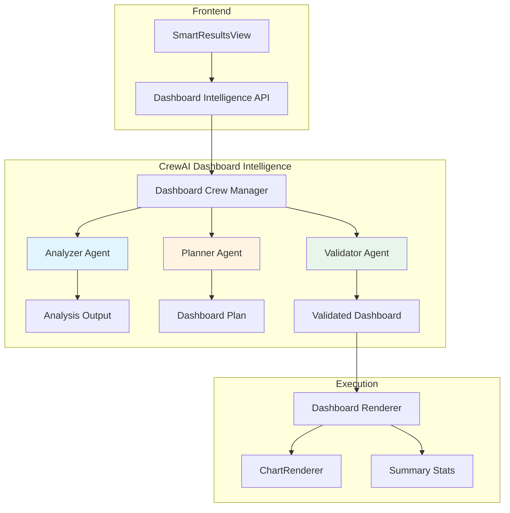

# CrewAI Dashboard Intelligence System
## Intelligent Multi-Agent Visualization Generation

---

## Executive Summary

This document outlines the architecture and implementation of an intelligent dashboard generation system using CrewAI's multi-agent framework. Inspired by nvAgent's three-agent architecture (Processor, Composer, Validator), our system analyzes SQL query results and generates optimal dashboard layouts with appropriate visualizations, data transformations, and explanatory reasoning.

**Goal**: Replace rule-based visualization logic with intelligent agent-based analysis that understands data semantics, business context, and visualization best practices.

---

## Architecture Overview



---

## Agent Architecture

### Agent 1: Data Analyzer
**Role**: Deep semantic analysis of query results

**Responsibilities**:
- Identify data types (temporal, categorical, numerical, geographic)
- Detect patterns (trends, distributions, correlations, outliers)
- Recognize business metrics (revenue, count, rate, percentage)
- Understand query intent from SQL structure
- Identify grouping and aggregation patterns

**Input**:
```typescript
{
  sql: string;
  columns: string[];
  rows: any[][];
  rowCount: number;
}
```

**Output**:
```typescript
{
  dataProfile: {
    columns: Array<{
      name: string;
      type: 'temporal' | 'categorical' | 'numerical' | 'geographic' | 'text';
      role: 'dimension' | 'measure' | 'identifier';
      cardinality: number;
      nullPercentage: number;
      uniqueCount: number;
      sampleValues: any[];
    }>;
    patterns: Array<{
      type: 'trend' | 'distribution' | 'correlation' | 'outlier' | 'seasonality';
      description: string;
      confidence: number;
      affectedColumns: string[];
    }>;
    businessContext: {
      domain: string; // e.g., "customer analytics", "sales performance"
      metrics: string[]; // e.g., ["revenue", "conversion_rate"]
      entities: string[]; // e.g., ["customers", "orders"]
    };
  };
  queryIntent: string; // Natural language description of what the query is trying to answer
  recommendedFocus: string[]; // Which aspects are most interesting
}
```

**Agent Prompt Template**:
```
You are a Data Analysis Expert specializing in understanding query results and identifying meaningful patterns.

Given this SQL query and its results:

SQL Query:
{sql}

Columns: {columns}
Row Count: {rowCount}
Sample Rows (first 5):
{sampleRows}

Analyze the data and provide:

1. Column Profiling:
   - For each column, determine its semantic type (temporal, categorical, numerical, geographic, text)
   - Identify its role (dimension to group by, measure to aggregate, or identifier)
   - Calculate cardinality and uniqueness

2. Pattern Detection:
   - What trends exist in the data?
   - What distributions are present?
   - Are there any correlations between columns?
   - Any outliers or anomalies?

3. Business Context:
   - What business domain is this data about?
   - What business metrics are being measured?
   - What business entities are involved?

4. Query Intent:
   - What question is this query trying to answer?
   - What insights should be highlighted?

Provide your analysis in structured JSON format.
```

---

### Agent 2: Visualization Planner
**Role**: Design optimal dashboard layout with multiple complementary views

**Responsibilities**:
- Select appropriate chart types based on data characteristics
- Design multi-view dashboard layouts
- Plan data transformations (histograms, grouping, pivoting)
- Create summary statistics
- Ensure views are complementary and tell a cohesive story

**Input**: Analyzer Agent's output

**Output**:
```typescript
{
  dashboard: {
    title: string;
    description: string;
    summaryStats: Array<{
      label: string;
      value: string | number;
      format: 'number' | 'currency' | 'percentage' | 'text';
      trend?: {
        direction: 'up' | 'down' | 'neutral';
        value: string;
      };
    }>;
    views: Array<{
      id: string;
      title: string;
      description: string;
      chartType: 'bar' | 'line' | 'area' | 'pie' | 'scatter' | 'histogram' | 'metric';
      size: 'full' | 'half' | 'third' | 'quarter';
      dataMapping: {
        xColumn: string;
        yColumns: string[];
        groupBy?: string;
        sortBy?: string;
        sortOrder?: 'asc' | 'desc';
        limit?: number;
      };
      transformation?: {
        type: 'histogram' | 'topN' | 'bottomN' | 'pivot' | 'aggregate' | 'none';
        params: Record<string, any>;
      };
      reasoning: string;
      confidence: number;
    }>;
  };
  reasoning: string; // Overall reasoning for the dashboard design
}
```

**Agent Prompt Template**:
```
You are a Data Visualization Expert specializing in dashboard design and storytelling with data.

Based on this data analysis:

{analyzerOutput}

Design a comprehensive dashboard that:

1. Summary Statistics:
   - Identify 3-4 key metrics to highlight
   - Calculate their values
   - Add trend indicators if temporal data exists

2. Primary Visualization:
   - Choose the best chart type for the main insight
   - Full-width prominent display
   - Clear title and description

3. Complementary Views (if data supports):
   - Distribution/histogram view (if numeric data)
   - Top N / Bottom N comparison (if ordered data)
   - Correlation view (if multiple measures)
   - Time series trend (if temporal data)

4. Data Transformations:
   - Specify any required data transformations
   - Plan histogram binning if needed
   - Define sorting and filtering
   - Handle top/bottom N selections

Guidelines:
- Use bar charts for categorical comparisons
- Use line/area charts for temporal trends
- Use pie charts for part-to-whole (max 6 categories)
- Use scatter plots for correlations
- Use metric cards for single values
- Each view should provide unique insights
- Views should complement, not repeat

Provide your dashboard plan in structured JSON format.
```

---

### Agent 3: Validator
**Role**: Validate and ensure dashboard can be executed

**Responsibilities**:
- Verify all column references are valid
- Validate data transformations are feasible
- Check chart type compatibility with data
- Generate executable transformation code
- Provide fallback options if validation fails

**Input**: Planner Agent's output + Original data

**Output**:
```typescript
{
  valid: boolean;
  validatedDashboard: DashboardLayout; // Same structure as Planner output but validated
  validationErrors: Array<{
    viewId: string;
    error: string;
    severity: 'error' | 'warning';
    suggestion: string;
  }>;
  transformationCode?: {
    [viewId: string]: {
      transform: (columns: string[], rows: any[][]) => { columns: string[], rows: any[][] };
      description: string;
    };
  };
}
```

**Agent Prompt Template**:
```
You are a Data Validation Expert ensuring dashboard configurations are executable and error-free.

Validate this dashboard plan against the actual data:

Dashboard Plan:
{plannerOutput}

Available Columns: {columns}
Available Rows: {rowCount} rows

Validation Checklist:

1. Column Reference Validation:
   - Do all xColumn and yColumns exist in the data?
   - Are column types compatible with chart types?
   - Flag any missing or misnamed columns

2. Transformation Feasibility:
   - For histograms: is the column numeric? What bin size?
   - For topN/bottomN: what's the sort column and direction?
   - For pivots: are group columns valid?
   - Generate transformation logic

3. Chart Type Compatibility:
   - Bar chart: needs categorical x, numeric y
   - Line chart: needs ordered x (temporal/numerical), numeric y
   - Pie chart: needs categorical x, numeric y, <=6 categories
   - Scatter: needs numeric x and y

4. Data Sufficiency:
   - Are there enough rows for the visualization?
   - Is cardinality appropriate for chart type?
   - Are there null values that need handling?

5. Performance Considerations:
   - Will any view cause performance issues?
   - Suggest data sampling if needed

For each validation error, provide:
- Clear error message
- Severity (error blocks rendering, warning is suboptimal)
- Suggestion for fix or alternative

Provide validation results in structured JSON format.
```

---

## Implementation Architecture

### File Structure

```
backend/
├── services/
│   ├── crew_dashboard_intelligence.py  # CrewAI crew definition
│   └── dashboard_transformation.py      # Data transformation utilities
├── api/
│   └── dashboard_intelligence_routes.py # API endpoints

lib/services/
└── dashboard-intelligence-client.ts     # Frontend API client

components/build/workspace/
└── SmartResultsView.tsx                 # Updated to use new system
```

---

## Implementation Details

### Backend: CrewAI Crew Setup

**File**: `backend/services/crew_dashboard_intelligence.py`

```python
from crewai import Agent, Task, Crew, Process
from typing import List, Dict, Any
import json

class DashboardIntelligenceCrew:
    """
    CrewAI-based dashboard intelligence system.
    Analyzes SQL query results and generates optimal dashboard layouts.
    """

    def __init__(self, llm_config: Dict[str, Any]):
        self.llm_config = llm_config
        self.analyzer_agent = self._create_analyzer_agent()
        self.planner_agent = self._create_planner_agent()
        self.validator_agent = self._create_validator_agent()

    def _create_analyzer_agent(self) -> Agent:
        """Data Analysis Expert"""
        return Agent(
            role='Data Analysis Expert',
            goal='Deeply understand query results and identify meaningful patterns',
            backstory="""You are an expert data analyst with 15 years of experience
            in business intelligence and data science. You excel at understanding
            the semantic meaning of data, identifying patterns, and recognizing
            business context from SQL queries and their results.""",
            verbose=True,
            allow_delegation=False,
            llm_config=self.llm_config
        )

    def _create_planner_agent(self) -> Agent:
        """Visualization Design Expert"""
        return Agent(
            role='Data Visualization Expert',
            goal='Design optimal dashboard layouts that tell a compelling data story',
            backstory="""You are a senior data visualization designer with expertise
            in dashboard design, chart selection, and storytelling with data. You
            understand which visualizations work best for different data types and
            how to create complementary views that provide comprehensive insights.""",
            verbose=True,
            allow_delegation=False,
            llm_config=self.llm_config
        )

    def _create_validator_agent(self) -> Agent:
        """Data Validation Expert"""
        return Agent(
            role='Data Validation Expert',
            goal='Ensure dashboard configurations are executable and error-free',
            backstory="""You are a meticulous data engineer with expertise in
            data validation, transformation pipelines, and error handling. You
            ensure that every visualization configuration is technically sound
            and will execute successfully.""",
            verbose=True,
            allow_delegation=False,
            llm_config=self.llm_config
        )

    def analyze_and_generate_dashboard(
        self,
        sql: str,
        columns: List[str],
        rows: List[List[Any]],
        row_count: int
    ) -> Dict[str, Any]:
        """
        Main orchestration method for dashboard generation.

        Args:
            sql: The SQL query that generated the results
            columns: Column names
            rows: Query result rows
            row_count: Total number of rows

        Returns:
            Validated dashboard configuration
        """

        # Prepare data context
        sample_rows = rows[:5]
        data_context = {
            'sql': sql,
            'columns': columns,
            'rows': sample_rows,
            'row_count': row_count
        }

        # Task 1: Analyze data
        analyze_task = Task(
            description=self._build_analyzer_prompt(data_context),
            agent=self.analyzer_agent,
            expected_output="Structured JSON analysis of data patterns, types, and business context"
        )

        # Task 2: Plan dashboard
        plan_task = Task(
            description="""Based on the data analysis, design a comprehensive dashboard
            with multiple complementary views. Include summary statistics, primary
            visualization, and supporting views. Specify all data transformations needed.""",
            agent=self.planner_agent,
            expected_output="Complete dashboard layout with chart configurations and transformations",
            context=[analyze_task]
        )

        # Task 3: Validate plan
        validate_task = Task(
            description=f"""Validate the dashboard plan against actual data.
            Available columns: {columns}
            Row count: {row_count}

            Check all column references, validate transformations, ensure chart type
            compatibility, and generate transformation code if needed.""",
            agent=self.validator_agent,
            expected_output="Validated dashboard with error checks and transformation code",
            context=[plan_task]
        )

        # Create and run crew
        crew = Crew(
            agents=[self.analyzer_agent, self.planner_agent, self.validator_agent],
            tasks=[analyze_task, plan_task, validate_task],
            process=Process.sequential,
            verbose=True
        )

        result = crew.kickoff()

        return self._parse_crew_result(result)

    def _build_analyzer_prompt(self, data_context: Dict[str, Any]) -> str:
        """Build the detailed prompt for the analyzer agent"""
        return f"""
Analyze this SQL query and its results:

SQL Query:
```sql
{data_context['sql']}
```

Columns: {', '.join(data_context['columns'])}
Row Count: {data_context['row_count']}

Sample Rows (first 5):
{json.dumps(data_context['rows'], indent=2)}

Provide a comprehensive analysis including:

1. Column Profiling (for each column):
   - Semantic type: temporal, categorical, numerical, geographic, or text
   - Role: dimension (group by), measure (aggregate), or identifier
   - Approximate cardinality
   - Data quality observations

2. Pattern Detection:
   - Trends (increasing, decreasing, cyclical)
   - Distributions (normal, skewed, uniform)
   - Correlations between columns
   - Outliers or anomalies
   - Seasonality or temporal patterns

3. Business Context:
   - What domain does this data represent?
   - What business metrics are being measured?
   - What business entities are involved?
   - What business questions can be answered?

4. Query Intent:
   - What is the primary question this query answers?
   - What insights should be highlighted in visualizations?
   - What additional context would be valuable?

Return your analysis as structured JSON.
"""

    def _parse_crew_result(self, result: Any) -> Dict[str, Any]:
        """Parse the crew execution result into structured format"""
        # CrewAI returns results as strings, need to parse JSON
        try:
            if isinstance(result, str):
                return json.loads(result)
            return result
        except json.JSONDecodeError:
            # Fallback: extract JSON from text
            import re
            json_match = re.search(r'\{.*\}', result, re.DOTALL)
            if json_match:
                return json.loads(json_match.group())
            raise ValueError("Could not parse crew result as JSON")


# Singleton instance
_dashboard_crew_instance = None

def get_dashboard_crew():
    """Get or create the dashboard intelligence crew"""
    global _dashboard_crew_instance
    if _dashboard_crew_instance is None:
        llm_config = {
            "model": "gpt-4",
            "temperature": 0.3,
            "max_tokens": 2000
        }
        _dashboard_crew_instance = DashboardIntelligenceCrew(llm_config)
    return _dashboard_crew_instance
```

---

### Backend: API Endpoint

**File**: `backend/api/dashboard_intelligence_routes.py`

```python
from fastapi import APIRouter, HTTPException
from pydantic import BaseModel
from typing import List, Any, Dict
from ..services.crew_dashboard_intelligence import get_dashboard_crew
import logging

router = APIRouter()
logger = logging.getLogger(__name__)


class DashboardGenerationRequest(BaseModel):
    sql: str
    columns: List[str]
    rows: List[List[Any]]
    row_count: int


class DashboardGenerationResponse(BaseModel):
    success: bool
    dashboard: Dict[str, Any]
    error: str = None


@router.post("/generate-dashboard", response_model=DashboardGenerationResponse)
async def generate_dashboard(request: DashboardGenerationRequest):
    """
    Generate intelligent dashboard layout using CrewAI agents.

    This endpoint orchestrates three specialized agents:
    1. Analyzer: Understands data patterns and business context
    2. Planner: Designs optimal dashboard layout with visualizations
    3. Validator: Ensures dashboard is executable and error-free
    """
    try:
        logger.info(f"Generating dashboard for query with {request.row_count} rows and {len(request.columns)} columns")

        # Get dashboard crew
        crew = get_dashboard_crew()

        # Generate dashboard
        result = crew.analyze_and_generate_dashboard(
            sql=request.sql,
            columns=request.columns,
            rows=request.rows,
            row_count=request.row_count
        )

        logger.info("Dashboard generation completed successfully")

        return DashboardGenerationResponse(
            success=True,
            dashboard=result
        )

    except Exception as e:
        logger.error(f"Dashboard generation failed: {str(e)}", exc_info=True)
        return DashboardGenerationResponse(
            success=False,
            dashboard={},
            error=str(e)
        )


@router.get("/health")
async def health_check():
    """Health check endpoint for dashboard intelligence service"""
    return {"status": "healthy", "service": "dashboard-intelligence"}
```

---

### Frontend: API Client

**File**: `lib/services/dashboard-intelligence-client.ts`

```typescript
/**
 * Dashboard Intelligence API Client
 *
 * Communicates with CrewAI-powered backend service for intelligent
 * dashboard generation from query results.
 */

export interface DashboardGenerationRequest {
  sql: string;
  columns: string[];
  rows: any[][];
  rowCount: number;
}

export interface SummaryStatistic {
  label: string;
  value: string | number;
  format: 'number' | 'currency' | 'percentage' | 'text';
  trend?: {
    direction: 'up' | 'down' | 'neutral';
    value: string;
  };
}

export interface DataTransformation {
  type: 'histogram' | 'topN' | 'bottomN' | 'pivot' | 'aggregate' | 'none';
  params: Record<string, any>;
}

export interface DashboardView {
  id: string;
  title: string;
  description: string;
  chartType: 'bar' | 'line' | 'area' | 'pie' | 'scatter' | 'histogram' | 'metric';
  size: 'full' | 'half' | 'third' | 'quarter';
  dataMapping: {
    xColumn: string;
    yColumns: string[];
    groupBy?: string;
    sortBy?: string;
    sortOrder?: 'asc' | 'desc';
    limit?: number;
  };
  transformation?: DataTransformation;
  reasoning: string;
  confidence: number;
}

export interface IntelligentDashboardLayout {
  title: string;
  description: string;
  summaryStats: SummaryStatistic[];
  views: DashboardView[];
  reasoning: string;
}

export interface DashboardGenerationResponse {
  success: boolean;
  dashboard: IntelligentDashboardLayout;
  error?: string;
}

/**
 * Generate intelligent dashboard layout using CrewAI agents
 */
export async function generateIntelligentDashboard(
  request: DashboardGenerationRequest
): Promise<IntelligentDashboardLayout> {
  try {
    const response = await fetch('/api/dashboard-intelligence/generate-dashboard', {
      method: 'POST',
      headers: {
        'Content-Type': 'application/json',
      },
      body: JSON.stringify(request),
    });

    if (!response.ok) {
      throw new Error(`Dashboard generation failed: ${response.statusText}`);
    }

    const result: DashboardGenerationResponse = await response.json();

    if (!result.success) {
      throw new Error(result.error || 'Dashboard generation failed');
    }

    return result.dashboard;
  } catch (error) {
    console.error('Dashboard intelligence API error:', error);
    throw error;
  }
}

/**
 * Apply data transformation to rows based on transformation config
 */
export function applyDataTransformation(
  columns: string[],
  rows: any[][],
  transformation: DataTransformation
): { columns: string[]; rows: any[][] } {
  switch (transformation.type) {
    case 'none':
      return { columns, rows };

    case 'topN': {
      const { sortBy, limit = 10, sortOrder = 'desc' } = transformation.params;
      const sortColIdx = columns.indexOf(sortBy);
      if (sortColIdx === -1) return { columns, rows };

      const sorted = [...rows].sort((a, b) => {
        const aVal = a[sortColIdx];
        const bVal = b[sortColIdx];
        const comparison = aVal > bVal ? 1 : aVal < bVal ? -1 : 0;
        return sortOrder === 'desc' ? -comparison : comparison;
      });

      return { columns, rows: sorted.slice(0, limit) };
    }

    case 'bottomN': {
      const { sortBy, limit = 10, sortOrder = 'asc' } = transformation.params;
      const sortColIdx = columns.indexOf(sortBy);
      if (sortColIdx === -1) return { columns, rows };

      const sorted = [...rows].sort((a, b) => {
        const aVal = a[sortColIdx];
        const bVal = b[sortColIdx];
        const comparison = aVal > bVal ? 1 : aVal < bVal ? -1 : 0;
        return sortOrder === 'asc' ? comparison : -comparison;
      });

      return { columns, rows: sorted.slice(0, limit) };
    }

    case 'histogram': {
      const { column, buckets = 10 } = transformation.params;
      const colIdx = columns.indexOf(column);
      if (colIdx === -1) return { columns, rows };

      // Extract numeric values
      const values = rows.map(row => Number(row[colIdx]) || 0);
      const min = Math.min(...values);
      const max = Math.max(...values);
      const range = max - min;

      if (range === 0) return { columns, rows };

      // Create histogram buckets
      const bucketSize = range / buckets;
      const distribution = new Array(buckets).fill(0);
      const bucketLabels: string[] = [];

      values.forEach(val => {
        const bucketIdx = Math.min(Math.floor((val - min) / bucketSize), buckets - 1);
        distribution[bucketIdx]++;
      });

      for (let i = 0; i < buckets; i++) {
        const start = min + i * bucketSize;
        const end = start + bucketSize;
        bucketLabels.push(`${start.toFixed(1)}-${end.toFixed(1)}`);
      }

      // Return transformed data
      return {
        columns: ['range', 'count'],
        rows: bucketLabels.map((label, idx) => [label, distribution[idx]]),
      };
    }

    case 'aggregate': {
      const { groupBy, aggregations } = transformation.params;
      // Implementation for groupBy aggregations
      // This would require more complex logic
      return { columns, rows };
    }

    default:
      return { columns, rows };
  }
}
```

---

## Integration with Existing System

### Update SmartResultsView.tsx

Replace the existing dashboard logic with CrewAI-powered intelligence:

```typescript
// In SmartResultsView.tsx

import { generateIntelligentDashboard, IntelligentDashboardLayout } from '@/lib/services/dashboard-intelligence-client';

// Replace the useMemo for dashboardLayout with async call
const [dashboardLayout, setDashboardLayout] = useState<IntelligentDashboardLayout | null>(null);
const [isLoadingDashboard, setIsLoadingDashboard] = useState(false);

useEffect(() => {
  async function generateDashboard() {
    if (!shouldUseDashboard(cols, rows)) {
      setDashboardLayout(null);
      return;
    }

    setIsLoadingDashboard(true);
    try {
      const dashboard = await generateIntelligentDashboard({
        sql: sql || '',
        columns: cols,
        rows: rows,
        rowCount: result.rowCount,
      });
      setDashboardLayout(dashboard);
    } catch (error) {
      console.error('Failed to generate intelligent dashboard:', error);
      // Fallback to rule-based
      setDashboardLayout(analyzeDashboardLayout(cols, rows, sql));
    } finally {
      setIsLoadingDashboard(false);
    }
  }

  generateDashboard();
}, [cols, rows, sql, result.rowCount]);
```

---

## Example Flow

### Input: Customer Churn Query

```sql
SELECT
  customer_id,
  customer_name,
  email,
  last_order_date,
  total_orders,
  avg_order_value
FROM customers
WHERE last_order_date < DATE_SUB(NOW(), INTERVAL 90 DAY)
ORDER BY total_orders DESC
LIMIT 100;
```

**Columns**: `[customer_id, customer_name, email, last_order_date, total_orders, avg_order_value]`
**Rows**: 100 customer records

---

### Agent 1: Analyzer Output

```json
{
  "dataProfile": {
    "columns": [
      {
        "name": "customer_id",
        "type": "numerical",
        "role": "identifier",
        "cardinality": 100,
        "uniqueCount": 100
      },
      {
        "name": "total_orders",
        "type": "numerical",
        "role": "measure",
        "cardinality": 45,
        "sampleValues": [23, 18, 15, 12, 10]
      },
      {
        "name": "avg_order_value",
        "type": "numerical",
        "role": "measure",
        "cardinality": 87,
        "sampleValues": [145.50, 89.99, 234.00, 67.50]
      },
      {
        "name": "last_order_date",
        "type": "temporal",
        "role": "dimension",
        "cardinality": 78
      }
    ],
    "patterns": [
      {
        "type": "distribution",
        "description": "total_orders shows right-skewed distribution with most customers having 5-15 orders",
        "confidence": 0.9,
        "affectedColumns": ["total_orders"]
      },
      {
        "type": "correlation",
        "description": "Weak positive correlation between total_orders and avg_order_value",
        "confidence": 0.65,
        "affectedColumns": ["total_orders", "avg_order_value"]
      }
    ],
    "businessContext": {
      "domain": "customer retention analytics",
      "metrics": ["total_orders", "avg_order_value", "churn_risk"],
      "entities": ["customers", "orders"]
    }
  },
  "queryIntent": "Identify at-risk customers who haven't ordered in 90+ days, prioritized by their historical order volume",
  "recommendedFocus": [
    "Distribution of order history among churned customers",
    "Value segmentation of at-risk customers",
    "Temporal pattern of last orders"
  ]
}
```

---

### Agent 2: Planner Output

```json
{
  "dashboard": {
    "title": "Customer Churn Risk Analysis",
    "description": "100 customers who haven't ordered in 90+ days, ranked by historical order volume",
    "summaryStats": [
      {
        "label": "At-Risk Customers",
        "value": "100",
        "format": "number"
      },
      {
        "label": "Total Historic Orders",
        "value": "1,247",
        "format": "number"
      },
      {
        "label": "Avg Order Value",
        "value": "$124.50",
        "format": "currency"
      },
      {
        "label": "Days Since Last Order",
        "value": "127",
        "format": "number",
        "trend": {
          "direction": "up",
          "value": "+15%"
        }
      }
    ],
    "views": [
      {
        "id": "primary-distribution",
        "title": "Order History Distribution",
        "description": "How many orders did churned customers typically make before churning?",
        "chartType": "histogram",
        "size": "full",
        "dataMapping": {
          "xColumn": "total_orders",
          "yColumns": ["count"]
        },
        "transformation": {
          "type": "histogram",
          "params": {
            "column": "total_orders",
            "buckets": 8
          }
        },
        "reasoning": "Histogram shows the distribution of order counts, revealing whether we're losing new customers or long-term loyal customers",
        "confidence": 0.95
      },
      {
        "id": "top-value-customers",
        "title": "Top 15 At-Risk Customers by Order Value",
        "description": "Highest-value churned customers prioritized for re-engagement",
        "chartType": "bar",
        "size": "half",
        "dataMapping": {
          "xColumn": "customer_name",
          "yColumns": ["avg_order_value"],
          "sortBy": "avg_order_value",
          "sortOrder": "desc",
          "limit": 15
        },
        "transformation": {
          "type": "topN",
          "params": {
            "sortBy": "avg_order_value",
            "limit": 15,
            "sortOrder": "desc"
          }
        },
        "reasoning": "Identifies the most valuable customers to prioritize in win-back campaigns",
        "confidence": 0.9
      },
      {
        "id": "volume-vs-value",
        "title": "Order Volume vs Average Value",
        "description": "Relationship between how often customers ordered and how much they spent",
        "chartType": "scatter",
        "size": "half",
        "dataMapping": {
          "xColumn": "total_orders",
          "yColumns": ["avg_order_value"]
        },
        "transformation": {
          "type": "none",
          "params": {}
        },
        "reasoning": "Scatter plot reveals customer segments: high-frequency/low-value vs low-frequency/high-value",
        "confidence": 0.75
      }
    ]
  },
  "reasoning": "This dashboard tells the story of customer churn through three lenses: overall distribution (histogram), high-priority targets (top N bar chart), and customer segmentation (scatter plot). Each view provides actionable insights for retention strategies."
}
```

---

### Agent 3: Validator Output

```json
{
  "valid": true,
  "validatedDashboard": {
    // Same as planner output, all validated
  },
  "validationErrors": [],
  "transformationCode": {
    "primary-distribution": {
      "description": "Create 8-bucket histogram from total_orders column",
      "implementation": "histogram transformation with column 'total_orders', 8 buckets"
    },
    "top-value-customers": {
      "description": "Sort by avg_order_value descending, take top 15",
      "implementation": "topN transformation with sortBy 'avg_order_value', limit 15"
    },
    "volume-vs-value": {
      "description": "No transformation needed, direct scatter plot",
      "implementation": "none"
    }
  }
}
```

---

## Benefits Over Rule-Based Approach

### Current System (Rule-Based)
- Fixed logic for chart type selection
- No understanding of business context
- Creates invalid transformations (fake columns)
- No reasoning or explanation
- Limited to pre-programmed scenarios

### New System (Agent-Based)
- Semantic understanding of data and query intent
- Business context awareness
- Valid transformations with proper column references
- Explainable reasoning for each decision
- Adapts to any data structure
- Learns from organizational patterns (future)
- Multi-view storytelling vs single chart

---

## Performance Considerations

### Latency
- Agent analysis takes 5-10 seconds
- Show loading state in UI
- Fallback to rule-based if timeout
- Cache results for repeated queries

### Cost
- 3 LLM calls per dashboard generation
- ~2000 tokens per agent (6000 total)
- Estimated $0.06 per dashboard (GPT-4)
- Consider using GPT-3.5-turbo for cost reduction

### Scaling
- Implement request queue
- Rate limiting per user
- Cache popular queries
- Background processing for non-urgent requests

---

## Future Enhancements

### Phase 1 (Current): Basic Intelligence
- Three-agent workflow
- Standard chart types
- Basic transformations

### Phase 2: Learning System
- Save successful dashboard configurations
- Learn from user interactions (chart collapses, exports)
- Improve recommendations based on organizational patterns
- User feedback loop

### Phase 3: Advanced Analytics
- Statistical significance testing
- Anomaly detection in visualizations
- Predictive insights
- What-if scenarios

### Phase 4: Cross-Query Intelligence
- Remember context across queries
- Build knowledge graph of data relationships
- Suggest follow-up queries
- Collaborative filtering for dashboard templates

---

## Testing Strategy

### Unit Tests
- Test each agent independently with mock data
- Validate JSON parsing and error handling
- Test transformation functions

### Integration Tests
- End-to-end dashboard generation
- Fallback behavior when agents fail
- Performance benchmarks

### User Acceptance Testing
- A/B test against rule-based system
- Measure user satisfaction
- Track dashboard usage patterns
- Collect feedback on reasoning quality

---

## Conclusion

This CrewAI-based dashboard intelligence system transforms visualization generation from rigid rule-based logic into adaptive, context-aware intelligence. By leveraging specialized agents for analysis, planning, and validation, we create dashboards that truly understand the data, the business context, and the user's intent.

The system maintains technical rigor (validated column references, feasible transformations) while adding semantic understanding (business metrics, patterns, storytelling) that rule-based systems cannot achieve.

**Next Steps**: Implement the backend crew, create the API endpoints, and integrate with the frontend to replace the current rule-based dashboard analyzer.
